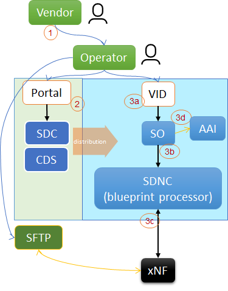
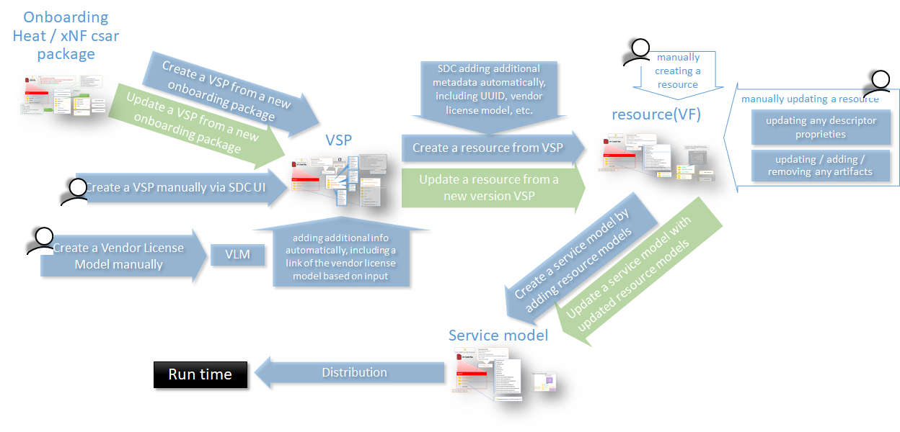
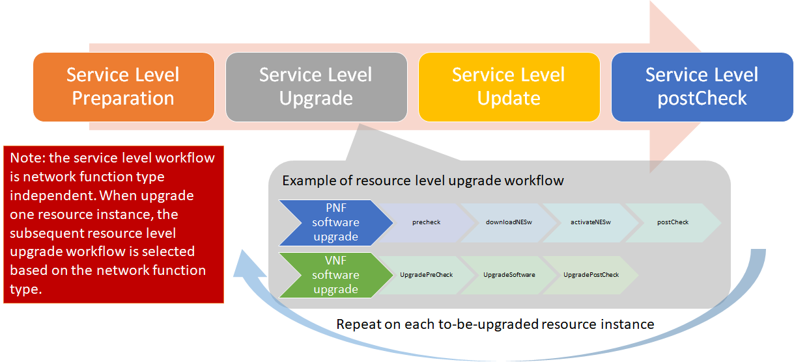
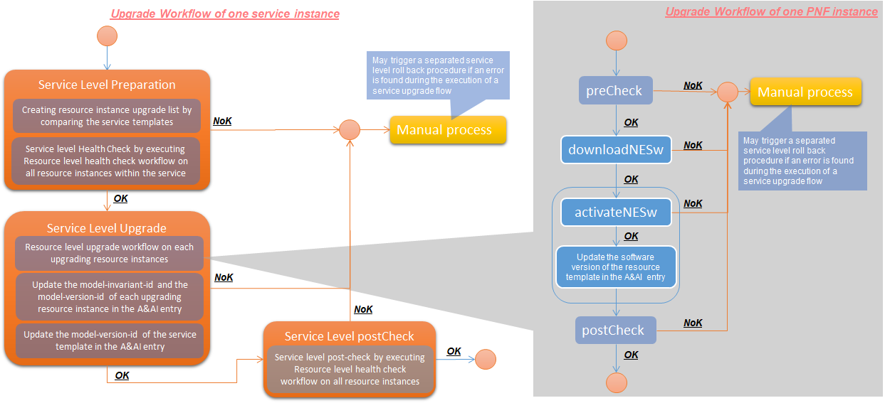
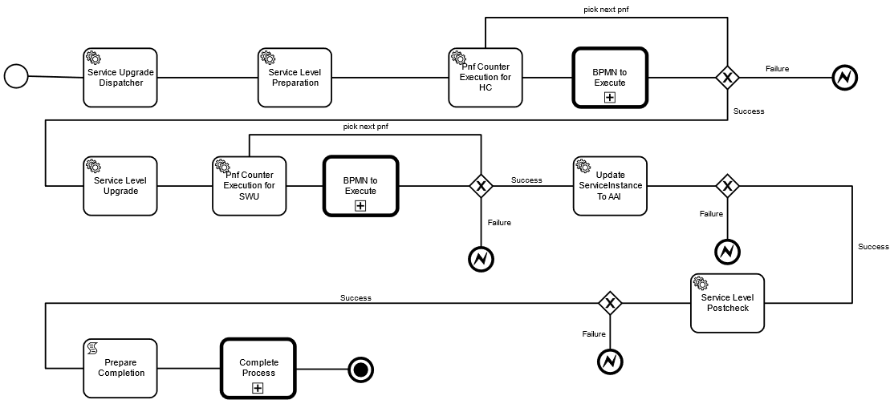

.. This work is licensed under a Creative Commons Attribution 4.0 International License.
.. http://creativecommons.org/licenses/by/4.0

.. _docs_5g_pnf_software_upgrade_with_schema_update:

:orphan:

Support xNF Software Upgrade in association to schema updates
-------------------------------------------------------------

Description
~~~~~~~~~~~

A schema update in relation to a xNF software upgrades is a routine for network upgrade to support new xNF features, improve efficiency or increase xNF capacity on the field, and to  eliminate bugs.  This use case provides to ONAP an advantage in orchestrating and managing the Life Cycle of a Network Services in-line with business and service objectives. Deployment and orchestration of new services over CNFs,  VNFs and PNFs in a model and software driven way simplifies the network management. Enables operators and service providers to manage the Life Cycle of a Network Service. Assuring continuity of operation of services is crucial for production and carrier grade environments. The actualization or upgrades of software and in consequence required changes in the service model is a natural part of service instance life cycle. Without the support of ONAP service update with schema change, service life cycle management by ONAP can be very difficult which can impact the quality and continuity of services.

Current Status in Guilin
~~~~~~~~~~~~~~~~~~~~~~~~~~~

xNF Software Upgrade with xNF artifacts updating in Release G
-------------------------------------------------------------

The following is the xNF software upgrade procedure with schema update.

1. A vendor shall provide
     a. a new VNF/PNF package with updated artifacts, and
     b. the new VNF/ PNF software image to the operator.
2. At receiving of the new package, the operator shall
     a. onboard the new package and create a new resource template or update the existing resource template (PNF or VNF)
     b. update the existing service template with the new or updated resource template
     c. distribute the updated service template to run time.
3. At run time, the operator shall, based on the updated service template,
     a. upgrade a service instance and its resource instances, and
     b. update the AAI entry accordingly

The above procedure is based on the following conditions:

* When updating a service template at design time, the resource instance name and network topology shall be unchanged.

* A service template must be upgradable from any previous versions, including that any new resource template of a given resource instance (within the service template) must be upgradeable from any previous resource template versions.

* At run time, resource upgrade sequence is not sensitive in service instance upgrading procedure.

Function limitations in Release G
~~~~~~~~~~~~~~~~~~~~~~~~~~~~~~~~~

* The operator shall know the possible/feasible resource upgrade path based on vendor provided information.

* When operator updating a service template, the updated service template must be upgradable from any previous versions:
    - Within the service template, the resource instance name and network topology are unchanged.
    - The new resource template of a given resource instance (within the service template) must be upgradeable from any previous resource template versions.

.. note::
    This is to avoid adding possible upgrade paths info and upgrade sequence info into SDC model

Update a xNF resource template from a new onboarding package
~~~~~~~~~~~~~~~~~~~~~~~~~~~~~~~~~~~~~~~~~~~~~~~~~~~~~~~~~~~~

When updating a resource template from a new VSP casr, the new onboarded descriptor and the new onboarded artifacts will be transformed into the new version of the resource csar. The current resource name and invariantUUID will be remained.

As an alternative, a resource csar can be updated manually using SDC GUI.

The update path (green path in above picture) is supported in the current SDC implementation. However, there are bugs which need to be fixed.

Service level LCM workflow in SO
~~~~~~~~~~~~~~~~~~~~~~~~~~~~~~~~

A generic SO workflow is created which can be used to upgrade one service instance based on the updated service template. This service level workflow is network function type independent. When upgrade one resource instance, the subsequent resource level upgrade workflow is selected based on the network function type. It contains following main steps:

* Service Level Preparation
    - Creating resource template instance upgrade list by comparing the service templates
    - Select a resource level health check workflow based on the resource type
    - Execute the selected resource level health check workflow on all resource instances within the service
* Service Level Upgrade
    - Select a resource level upgrade workflow based on the resource type
    - Execute the selected resource level upgrade workflow on each upgrading resource instances
    - Update the software version, model-invariant-id and model-version-id of the resource template in the A&AI entry at end of each Resource level upgrade workflow
* Service Level Update
    - Update the model-version-id of the service template in the A&AI entry
* Service Level postCheck
    - Select a resource level health check workflow based on the resource type
    - Execute the selected resource level health check workflow on all resource instances within the service

The following is an example of the service level workflow with PNF upgrade sub-workflow is called at Service Level Upgrade step:

Workflow view
~~~~~~~~~~~~~

SO APIs
~~~~~~~
.. csv-table:: use case table
   :file: schema-update-apis.csv
   :widths: 60,20,20
   :header-rows: 1

Reference
~~~~~~~~~~~

`PNF Software Upgrade with Schema Update Wiki Page <https://wiki.onap.org/pages/viewpage.action?pageId=81400388#SupportxNFSoftwareUpgradeinassociationtoschemaupdates-DevelopmentStatus>`_

Testing Procedure
~~~~~~~~~~~~~~~~~~

:ref:`Testing 5G PNF Software Upgrade with Schema Update <docs_Testing_5G_PNF_Software_Upgrade_With_Schema_Update>`