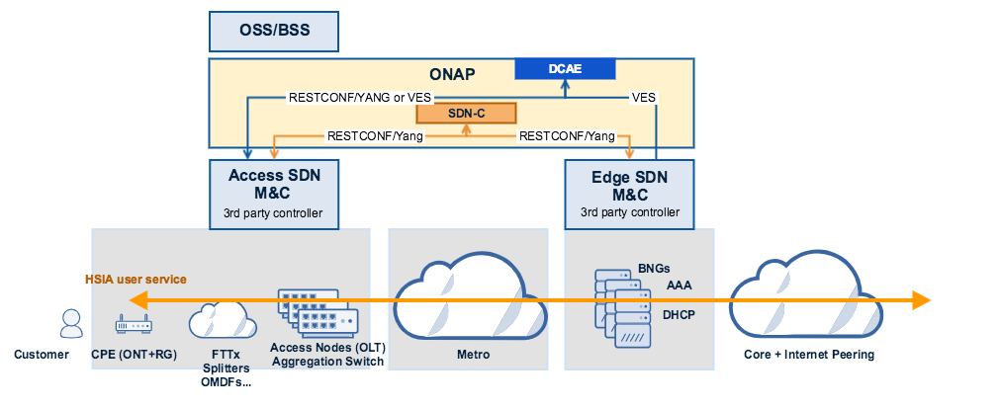
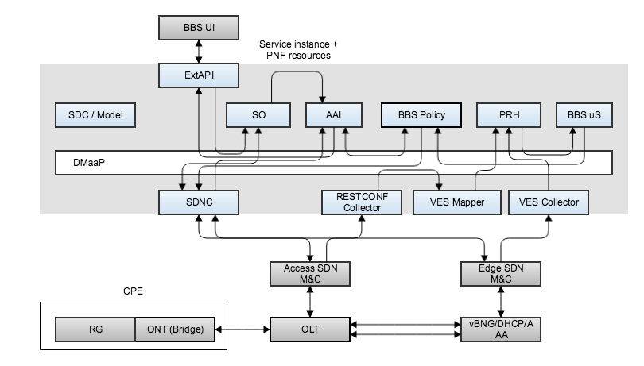
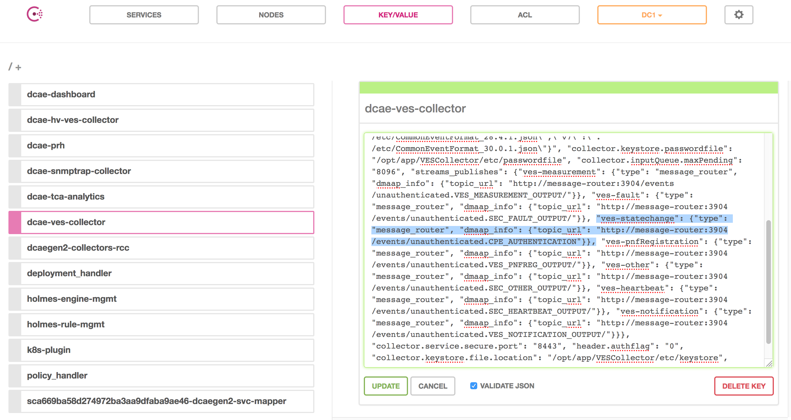

.. _docs_bbs:

BBS (Broadband Service)
-----------------------

Overview
~~~~~~~~
The BBS use case proposes using ONAP for the design, provisioning, life-cycle
management and assurance of broadband services. BBS focuses on multi-Gigabit
Internet Connectivity services based on PON (Passive Optical Network) access
technology.

In Frankfurt release, BBS enables ONAP to

1. Establish a subscriber's HSIA (High Speed Internet Access) service from an ONT (Optical Network Termination unit) to the Internet drain

   - The HSIA service is designed and deployed using ONAP's design and deployment capabilities
   - The HSIA service activation is initiated via ONAP's External APIs and orchestrated and controlled using ONAP orchestration and control capabilities. The control capabilities leverage a 3rd party controller to implement the requested actions within the technology domain/location represented by the domain specific SDN management and control function.

2. Detect the change of location for ONT devices (Nomadic ONT devices)

   - PNF (Re-)Registration for an ONT

     - Subscriber association to an ONT via ONAP's External APIs
     - ONT association with a expected Access UNI (PON port) when a HSIA service is created/deployed for a subscriber
     - PNF (Re-)Registration using ONAP's PNF registration capabilities

   - Service location modification that is detected by ONAP's analytic and initiated via the closed loop capabilities

     - The closed loop capabilities invoke a HSIA location change service that
     is orchestrated and controlled using ONAP capabilities and 3rd party controllers

|image1|

**Figure 1. Architecture Overview**

System View
~~~~~~~~~~~
BBS relies on key ONAP components such as External API, SO, AAI, SDC, Policy
(APEX engine), DCAE (PRH, BBS Event Processor, VES collector, VES mapper,
RESTCONF collector) and SDNC

|image2|

**Figure 2. System View**

System Set Up and configuration
~~~~~~~~~~~~~~~~~~~~~~~~~~~~~~~

SO: Custom Workflow Configuration
=================================

::

  ~/oom/kubernetes# kubectl edit cm dev-so-bpmn-infra-app-configmap

    ## replace "workflow:\n    CreateGenericVNFV1:\n"
    ## with "workflow:\n    custom:\n        BBS_E2E_Service:\n            sdnc:\n                need: true\n    CreateGenericVNFV1:\n"

  ## Restart the pod
  ~/oom/kubernetes# kubectl delete po dev-so-so-bpmn-infra-7556d7f6bc-8fthk

As shown below, new entries need to be inserted manually in SO database (mariadb-galera) in order to map a given resource model to a specific BPMN recipe. For instance, the CPE is modeled in SDC as a VF but it is treated as PNF resource by SO by using the handlePNF BPMN recipe. Those entries need to be inserted in catalogdb database > vnf_recipe table.

IMPORTANT: make sure vnf_recipe.NF_ROLE matches vnf_resource.MODEL_NAME, and vnf_recipe.VERSION_STR matches vnf_resource.MODEL_VERSION.

::

  root@onap-rancher-daily:/home/ubuntu# kubectl exec -ti dev-mariadb-galera-0 sh
  sh-4.2$ mysql -u root -p
  MariaDB [(none)]> use catalogdb;
  MariaDB [catalogdb]> INSERT INTO vnf_recipe (NF_ROLE, ACTION, SERVICE_TYPE, VERSION_STR, DESCRIPTION, ORCHESTRATION_URI, VNF_PARAM_XSD, RECIPE_TIMEOUT)
  VALUES
    ("InternetProfile", "createInstance", "NF", "1.0", "create InternetProfile", "/mso/async/services/CreateSDNCNetworkResource", '{"operationType":"AccessConnectivity"}', 180000),
    ("AccessConnectivity", "createInstance", "NF", "1.0", "create AccessConnectivity", "/mso/async/services/CreateSDNCNetworkResource", '{"operationType":"InternetProfile"}', 180000),
    ("CPE", "createInstance", "NF", "1.0", "create CPE", "/mso/async/services/HandlePNF", NULL, 180000);

  MariaDB [catalogdb]> select * from vnf_recipe where NF_ROLE IN ('AccessConnectivity','InternetProfile', 'CPE');
  +-------+--------------------+----------------+--------------+-------------+---------------------------+-----------------------------------------------+----------------------------------------+----------------+---------------------+--------------+
  | id    | NF_ROLE            | ACTION         | SERVICE_TYPE | VERSION_STR | DESCRIPTION               | ORCHESTRATION_URI                             | VNF_PARAM_XSD                          | RECIPE_TIMEOUT | CREATION_TIMESTAMP  | VF_MODULE_ID |
  +-------+--------------------+----------------+--------------+-------------+---------------------------+-----------------------------------------------+----------------------------------------+----------------+---------------------+--------------+
  | 10048 | InternetProfile    | createInstance | NF           | 1.0         | create InternetProfile    | /mso/async/services/CreateSDNCNetworkResource | {"operationType":"InternetProfile"}    |        1800000 | 2020-01-20 17:43:07 | NULL         |
  | 10051 | AccessConnectivity | createInstance | NF           | 1.0         | create AccessConnectivity | /mso/async/services/CreateSDNCNetworkResource | {"operationType":"AccessConnectivity"} |        1800000 | 2020-01-20 17:43:07 | NULL         |
  | 10054 | CPE                | createInstance | NF           | 1.0         | create CPE                | /mso/async/services/HandlePNF                 | NULL                                   |        1800000 | 2020-01-20 17:43:07 | NULL         |
  +-------+--------------------+----------------+--------------+-------------+---------------------------+-----------------------------------------------+----------------------------------------+----------------+---------------------+--------------+
  3 rows in set (0.00 sec)

DMaaP Message Router
====================

Create the required topics in DMaaP

::

  curl -kX POST \
    https://mr.api.simpledemo.openecomp.org:30226/topics/create \
    -H 'Accept: application/json' \
    -H 'Content-Type: application/json' \
    -H 'cache-control: no-cache' \
    -d '{
      "topicName": "unauthenticated.DCAE_CL_OUTPUT",
      "topicDescription": "",
      "partitionCount": "",
      "replicationCount": "3"
  }'

  curl -kX POST \
    https://mr.api.simpledemo.openecomp.org:30226/topics/create \
    -H 'Accept: application/json' \
    -H 'Content-Type: application/json' \
    -H 'cache-control: no-cache' \
    -d '{
      "topicName": "unauthenticated.CPE_AUTHENTICATION",
      "topicDescription": "",
      "partitionCount": "",
      "replicationCount": "3"
  }'

  curl -kX POST \
    https://mr.api.simpledemo.openecomp.org:30226/topics/create \
    -H 'Accept: application/json' \
    -H 'Content-Type: application/json' \
    -H 'cache-control: no-cache' \
    -d '{
      "topicName": "unauthenticated.PNF_READY",
      "topicDescription": "",
      "partitionCount": "",
      "replicationCount": "3"
  }'

  curl -kX POST \
    https://mr.api.simpledemo.openecomp.org:30226/topics/create \
    -H 'Accept: application/json' \
    -H 'Content-Type: application/json' \
    -H 'cache-control: no-cache' \
    -d '{
      "topicName": "unauthenticated.PNF_UPDATE",
      "topicDescription": "",
      "partitionCount": "",
      "replicationCount": "3"
  }'

  curl -k 'https://mr.api.simpledemo.openecomp.org:30226/topics'

  {
      "topics": [
          "org.onap.dmaap.mr.PNF_REGISTRATION",
          "unauthenticated.DCAE_CL_OUTPUT",
          "AAI-EVENT",
          "SDC-DISTR-STATUS-TOPIC-AUTO",
          "SDC-DISTR-NOTIF-TOPIC-AUTO",
          "org.onap.dmaap.mr.PNF_READY",
          "unauthenticated.PNF_READY",
          "POLICY-PDP-PAP",
          "unauthenticated.CPE_AUTHENTICATION",
          "unauthenticated.VES_MEASUREMENT_OUTPUT",
          "unauthenticated.PNF_UPDATE",
          "org.onap.dmaap.mr.mirrormakeragent",
          "__consumer_offsets"
      ]
  }

DCAE: BBS Event Processor (BBS-ep)
==================================

Description: :doc:`BBS-ep <../../../dcaegen2.git/docs/sections/services/bbs-event-processor/index.rst>`_

The following BBS event processor blueprint will be used:

- `k8s-bbs-event-processor.yaml <https://git.onap.org/dcaegen2/platform/blueprints/plain/blueprints/k8s-bbs-event-processor.yaml?h=frankfurt>`_

The BBS-ep deployment procedure:

::

  root@onap-nfs:/home/ubuntu# kubectl exec -ti dev-dcae-bootstrap-7599b45c77-czxsx -n onap bash
  bash-4.2$ cfy install -b restconf -d restconf /blueprints/k8s-bbs-event-processor.yaml

IMPORTANT: Make sure that the configuration of BBS-ep in Consul contains the following version for the close loop policy in order to match the version expected by BBS APEX policy:

::

  "application.clVersion": "1.0.2"

DCAE: RESTCONF Collector
========================

Description: :doc:`RESTCONF Collector <../../../dcaegen2.git/docs/sections/services/restconf/index.rst>`_

The following RESTCONF collector blueprint will be used:

- `k8s-restconf.yaml <https://git.onap.org/dcaegen2/platform/blueprints/plain/blueprints/k8s-restconf.yaml?h=frankfurt>`_

RESTCONF Collector deployment procedure:

::

  root@onap-nfs:/home/ubuntu# kubectl exec -ti dev-dcae-bootstrap-7599b45c77-czxsx -n onap bash
  bash-4.2$ cfy install -b restconf -d restconf /blueprints/k8s-restconf.yaml

DCAE: VES mapper
================

Description: :doc:`VES Mapper <../../../dcaegen2.git/docs/sections/services/mapper/index.rst>`_

The following VES mapper blueprint will be used:

- `k8s-ves-mapper.yaml <https://git.onap.org/dcaegen2/platform/blueprints/tree/blueprints/k8s-ves-mapper.yaml?h=frankfurt>`_

VES Mapper deployment procedure:

::

  root@onap-nfs:/home/ubuntu# kubectl exec -ti dev-dcae-bootstrap-7599b45c77-czxsx -n onap bash
  bash-4.2$ cfy install -b ves-mapper -d ves-mapper /blueprints/k8s-ves-mapper.yaml

DCAE: VES collector
===================

Configure the mapping of the VES event domain to the correct DMaaP topic in Consul: ves-statechange --> unauthenticated.CPE_AUTHENTICATION

1. Access Consul UI: `<http://CONSUL_SERVER_UI:30270/ui/#/dc1/services>`_

2. Modify the dcae-ves-collector configuration by adding a new VES domain to DMaaP topic mapping

::

  "ves-statechange": {"type": "message_router", "dmaap_info": {"topic_url": "http://message-router:3904/events/unauthenticated.CPE_AUTHENTICATION"}}

|image3|

3. Click on UPDATE in order to apply the new configuration

SDNC: BBS DGs (Directed Graphs)
===============================

Make sure that the following BBS DGs in the SDNC DGBuilder are in Active state

::

  bbs-access-connectivity-vnf-topology-operation-create-huawei
  bbs-access-connectivity-vnf-topology-operation-delete-huawei
  bbs-internet-profile-vnf-topology-operation-change-huawei
  bbs-internet-profile-vnf-topology-operation-common-huawei
  bbs-internet-profile-vnf-topology-operation-create-huawei
  bbs-internet-profile-vnf-topology-operation-delete-huawei
  validate-bbs-vnf-input-parameters

DGBuilder URL: `<https://sdnc.api.simpledemo.onap.org:30203>`_

Access SDN M&C DG
=================
Configure Access SDN M&C IP address in SDNC DG using dgbuilder. For instance:

> GENERIC-RESOURCE-API: bbs-access-connectivity-vnf-topology-operation-create-huawei.json
> GENERIC-RESOURCE-API: bbs-access-connectivity-vnf-topology-operation-delete-huawei.json

1. Export the relevant DG

2. Modify the IP address

3. Import back the DG and Activate it

DGBuilder URL: `<https://sdnc.api.simpledemo.onap.org:30203>`_

Edge SDN M&C DG
===============
Configure Edge SDN M&C IP address in SDNC DG using dgbuilder. For instance:

> GENERIC-RESOURCE-API: bbs-access-connectivity-vnf-topology-operation-common-huawei.json

1. Export the relevant DG

2. Modify the IP address

3. Import back the DG and Activate it

DGBuilder URL: `<https://sdnc.api.simpledemo.onap.org:30203>`_

Add SSL certificate of the 3rd party controller into the SDNC trust store
=========================================================================

::

  kubectl exec -ti dev-sdnc-sdnc-0 -n onap -- bash

  openssl s_client -connect <IP_ADDRESS_EXT_CTRL>:<PORT>
  # copy server certificate and paste in /tmp/<CA_CERT_NAME>.crt
  sudo keytool -importcert -file /tmp/<CA_CERT_NAME>.crt -alias <CA_CERT_NAME>_key -keystore truststore.onap.client.jks -storepass adminadmin
  keytool -list -keystore truststore.onap.client.jks -storepass adminadmin | grep <CA_CERT_NAME>

Policy: BBS APEX policy
=======================

Deployment procedure of BBS APEX Policy (master, apex-pdp image v2.3+)

1. Make Sure APEX PDP is running and in Active state

::

  API:  GET
  URL: {{POLICY-PAP-URL}}/policy/pap/v1/pdps

2. Create the operational control loop APEX policy type

::

  API: POST
  URL: {{POLICY-API-URL}}/policy/api/v1/policytypes
  
JSON Payload: `<https://git.onap.org/integration/usecases/bbs/tree/policy/apex/json/bbs_policytypes.json>`_

3. Create BBS APEX policy

::

  API: POST
  URL: {{POLICY-API-URL}}/policy/api/v1/policytypes/onap.policies.controlloop.operational.Apex/versions/1.0.0/policies
  
JSON Payload: `<https://git.onap.org/integration/usecases/bbs/tree/policy/apex/json/bbs_create_policy.json>`_

4. Deploy BBS policy

::

  API: POST
  URL: {{POLICY-PAP-URL}}/policy/pap/v1/pdps/deployments/batch
  
JSON Payload: `<https://git.onap.org/integration/usecases/bbs/tree/policy/apex/json/bbs_simple_deploy.json>`_

5. Verify the deployment

::

  API: GET
  URL: {{POLICY-API-URL}}/policy/api/v1/policytypes/onap.policies.controlloop.operational.Apex/versions/1.0.0/policies/

Edge Services: vBNG+AAA+DHCP, Edge SDN M&C
==========================================

Installation and setup instructions: `Swisscom Edge SDN M&C and virtual BNG <https://wiki.onap.org/pages/viewpage.action?pageId=63996962>`_

References
==========

Please refer to the following wiki page for further steps related to the BBS service design and instantiation:

- `BBS Documentation <https://wiki.onap.org/pages/viewpage.action?pageId=75303137#BBSDocumentation(Frankfurt)-BBSServiceConfiguration>`_

Known Issues
------------

- E2E Service deletion workflow does not delete the PNF resource in AAI (`SO-2609 <https://jira.onap.org/browse/SO-2609>`_)

