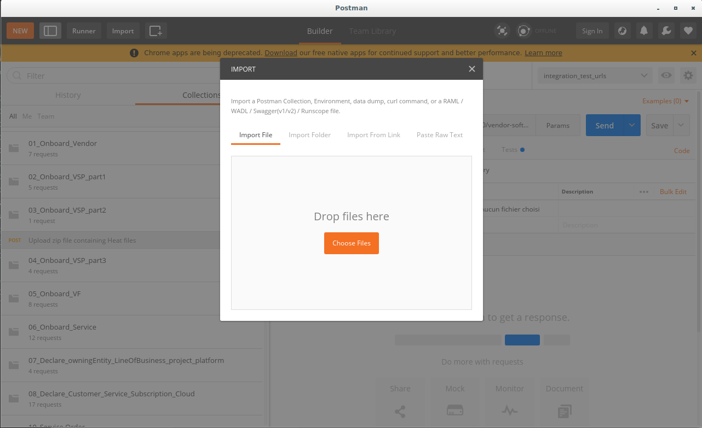
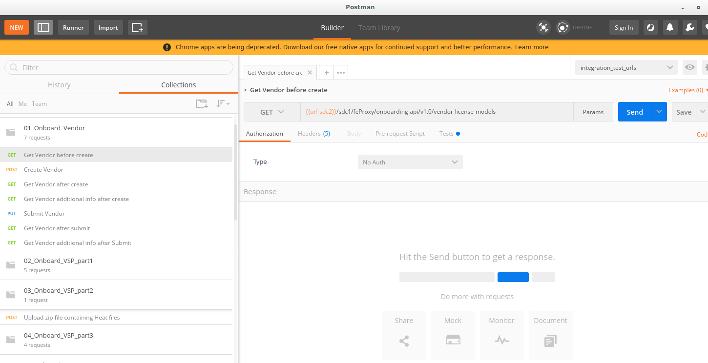
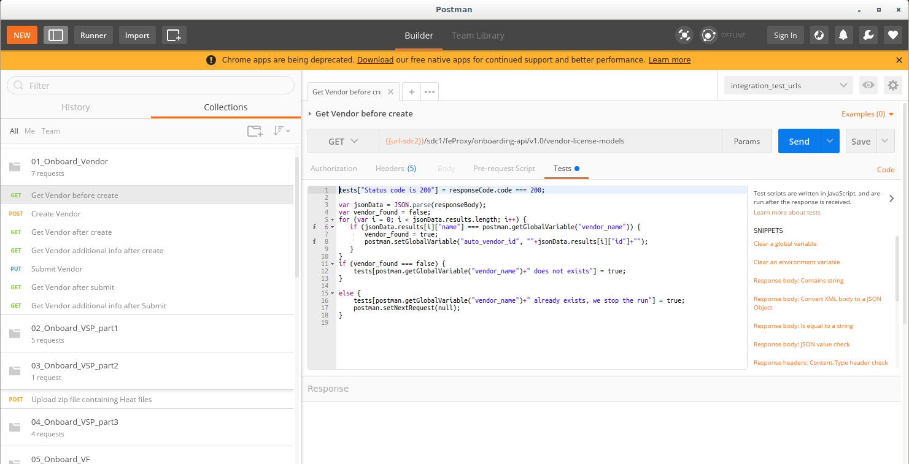

.. This work is licensed under a Creative Commons Attribution 4.0
.. International License.  http://creativecommons.org/licenses/by/4.0
.. Copyright 2017 AT&T Intellectual Property.  All rights reserved.
.. _docs_postman:
.. _postman-guides:

Test ONAP API with Postman
==========================

Postman
-------

Postman is a tool that allows a user to run REST API.

The user defines the API requests and has the possibility to group them
in files called a "Collections".

The user can then run each individual API request or run a complete collection.

Postman includes the possibility to define "environment" variables.

An API request can then get or set a value from/to that "environment" variable.

Get and install Postman tool on your own machine (Linux/windows).

Postman is available here: https://www.getpostman.com/

ONAP Postman collections
------------------------

ONAP Integration project provides several Postman collections with two
environment files.

Those Postman Collections will allow a Developer to experiment various ONAP API
on various ONAP components (SDC, NBI, SO, AAI, SDNC)

- declare a vendor
- declare a VSP
- upload a package
- declare a VF based on the VSP
- declare a Service composed of the VF and a Virtual Link
- distribute all those informations
- declare a customer, a service subscription
- declare OwningEntity, Platform...
- declare a Complex, Cloud Region, Tenant
- associate customer/service/tenant
- declare a service instance via a serviceOrder
- declare a vnf
- declare a vf-module
- declare a network

A collection is also provided to delete objects
(reminder: it is not possible to delete object in SDC)

They have been tested with Onap ElAlto (they are not all compatible with
Dublin, and there is not guaranty about ONAP "master" as API definition
can change)

Download ONAP Postman collections
---------------------------------

From your machine, git clone the ONAP Integration project.

::

  git clone "https://gerrit.onap.org/r/integration"

Import ONAP Postman collections
-------------------------------

ONAP Postman collection are in the repository integration/test/postman

Launch Postman tool

import all ONAP Collections into Postman

And you should see all the collections into Postman

.. figure:: files/postman/collections.png
   :align: center

Each collection is made of several API operations

Running ONAP Postman collections
--------------------------------

Running all those collections, in the order, from 1 to 10 will create a lot of
objects in ONAP components :

- SDC : vendor, VSP, zip file upload, VF from VSP, Service, add VF to Service
- VID : OwningEntity, LineOfBusiness, Project, Platform
- AAI : customer, subscription, cloud region, tenant
- NBI : serviceOrder to add a service instance, serviceOrder to delete
  a service instance

The order is very important because a lot of API requests will need the API
response from the previous operation to get and set some variable values.

It is possible to run the complete collection using Postman

.. figure:: files/postman/run.png
   :align: center

You need, a zip file that contains Heat files for a VNF.

Collection 3 is about uploading that file into ONAP SDC.

.. figure:: files/postman/zipfile.png
   :align: center

Before running those collections, once in Postman, you need to have a look
at "globals" environment parameters.

.. figure:: files/postman/globals.png
   :align: center

All variables that begin by "auto" must NOT be changed (they will be modified
using API response).

All other variables must be adapted to your needs.

In particular, you need to put your own values for cloud_region_id, tenant_name
and tenant_id to fit with the place where you will instantiate the VNF.

::

  service:freeradius
  vf_name:integration_test_VF_freeradius
  vsp_name:integration_test_VSP
  vendor_name:onap_integration_vendor
  owning_entity:integration_test_OE
  platform:integration_test_platform
  project:integration_test_project
  lineofbusiness:integration_test_LOB
  customer_name:generic
  cloud_owner_name:OPNFV
  cloud_region_id:RegionOne
  tenant_name:openlab-vnfs
  tenant_id:234a9a2dc4b643be9812915b214cdbbb
  externalId:integration_test_BSS-order-001
  service_instance_name:integration_test_freeradius_instance_001

Using Newman
------------

Newman is a tool that allow to run postman collections via command-line

On a linux server, with Docker installed on it, run those lines:

::

  git clone https://gitlab.com/Orange-OpenSource/lfn/onap/onap-tests.git
  cd onap-tests/postman
  sudo apt-get -y install zip
  USECASE=$'ubuntu16'
  zip -j $USECASE.zip ../onap_tests/templates/heat_files/$USECASE/*
  TAB=$'\t\t\t\t\t\t\t'
  sed -i -e "s/.*src.*/$TAB\"src\": \"$USECASE.zip\"/" 03_Onboard_VSP_part2.postman_collection.json
  docker pull postman/newman:alpine
  docker run --network="host" --volume="/home/debian/rene/onap-tests/postman:/etc/newman" postman/newman:alpine run 01_Onboard_Vendor.postman_collection.json --environment integration_test_urls.postman_environment.json --globals globals.postman_globals.json --export-environment integration_test_urls.postman_environment.json --reporters cli,json --reporter-cli-no-assertions --reporter-cli-no-console
  docker run --network="host" --volume="/home/debian/rene/onap-tests/postman:/etc/newman" postman/newman:alpine run 02_Onboard_VSP_part1.postman_collection.json --environment integration_test_urls.postman_environment.json --globals globals.postman_globals.json --export-environment integration_test_urls.postman_environment.json
  docker run --network="host" --volume="/home/debian/rene/onap-tests/postman:/etc/newman" postman/newman:alpine run 03_Onboard_VSP_part2.postman_collection.json --environment integration_test_urls.postman_environment.json --globals globals.postman_globals.json --export-environment integration_test_urls.postman_environment.json
  docker run --network="host" --volume="/home/debian/rene/onap-tests/postman:/etc/newman" postman/newman:alpine run 04_Onboard_VSP_part3.postman_collection.json --environment integration_test_urls.postman_environment.json --globals globals.postman_globals.json --export-environment integration_test_urls.postman_environment.json
  docker run --network="host" --volume="/home/debian/rene/onap-tests/postman:/etc/newman" postman/newman:alpine run 05_Onboard_VF.postman_collection.json --environment integration_test_urls.postman_environment.json --globals globals.postman_globals.json --export-environment integration_test_urls.postman_environment.json
  docker run --network="host" --volume="/home/debian/rene/onap-tests/postman:/etc/newman" postman/newman:alpine run 06_Onboard_Service.postman_collection.json --environment integration_test_urls.postman_environment.json --globals globals.postman_globals.json --export-environment integration_test_urls.postman_environment.json
  docker run --network="host" --volume="/home/debian/rene/onap-tests/postman:/etc/newman" postman/newman:alpine run 07_Declare_owningEntity_LineOfBusiness_project_platform.postman_collection.json --environment integration_test_urls.postman_environment.json --globals globals.postman_globals.json --export-environment integration_test_urls.postman_environment.json
  docker run --network="host" --volume="/home/debian/rene/onap-tests/postman:/etc/newman" postman/newman:alpine run 08_Declare_Customer_Service_Subscription_Cloud.postman_collection.json --insecure --environment integration_test_urls.postman_environment.json --globals globals.postman_globals.json --export-environment integration_test_urls.postman_environment.json
  docker run --network="host" --volume="/home/debian/rene/onap-tests/postman:/etc/newman" postman/newman:alpine run 10_instantiate_service_vnf_vfmodule.postman_collection.json --environment integration_test_urls.postman_environment.json --globals globals.postman_globals.json --export-environment integration_test_urls.postman_environment.json --reporters cli,json --reporter-cli-no-assertions --reporter-cli-no-console

All collections are processed, then you can see results and you will
also obtain result json files in the onap-tests/postman/newman directory

Of course you can adapt globals variables in globals.postman_globals.json
or change the USECASE=$'ubuntu16' value to onboard any heat template located
in onap_tests/templates/heat_files directory
