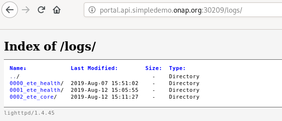
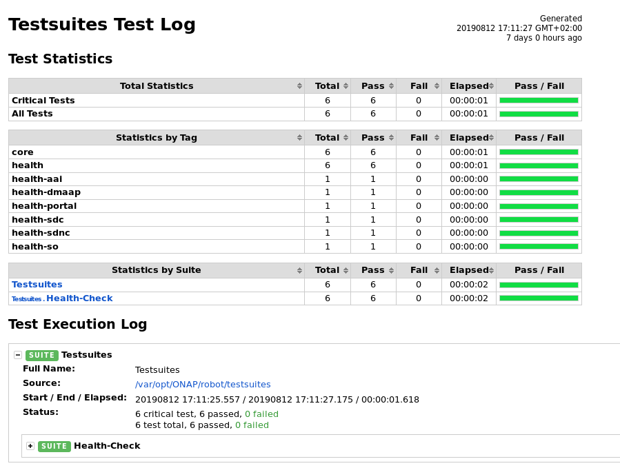
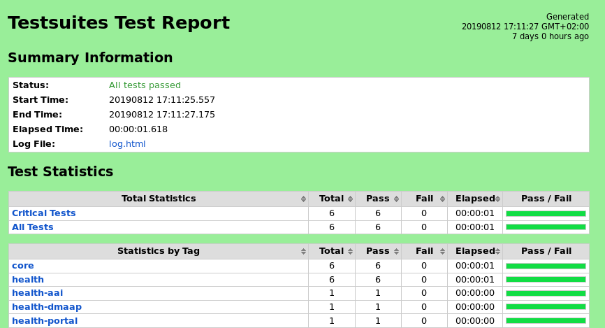
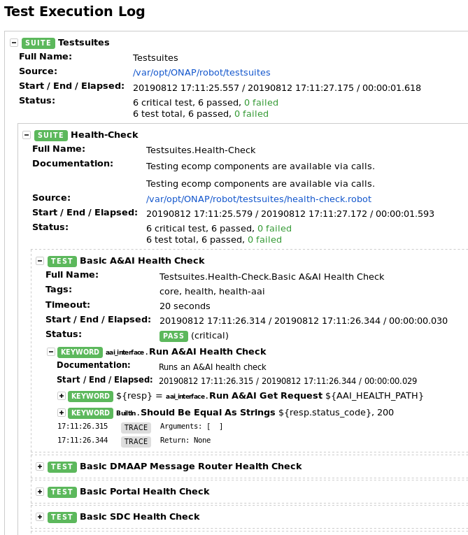
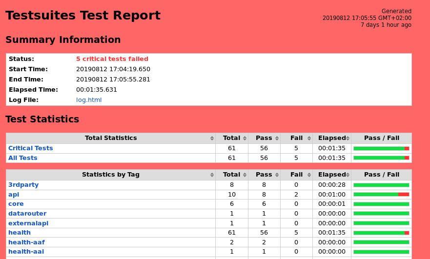

.. This work is licensed under a Creative Commons Attribution 4.0
   International License. http://creativecommons.org/licenses/by/4.0

.. _docs_robot:

Robot
-----

Introduction
~~~~~~~~~~~~
Robot Framework is a generic open source automation framework for acceptance
testing, acceptance test driven development (ATDD), and robotic process
automation (RPA). This framework is widely used in ONAP.
The full documentation of robot can be found in https://robotframework.org/.

In ONAP, Robot scripts have been developed to validate the components, provision
and run end to end tests.

The robot scripts can be retrieved in the ONAP testsuite repository: https://git.onap.org/testsuite/

A Robot pod is part of the ONAP default installation.
This pod includes the robot framework and the needed scripts cloned from the
testsuite repository.
Additional scripts are created during the installation in order to simplify
the launch of the different tests and are loacted in /opt/oom/kubernetes/robots.

From one of the kubernetes controller, you shall see the pod as follows:

::

  $ kubectl get pods -n onap | grep robot
  onap-robot-robot-7fc49977fd-6jblt    1/1     Running    0          9h

You can access the robot configuration through its configmap.

::

  $ kubectl describe cm onap-robot-robot-eteshare-configmap -n onap

You shall see a long list of variables set during the ONAP installation by OOM.
Please note that some of these variables are set thanks to the OOM
overide openstack.yaml file. See the examples described in https://git.onap.org/oom/tree/kubernetes/onap/resources/overrides/openstack.yaml

Verification of the ONAP components
~~~~~~~~~~~~~~~~~~~~~~~~~~~~~~~~~~~
ONAP robot healthcheck tests have been created to give a quick feedback on the
status of the ONAP components.

You can run them from one of the kubernetes controller. You need to log on the
machine then perform the following commands:

::

  $ cd /opt/oom/kubernetes/robot
  $ ./ete-k8s.sh onap health

You shall the execution of all the healthcheck launched from bash script hosted
on the kubernetes controller and executed on the robot pod.

At the end you shall see that logs and reporting are automatically generated
by robot and stored on the pod under /share/logs/.
You can retrieve the logs directly from the pods or through the web interface
integrated in the robot pod by typing
http://portal.api.simpledemo.onap.org:30209/logs/

.. note::
  Login credentials: (test/test)

In every test directory, You shall see 3 files:

* log.html
* output.xml
* report.html

A new directory will be created after each run.

log.html should look like

When the testsuite is passed, the reporting page is green.

You can click on the test case to get details.

If one of the test is FAIL, the generated web reporting page will be red.

Lots of tags have been created for healthcheck tests. You may replace health by
core, small, medium, 3rdparty, health-sdc, health-multicloud,...

See https://git.onap.org/testsuite/tree/robot/testsuites/health-check.robot to
get all the tags.

As an illustration, healthcheck core traces should be displayed as follows.

::

  $ ./ete-k8s.sh onap core
  ++ export NAMESPACE=onap
  ++ NAMESPACE=onap
  +++ kubectl --namespace onap get pods
  +++ sed 's/ .*//'
  +++ grep robot
  ++ POD=onap-robot-robot-7c47659f7-tt9w4
  ++ TAGS='-i core'
  ++ ETEHOME=/var/opt/ONAP
  +++ kubectl --namespace onap exec onap-robot-robot-7c47659f7-tt9w4 -- bash -c 'ls -1q /share/logs/ | wc -l'
  ++ export GLOBAL_BUILD_NUMBER=2
  ++ GLOBAL_BUILD_NUMBER=2
  +++ printf %04d 2
  ++ OUTPUT_FOLDER=0002_ete_core
  ++ DISPLAY_NUM=92
  ++ VARIABLEFILES='-V /share/config/vm_properties.py -V /share/config/integration_robot_properties.py -V /share/config/integration_preload_parameters.py'
  ++ VARIABLES='-v GLOBAL_BUILD_NUMBER:17175'
  ++ kubectl --namespace onap exec onap-robot-robot-7c47659f7-tt9w4 -- /var/opt/ONAP/runTags.sh -V /share/config/vm_properties.py -V /share/config/integration_robot_properties.py -V /share/config/integration_preload_parameters.py -v GLOBAL_BUILD_NUMBER:17175 -d /share/logs/0002_ete_core -i core --display 92
  Starting Xvfb on display :92 with res 1280x1024x24
  Executing robot tests at log level TRACE
  ==============================================================================
  Testsuites
  ==============================================================================
  Testsuites.Health-Check :: Testing ecomp components are available via calls.
  ==============================================================================
  Basic A&AI Health Check                                               | PASS |
  ------------------------------------------------------------------------------
  Basic DMAAP Message Router Health Check                               | PASS |
  ------------------------------------------------------------------------------
  Basic Portal Health Check                                             | PASS |
  ------------------------------------------------------------------------------
  Basic SDC Health Check                                                (DMaaP:UP)| PASS |
  ------------------------------------------------------------------------------
  Basic SDNC Health Check                                               | PASS |
  ------------------------------------------------------------------------------
  Basic SO Health Check                                                 | PASS |
  ------------------------------------------------------------------------------
  Testsuites.Health-Check :: Testing ecomp components are available ... | PASS |
  6 critical tests, 6 passed, 0 failed
  6 tests total, 6 passed, 0 failed
  ==============================================================================
  Testsuites                                                            | PASS |
  6 critical tests, 6 passed, 0 failed
  6 tests total, 6 passed, 0 failed
  ==============================================================================
  Output:  /share/logs/0002_ete_core/output.xml
  Log:     /share/logs/0002_ete_core/log.html
  Report:  /share/logs/0002_ete_core/report.html

Onboard and Instantiate VNF/PNF with Robot
~~~~~~~~~~~~~~~~~~~~~~~~~~~~~~~~~~~~~~~~~~
Robot scripts have been also created to provision components and perform end
to end tests.
All the robot scripts are hosted on the tesuite repository (https://git.onap.org/testsuite/tree/robot/testsuites)
and deal with various test cases and/or components.

::

  robot/testsuites/
  ├── aai
  │   └── aai-regression-test-v14.robot
  ├── cds.robot
  ├── clamp.robot
  ├── closed-loop.robot
  ├── create-cloud-config.robot
  ├── demo.robot
  ├── health-check.robot
  ├── hvves.robot
  ├── model-distribution.robot
  ├── model-distribution-vcpe.robot
  ├── oof
  │   ├── oof-cmso.robot
  │   ├── oof-has.robot
  │   └── oof-osdf.robot
  ├── pnf-registration.robot
  ├── portalApp.robot
  ├── post-install-tests.robot
  ├── update_onap_page.robot
  ├── vnf-orchestration-direct-so.robot
  └── vnf-orchestration.robot

It is, for instance possible to test the onboarding of the vFirewall model in
the SDC by running the command:

::

  $ ete-k8s.sh onap healthdist
  ++ export NAMESPACE=onap
  ++ NAMESPACE=onap
  +++ kubectl --namespace onap get pods
  +++ sed 's/ .*//'
  +++ grep robot
  ++ POD=dev-robot-robot-6d444f4cdd-n7vg5
  ++ TAGS='-i healthdist'
  +++ dirname ./ete-k8s.sh
  ++ DIR=.
  ++ SCRIPTDIR=scripts/etescript
  ++ ETEHOME=/var/opt/ONAP
  ++ [[ healthdist == \e\x\e\c\s\c\r\i\p\t ]]
  +++ kubectl --namespace onap exec dev-robot-robot-6d444f4cdd-n7vg5 -- bash -c 'ls -1q /share/logs/ | wc -l'
  ++ export GLOBAL_BUILD_NUMBER=5
  ++ GLOBAL_BUILD_NUMBER=5
  +++ printf %04d 5
  ++ OUTPUT_FOLDER=0005_ete_healthdist
  ++ DISPLAY_NUM=95
  ++ VARIABLEFILES='-V /share/config/robot_properties.py'
  ++ VARIABLES='-v GLOBAL_BUILD_NUMBER:32515'
  ++ kubectl --namespace onap exec dev-robot-robot-6d444f4cdd-n7vg5 -- /var/opt/ONAP/runTags.sh -V /share/config/robot_properties.py -v GLOBAL_BUILD_NUMBER:32515 -d /share/logs/0005_ete_healthdist -i healthdist --display 95
  Starting Xvfb on display :95 with res 1280x1024x24
  Executing robot tests at log level TRACE
  ==============================================================================
  Testsuites
  ==============================================================================
  Testsuites.Health-Check :: Test that ONAP components are available via basi...
  ==============================================================================
  Health Distribution Test                                              | PASS |
  ------------------------------------------------------------------------------
  Testsuites.Health-Check :: Test that ONAP components are available... | PASS |
  1 critical test, 1 passed, 0 failed
  1 test total, 1 passed, 0 failed
  ==============================================================================
  Testsuites                                                            | PASS |
  1 critical test, 1 passed, 0 failed
  1 test total, 1 passed, 0 failed
  ==============================================================================
  Output:  /share/logs/0005_ete_healthdist/output.xml
  Log:     /share/logs/0005_ete_healthdist/log.html
  Report:  /share/logs/0005_ete_healthdist/report.html

If you consider the ete-k8s.sh script, the following testsuites are referenced:

* cds.robot: cds
* clamp.robot: clamp
* demo.robot: InitDemo, InitCustomer, APPCCDTPreloadDemo, APPCMountPointDemo, DistributeDemoVFWDT, DistributeVFWNG
* health-check.robot: health, core, small, medium, 3rdparty, api, datarouter, externalapi, health-aaf,...
* hvves.robot: HVVES, ete
* model-distribution-vcpe.robot: distributevCPEResCust
* model-distribution.robot: distribute, distributeVFWDT, distributeVLB
* oof-cmso.robot, oof-homing.robot, oof-has.robot: oof related tests
* pnf-registration.robot: ete, pnf_registrate
* post-install-tests.robot dmaapacl, postinstall
* sdc-dcae-d.robot: sdc-dcae-d
* security.robot: security
* update_onap_page.robot: UpdateWebPage
* vnf-orchestration-direct-so.robot: instantiateVFWdirectso
* vnf-orchestration.robot: instantiate, instantiateNoDelete, stability72hr

If you use the demo-k8s.sh script, you may see the following options:

* init_robot
* init
* init_customer
* distribute
* preload
* appc
* instantiateVFW
* instantiateVFWdirectso
* instantiateVLB_CDS
* deleteVNF
* heatbridge
* cds
* distributeVFWNG
* distributeDemoVFWDT
* instantiateDemoVFWDT
* vfwclosedloop

Below is the sample output for init execution with demo-k8s.sh script

::

  $ ./demo-k8s.sh onap init
  Number of parameters: 2
  KEY: init
  ++ kubectl --namespace onap get pods
  ++ sed 's/ .*//'
  ++ grep robot
  + POD=dev-robot-robot-6d444f4cdd-6t77j
  ++ dirname ./demo-k8s.sh
  + DIR=.
  + SCRIPTDIR=scripts/demoscript
  + ETEHOME=/var/opt/ONAP
  + '[' ']'
  ++ kubectl --namespace onap exec dev-robot-robot-6d444f4cdd-6t77j -- bash -c 'ls -1q /share/logs/ | wc -l'
  + export GLOBAL_BUILD_NUMBER=4
  + GLOBAL_BUILD_NUMBER=4
  ++ printf %04d 4
  + OUTPUT_FOLDER=0004_demo_init
  + DISPLAY_NUM=94
  + VARIABLEFILES='-V /share/config/robot_properties.py'
  + kubectl --namespace onap exec dev-robot-robot-6d444f4cdd-6t77j -- /var/opt/ONAP/runTags.sh -V /share/config/robot_properties.py -d /share/logs/0004_demo_init -i InitDemo --display 94
  Starting Xvfb on display :94 with res 1280x1024x24
  Executing robot tests at log level TRACE
  ==============================================================================
  Testsuites
  ==============================================================================
  Testsuites.Demo :: Executes the VNF Orchestration Test cases including setu...
  ==============================================================================
  Initialize Customer And Models                                        | PASS |
  ------------------------------------------------------------------------------
  Initialize SO Openstack Identity For V3                               | PASS |
  ------------------------------------------------------------------------------
  Testsuites.Demo :: Executes the VNF Orchestration Test cases inclu... | PASS |
  2 critical tests, 2 passed, 0 failed
  2 tests total, 2 passed, 0 failed
  ==============================================================================
  Testsuites                                                            | PASS |
  2 critical tests, 2 passed, 0 failed
  2 tests total, 2 passed, 0 failed
  ==============================================================================
  Output:  /share/logs/0004_demo_init/output.xml
  Log:     /share/logs/0004_demo_init/log.html
  Report:  /share/logs/0004_demo_init/report.html

See :ref:`Verified Use Cases and Functional Requirements <docs_usecases>` to see
how to use these scripts. Some of them may need specific prerequisites on the
environment and may support specific versions and/or configurations.

Develop your own Robot scripts
~~~~~~~~~~~~~~~~~~~~~~~~~~~~~~
A dedicated wiki page has been created to help people to design and write their
own robot scripts within ONAP context (https://wiki.onap.org/display/DW/Robot+Framework+Development+Guide)
It is also possible to contact the integration team to get support.
