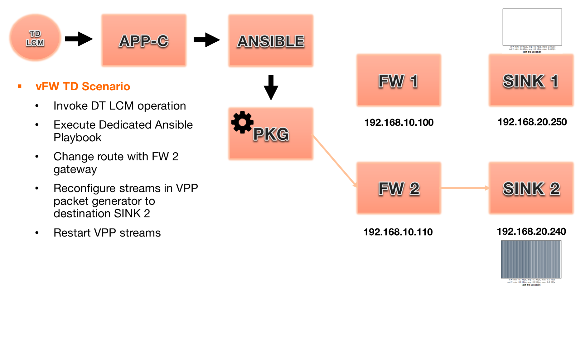
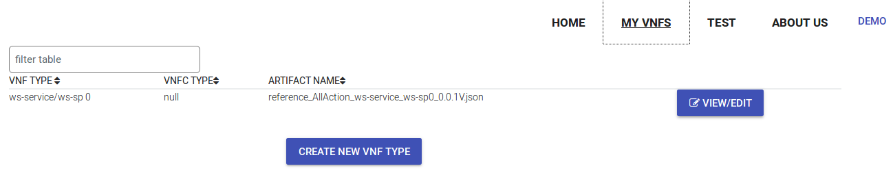
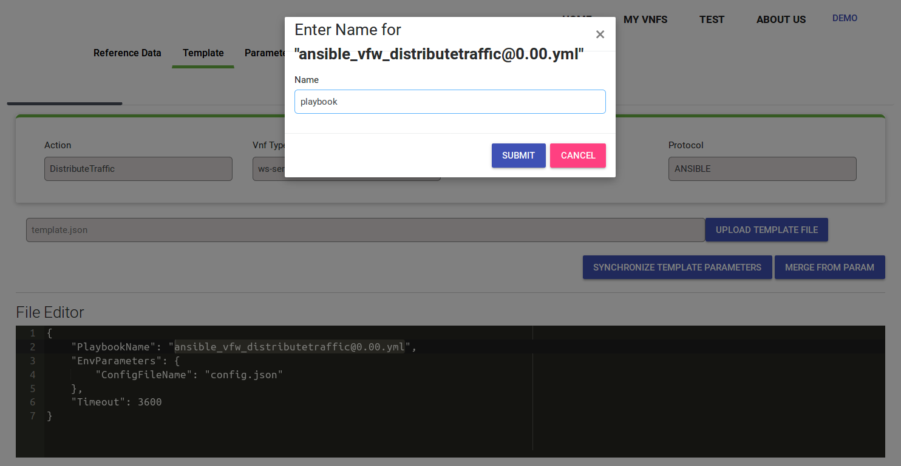
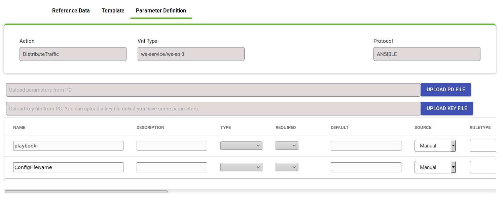

.. contents::
   :depth: 3
..

vFW Traffic Distribution Use Case
---------------------------------
Description
~~~~~~~~~~~

The purpose of this work was to create new LCM API in APPC – DistributeTraffic. The APPC/SDN-C client is requesting a change to traffic distribution (redistribution) done by a traffic balancing/distribution entity (aka anchor point) or mechanism. This action targets the traffic balancing/distribution entity, in some cases DNS, other cases a load balancer external to the VNF instance, as examples. Traffic distribution (weight) changes intended to take a VNF instance out of service are completed only when all in-flight traffic/transactions have been completed. To complete the traffic redistribution process, gracefully taking a VNF instance out-of-service,without dropping in-flight calls or sessions, QuiesceTraffic command may need to follow traffic distribution changes (assigning weight 0 or very low weight to VNF instance). The VNF application remains in an active state. 

Traffic Distribution functionality is an outcome of Change Management project. Further details can be found on project's page

https://wiki.onap.org/display/DW/Change+Management+Extensions

Test Scenario
~~~~~~~~~~~~~

   
   Figure 1 The idea of DistributeTraffic LCM Use Case

The idea of the scenario is shown on Figure 1. In a result of the DistributeTraffic LCM action traffic flow originated from vPKG to vFW 1 and vSINK 1 is redirected to vFW 2 and vSINK 2. Result of the change can be observed also on the vSINKs' dashboards which show a current incoming traffic. Observation of the dashboard from vSINK 1 and vSINK 2 proves that API works properly.

.. figure:: files/figure2.png
   :scale: 50 %
   :align: center
   
   Figure 2 The result of traffic distribution 

In order to setup the scenario and to test the DistributeTraffic LCM API in action you need to perform the following steps:

1. Create an instance of vFWDT (vPKG , 2 x vFW, 2 x vSINK) – dedicated for the DistributeTraffic LCM API tests

#. Upload Ansible playbook to Ansible Server

#. Setup Ansible Server to work with vPKG VM

#. Create configuration file for DistributeTraffic LCM in Ansible Server

#. Configure VNF in APPC CDT tool

#. Invoke REST API via APIDOC explorer, CDT Test tool or DMaaP

You need to have an access to the following containers:

-  APPC MariaDB container – setup Ansible adapter for VNF

-  APPC Ansible Server container – setyp of Ansible Server,
   configuration of playbook and input parameters for action

-  Any container that can be used to call DMaaP API e.g. the SO container

.. note:: This tutorial is based on SB-07 integration lab that was based on OpenStack deployment. For OOM based deployment port number may be different.

Scenario Setup
--------------

vFWDT Instantiation
~~~~~~~~~~~~~~~~~~~

In order to test a DistributeTraffic LCM API functionality a dedicated vFW instance must be prepared. It differs from a standard vFW instance by having an additional VF-module with a second instance of vFW and a second instance of vSINK. Thanks to that when a service instance is deployed there are already available two instances of vFW and vSINK that can be used for verification of DistributeTraffic LCM API – there is no need to use the ScaleOut function to test DistributeTraffic functionality what simplifies preparations for tests.

In order to instantiate vFWDT please follow the procedure for standard vFW with following changes:

1. Please use the following HEAT templates:

https://github.com/onap/demo/tree/master/heat/vFWDT

2. Create Virtual Service in SDC with composition like it is shown on Figure 3

.. figure:: files/figure3.png
   :scale: 50 %
   :align: center

   Figure 3 Composition of vFWDT Service

3. Use the following payload files in the SDNC-Preload phase during the VF-Module instantiation

- :download:`vPKG preload example <files/vpkg-preload.txt>`

- :download:`vFW/SNK 1 preload example <files/vfw-1-preload.txt>`

- :download:`vFW/SNK 2 preload example <files/vfw-2-preload.txt>`

**Note**: vFWDT has a specific configuration of the networks – different than the one in original vFW use case (see Figure 4). Two networks must be created before the heat stack creation: *onap-private* network (10.0.0.0/16 typically) and *onap-external-private* (e.g. "10.100.0.0/16"). The latter one should be connected over a router to the external network that gives an access to VMs. Thanks to that VMs can have a floating IP from the external network assigned automatically in a time of stacks' creation. Moreover, the vPKG heat stack must be created before the vFW/vSINK stacks (it means that the VF-module for vPKG must be created as a first one). The vPKG stack creates two networks for the vFWDT use case: *protected* and *unprotected*; so these networks must be present before the stacks for vFW/vSINK are created.

.. figure:: files/figure4.png
   :scale: 20 %
   :align: center

   Figure 4 Configuration of networks for vFWDT

Configuration of Ansible Server
~~~~~~~~~~~~~~~~~~~~~~~~~~~~~~~

After an instantiation of the vFWDT service the Ansible server must be configured in order to allow it a reconfiguration of vPKG VM.

1. Enter the Ansible Server container

2. Install nano and wget

::

    apt install wget nano

3. Download the distribute traffic playbook into the :file:`/opt/onap/ccsdk/Playbooks` directory

::

    cd /opt/onap/ccsdk/Playbooks

    wget https://raw.githubusercontent.com/onap/appc-deployment/master/playbook/ansible_vfw_distributetraffic%400.00.yml

4. Change with *nano* the *hosts: all* statement in the playbook into the *hosts: vpkg-1* statement

5. Copy a private key file used for VMs' creation into the :file:`/opt/onap/ccsdk/Playbooks/vpkg-1.pem` file and give it proper rights

::

    chown 400 vpkg-1.pem

.. note:: The private key file must be related with a public key specified in the *pub_key* statement used in the *SDNC-Preloading* phase

6. Edit the :file:`/opt/onap/ccsdk/Playbooks/Ansible\ \_\ inventory` file including *vpkg-1* host

::

    [vpkg-1]
    vpkg-1 ansible_ssh_host=10.0.110.2 ansible_ssh_user=ubuntu
    ansible_ssh_private_key_file=/opt/onap/ccsdk/Playbooks/vpkg-1.pem

.. note:: Change IP address respectively

7. Test that the Ansible server can access *vpkg-1* host over ssh

::

    ansible –i Ansible_inventory vpkg-1 –m ping

8. Upload the payload file :file:`/opt/onap/ccsdk/Playbooks/config.json` with extra parameters for the Ansible playbook.

::

    {
       "fwIp": "192.168.10.110",
       "sinkIp": "192.168.20.240"
    }

.. note:: This step can be omitted when the CDT template file for the *DistributeTraffic* action will be formulated in a different way. In consequence all the parameters required by a playbook can be defined directly on the CDT level and there is no need to maintain this file. For our VNF this file contains an IP address of vFW 2 from the *unprotected* network and an IP address of vSINK 2 from the *protected* network.

Configuration of MySQL/MariaDB for Ansible
~~~~~~~~~~~~~~~~~~~~~~~~~~~~~~~~~~~~~~~~~~

For each VNF that uses the Ansible protocol you need to configure *PASSWORD* and *URL* field* in the *DEVICE_AUTHENTICATION* table.

1. Enter the MariaDB container

2. Enter the Maria DB CLI (password is *gamma*)

::

    mysql -u sdnctl -p

3. Invoke the following commands

::

    MariaDB [(none)]> use sdnctl;
    MariaDB [sdnctl]> select * from DEVICE_AUTHENTICATION;
    MariaDB [sdnctl]> UPDATE DEVICE_AUTHENTICATION SET URL = 'http://ansiblehost:8000/Dispatch' WHERE DEVICE_AUTHENTICATION_ID=51;
    MariaDB [sdnctl]> UPDATE DEVICE_AUTHENTICATION SET PASSWORD = 'admin' WHERE DEVICE_AUTHENTICATION_ID=51;

.. note:: You need to find in the *select* query result ID of row that has VNF Type like the one specified in the CDT, *DistributeTraffic* as an action name and *Ansible* as a name of a protocol. You should replace *ansiblehost* with an IP or a hostname of the Ansible Server reachable for the APPC container.

Configuration of VNF in the APPC CDT tool
~~~~~~~~~~~~~~~~~~~~~~~~~~~~~~~~~~~~~~~~~

Following steps aim to configure DistributeTraffic LCM action for our vFW VNF in APPC CDT tool.

1. Enter the Controller Design Tool page: http://appc_ip:CDT_port

.. note:: i.e. http://10.12.5.227:8080 for ONAP OpenStack deployment
 
2. Click on the *CREATE NEW VNF TYPE* button

   Figure 5 Creation of new VNF type in CDT

3. Enter the VNF Type retrieved from AAI or VID and press the *NEXT* button. Retrieve proper values for the vFWDT service instance

.. figure:: files/figure6.png
   :scale: 60 %
   :align: center

   Figure 6 Retrieving VNF type value with VID from Virtual Service Instance

.. figure:: files/figure7.png
   :scale: 60 %
   :align: center

   Figure 7 Creation of new VNF type in CDT

4. For already created VNF Type (if the view does not open itself) click the *View/Edit* button. In the LCM action edit view in the first tab please choose:

   -  *DistributeTraffic* as Action namethe 

   -  *ANSIBLE* as Device Protocol

   -  *Y* value in Template dropdown menu

   -  *admin* as User Name

   -  *8000* as Port Number

.. figure:: files/figure8.png
   :scale: 60 %
   :align: center

   Figure 8 DistributeTraffic LCM action editing

5. Go to the *Template* tab and upload the request template file of the DistributeTraffic LCM action

::

    {
        "PlaybookName": "ansible_vfw_distributetraffic@400.00.yml",
        "NodeList": ["vpkg-1"],
        "EnvParameters": {
            "ConfigFileName": "config.json"
        },
        "Timeout": 3600
    }

.. note:: This step allows to create and edit template file for any APPC LCM DistributeTraffic action request for specified before VNF Type.

The *EnvParameters* group contains all the parameters that will be passed directly to the Ansible playbook during the request's execution. The *NodeList* parameter value must match the group of VMs like it was specified in the Ansible inventory file. *PlaybookName* must be the same as the name of playbook that was uploaded before to the Ansible server.

.. figure:: files/figure9.png
   :scale: 60 %
   :align: center

   Figure 9 Request template file after uploading

Select *ansible_vfw_distributetraffic@400.00.yml* and press CTRL+4 buttons. The new dialog window will appear. Enter a name *playbook* for this value and press the *Submit* button.

   Figure 10 Editing "playbook" parameter of request template

The same operation must be repeated for the *config.json* parameter. The parameter should have name *ConfigFileName*. Press the *Submit* button.

.. figure:: files/figure11.png
   :scale: 60 %
   :align: center

   Figure 11 Editing "ConfigFileName" parameter of request template

Afterwards press the *SYNCHRONIZE WITH TEMPLATE PARAMETERS* button. You will be moved to the *Parameter Definition* tab. The new parameters will be listed there.

   Figure 12 Summary of parameters specified for DistributeTraffic LCM action.

Finally, go back to the *Reference Data* tab and click *SAVE ALL TO APPC*.

Testing DistributeTraffic LCM API 
---------------------------------

Below we propose three different ways to test DistributeTraffic LCM API.

Test in CDT
~~~~~~~~~~~

In order to test API in CDT go to *TEST* tab. Upload spreadsheet (Excel file) and enter VNF ID of vFWDT VNF.

:download:`CDT request input <files/cdt-request-input.xlsx>`

The spreadsheet contains input parameters for API request. Values from the this file are used to automatically fill in the LCM request template file being edited in previous steps. Click on *Execute test* button to test API in action.

.. figure:: files/figure13.png
   :scale: 60 %
   :align: center

   Figure 13 Result of DistributeTraffic LCM API execution from CDT

APIDOC Explorer
~~~~~~~~~~~~~~~

Another way to test API is to use APIDOC explorer of APPC that comes with OpenDaylight.

1. Enter APIDOC explorer page: http://appc_ip:appc_portal_port/apidoc/explorer/index.html

.. note:: i.e. http://10.12.5.227:8282/apidoc/explorer/index.html for ONAP OpenStack deployment

2. Choose *appc-provider-lcm* and find POST
   */operations/appc-provider-lcm:distribute-traffic*

3. In the *payload* input paste below mentioned content.

::

    {
        "input": {
            "common-header": {
                "timestamp": "2018-10-18T08:51:01.628Z",
                "api-ver": "2.00",
                "originator-id": "demo",
                "request-id": "1539852661628",
                "sub-request-id": "1539852661629",
                "flags": {
                    "mode": "NORMAL",
                    "force": "TRUE",
                    "ttl": 3600
                }
            },
            "action": "DistributeTraffic",
            "action-identifiers": {
                "vnf-id": "2bd5cc6e-9738-436f-b5a8-c1a749a89f52"
            },
            "payload": "{\"configuration-parameters\":{\"ConfigFileName\":\ "/opt/onap/ccsdk/Playbooks/dt-vpkg-1-config.json\",\"playbook\":\"ansible_vfw_distributetraffic@400.00.yml\",\"node_list\":\"[vpkg-1]\"}}"
        }
    }

.. note:: Remember to use *vnf-id* of your instance of vFW 1 and to set a unique *request-id*. The value of *playbook* and *ConfigFileName* parameters should be the same as uploaded to Ansible Server names of files and their locations. Timestamp must have proper value as well (not from the future and from the past but not more than 30s). In the *payload* parameter *configuration-parameters* section must correspond to all the parameters defined in the template of *DistributeTraffic* action in CDT.

DMaaP event distribution
~~~~~~~~~~~~~~~~~~~~~~~~

The last option that can be used to test DistributeTraffic API is distribution of DMaaP event e.g. from SO container. It is the closest way to how DistributeTraffic API will be used in the future – invoked from a specific workflow by SO BPMN engine. For that we have a python script that prepares input parameters for DMaaP request. There is a need to change in the script IP address and Port of DMaaP. This script can be copied into any machine/container than has access to DMaaP – in particular it can be copied into the SO container.

::

    from datetime import datetime
    import os
    import json
    from pprint import pprint
    from random import randint

    request_id = randint(1, 100000000)

    curr_utc_timestamp = datetime.utcnow().strftime('%Y-%m-%dT%H:%M:%S.244Z')

    data = ''

    with open('dmaap-payload.json') as json_data:
        data = json.load(json_data)
        data['body']['input']['common-header']['timestamp'] = curr_utc_timestamp
        data['body']['input']['common-header']['request-id'] = request_id
        json_data.close()
        pprint(data)

    with open('dmaap-payload.json', 'w') as outfile:
        json.dump(data, outfile)

    os.system('curl -X POST -v -H "Content-Type: application/json" -d @./dmaap-payload.json http://10.12.6.80:3904/events/APPC-LCM-READ')

POST request to DMaaP requires that *payload* data is specific to a APPC LCM request and defines the same input parameters for the DistributeTraffic LCM action like in the two previous methods.

::

    {
        "body": {
            "input": {
                "action": "DistributeTraffic",
                "payload": "{\"configuration-parameters\":{\"ConfigFileName\":\"/opt/onap/ccsdk/Playbooks/dt-vpkg-1-config.json\",\"playbook\":\"ansible_vfw_distributetraffic@400.00.yml\",\"node_list\":\"[vpkg-1]\"}}",
                "common-header": {
                    "api-ver": "2.00",
                    "timestamp": "2018-10-22T11:11:25.244Z",
                    "flags": {
                        "force": "TRUE",
                        "mode": "NORMAL",
                        "ttl": 36000
                    },
                    "request-id": 27081074,
                    "originator-id": "demo",
                    "sub-request-id": "1540197850899"
                },
                "action-identifiers": {
                    "vnf-id": "50ac9605-ce63-442d-a103-80e9cf4753ca"
                }
            }
        },
        "cambria.partition": "APPC",
        "rpc-name": "distribute-traffic",
        "correlation-id": "c09ac7d1-de62-0016-2000-e63701125557-201",
        "version": "2.0",
        "type": "request"
    }