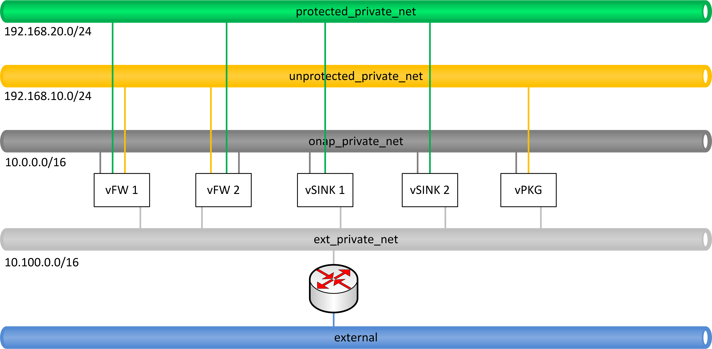

.. This work is licensed under a Creative Commons Attribution 4.0
   International License. http://creativecommons.org/licenses/by/4.0

.. _docs_vfw_traffic:

.. contents::
   :depth: 3
..

vFW In-Place Software Upgrade with Traffic Distribution Use Case
----------------------------------------------------------------
Description
~~~~~~~~~~~

The purpose of this work is to show In-Place Software Upgrade Traffic Distribution functionality implemented in Frankfurt release for vFW Use Case.
The use case is an evolution of vFW Traffic Distribution Use Case which was developed for Casablanca and Dublin releases.
The orchestration workflow triggers a change of the software on selected instance of the firewall. The change is proceeded with minimization of disruption of the
service since the firewall being upgraded must have all the traffic migrated out before the upgrade can be started. The traffic migration (redistribution) is done by
a traffic balancing/distribution entity (aka anchor point). The DistributeTraffic action targets the traffic balancing/distribution entity, in some cases DNS, other cases a load balancer external to the VNF instance, as examples.
Traffic distribution (weight) changes intended to take a VNF instance out of service are completed only when all in-flight traffic/transactions have been completed.
DistributeTrafficCheck command may be used to verify initial conditions of redistribution or can be used to verify the state of VNFs and redistribution itself.
To complete the traffic redistribution process, gracefully taking a VNF instance out-of-service/into-service, without dropping in-flight calls or sessions,
QuiesceTraffic/ResumeTraffic command may need to follow traffic distribution changes. The upgrade operation consist of the UpgradePreCheck operation which can used to verify
initial conditions for the operation like difference of the software version to the one requested, SoftwareUpgrade operation is responsible for modification of the software on
selected vFW instance and UpgradePostCheck LCM actions is used to verify if the software was properly installed on vFW. After the completion of the software upgrade the traffic is migrated to the
instance of the vFW which was before being upgraded. The workflow can be configured also in such a way to perform only singular migration of the traffic without upgrade of the software
what allows to experiment with the version of the workflow implemented in the previous releases. All the LCM operations are executed by APPC controller and they are implemented with Ansible protocol. In order to avoid the inconsistency in the VNFs state the Lock/Unlocks
mechanisms is used to prevent parallel execution of LCM actions on VNFs that are under maintenance because of the workflow that is currently executed on them.
The VNF application remains in an active state.

Traffic Distribution and In-Place Software Upgrade functionality is an outcome of Change Management project. Further details can be found on the following pages

- Frankfurt: https://wiki.onap.org/display/DW/Change+Management+Frankfurt+Extensions (Traffic Distribution workflow enhancements)

- Dublin: https://wiki.onap.org/display/DW/Change+Management+Extensions (DistributeTraffic LCM and Use Case)

- Casablanca https://wiki.onap.org/display/DW/Change+Management+Dublin+Extensions (Distribute Traffic Workflow with Optimization Framework)

Test Scenarios
~~~~~~~~~~~~~~

   Figure 1 The overview of interaction of components in vFW In-Place Software Upgrade with Traffic Distribution Use Case

The main idea of the use case and prepared workflow is to show the interaction of different components of ONAP, including AAI, Policy, OOF, APPC for realization of scenario of software upgrade
of vFW instance with migration of the traffic in time of its upgrade. vFW instance was modified to have two instances of vFW with dedicated vSINKs. The general idea of interaction of ONAP components
is shown on Figure 1. Software Upgrade is performed on selected vFW instance. vPKG and the other vFW taking action while migration of the traffic out of vFW being upgraded. In a result of the DistributeTraffic
LCM action traffic flow originated from vPKG to vFW 1 and vSINK 1 is redirected to vFW 2 and vSINK 2 (as it is seen on Figure 2). Result of the change can be observed also on the vSINKs' dashboards which show
a current incoming traffic. After migration software is upgraded on the vFW and afterwards the traffic can be migrated back to this vFW instance. Observation of the dashboard from vSINK 1 and vSINK 2 proves workflow works properly.

.. figure:: files/dt-result.png
   :scale: 60 %
   :align: center

   Figure 2 The result of traffic distribution in time of the upgrade

The traffic distribution sub-workflow takes as an input configuration parameters delivered by Optimization Framework and on their basis several traffic distribution LCM actions are executed by APPC in the specific workflow.
Further LCM actions are executed in order to present the idea of vFW In-Place Software Upgrade with Traffic Distribution. In this use case also APPC locking mechanisms is demonstrated, changes in APPC for VNFC level Ansible
actions support and changes for APPC Ansible automation also are used in the use case. The APPC Ansible automation scripts allows to configure LCM actions without the need to enter the CDT portal, however there is
possibility to do it manually and documentation describes also how to do it. In the same sense, the upload of policy types and policy instances is automated but the documentation describes how to do it manually.

The demonstration scripts can be used to execute two different scenarios:

1. Simple distribution of traffic from selected vFW instance to the other one

2. Upgrade of the software on selected vFW instance. Both are preceded with shared phase of identification of VF-modules for reconfiguration what is done with help of Optimization Framework.

Workflows
~~~~~~~~~

Whole vFW In-Place Software Upgrade with Traffic Distribution use case can be decomposed into following workflows:

1. High level workflow (simplified workflow on Figure 4 and more detailed on Figure 5)

   Figure 4 The In-Place Software Upgrade with Traffic Distribution general workflow

* Identification of vFW instances (**I**) for migration of the traffic (source and destination) and identification of vPKG instance (anchor point) which would be responsible for reconfiguration of the traffic distribution. This operation id performed by Optimization Framework, HAS algorithm in particular

* Before any operation is started workflow Locks (**II-IV**) with APPC all the VNFs involved in the procedure: vFW 1, vFW 2 and vPKG. In fact this is the vFW being upgraded, vFW which will be used to migrate traffic to and vPKG which performs the traffic distribution procedure. The VNFs needs to be locked in order to prevent the execution of other LCM actions in time of the whole workflow execution. Workflow checks state of the Lock on each VNF (**II**)(**1-6**), if the Locs are free (**III**)(**7**) the Locs are being acquired (**IV**)(**8-14**). If any Lock Check or Lock fails (**7, 14**), workflow is stopped.

* Depending on the workflow type different (Traffic Distribution or In-Place Software Upgrade with Traffic Distribution) LCM action are executed by APPC (**V**). All with Ansible protocol and with VNF and VF-modules identified before by Optimization Framework or the input parameters like selected vFW VNF instance. Workflows are conditional and will not be performed if the preconditions were not satisfied. In case of failure of LCM operation any other actions are canceled.

* At the end workflow Unlocks with APPC the previously Locked VNFs (**VI**)(**15-21**). This operations is performed always even when some steps before were not completed. The purpose is to not leave VNFs in locked state (in maintenance status) as this will prevent future execution of LCM actions or workflows on them. The locks are being automatically released after longer time.

   Figure 5 The In-Place Software Upgrade with Traffic Distribution detailed workflow

2. Identification of VF-modules candidates for migration of traffic (detailed workflow is shown on Figure 6)

   Figure 6 Identification of VF-Module candidates for migration of traffic

- Workflow sends placement request to Optimization Framework (**1**) specific information about the vPKG and vFW-SINK models and VNF-ID of vFW that we want to upgrade.
  Optimization Framework role is to find the vFW-SINK VNF/VF-module instance where traffic should be migrated to in time of the upgrade and vPKG which will be associated with this vFW.
  Although in our case the calculation is very simple, the mechanism is ready to work for instances of services with VNF having houndreds of VF-modules spread accross different cloud regions.

- Optimization Framework takes from the Policy Framework policies (**2-3**) for VNFs and for relations between each other (in our case there is checked ACTIVE status of vFW-SINK and vPKG VF-modules and the Region to which they belong)

- Optimization Framework, base on the information from the policies and service topology information taken from A&AI (**4-11**), offers traffic distribution anchor and destination candidates' pairs (**12-13**) (pairs of VF-modules data with information about their V-Servers and their network interfaces). This information is returned to the workflow script (**14**).

- Information from Optimization Framework can be used to construct APPC LCM requests for DistributeTrafficCheck, DistributeTraffic, UpgradePreCheck, SoftwareUpgrade and UpgradePostCheck commands. This information is used to fill CDT templates with proper data for further Ansible playbooks execution. Script generates also here CDT templates for LCM actions which can be uploaded automatically to APPC DB.

3. The Traffic Distribution sub-workflow (simplified workflow on Figure 7 and more detailed on Figure 8)

   Figure 7 The Traffic Distribution general workflow

- In the first DistributeTrafficCheck LCM request on vPGN VNF/VF-Module APPC, over Ansible, checks if already configured destination of vPKG packages is different than already configured one (**I-III**)(**1-8**). If not workflow is stopped (**9**).

- Next, APPC performs the DistributeTraffic action (**IV**)(**10-17**). If operation is completed properly traffic should be redirected to vFW 2 and vSINK 2 instance. If not, workflow is stopped (**18**).

- Finally, APPC executes the DistributeTrafficCheck action (**V**) on vFW 1 in order to verify that it does not receive any traffic anymore (**19-26**) and on vFW 2 in order to verify that it receives traffic forwarded from vFW 2 (**28-35**). Workflow is stopped with failed state (**37**) if one of those conditions was not satisfied (**27, 36**)

   Figure 8 The Traffic Distribution detailed workflow

4. The In-Place Software Upgrade with Traffic Distribution sub-workflow (simplified workflow on Figure 9 and more detailed on Figure 10)

   Figure 9 The In-Place Software Upgrade general workflow

- Firstly there is performed the UpgradePreCheck LCM operation on selected vFW instance (**I**)(**1-8**). The Ansible script executed by the APPC checks if the software version is different than the one indicated in workflow's input. If it is the same the workflow is stopped (**9**).

- When software of selected vFW instance needs to be upgraded (**II**) then the traffic migration procedure needs to be performed (**III** - see sub-workflow 3). If migration of traffic fails workflow is stopped.

- Next APPC performs over Ansible procedure of in place software upgrade. In our case this is simple refresh of the software packages on VM in order to simulate some upgrade process. Successful completion of the script should set the version of the software to the one from the upgrade request. If action fails workflow is stopped without further rollback (**18**).

- Afterwards, APPC performs the UpgradePostCheck LCM action (**IV**)(**19-26**). The script verifies if the version of software is the same like requested before in the upgrade. If not, workflow is stopped without further rollback (**27**).

- Finally, when software upgrade is completed traffic migration procedure needs to be performed again (**VI**) to migrate traffic back to upgraded before vFW instance (see sub-workflow 3). If migration of traffic fails workflow is stopped and rollback is no being performed.

   Figure 10 The In-Place Software Upgrade detailed workflow

Scenario Setup
--------------

In order to setup the scenario and to test workflows with APPC LCM APIs in action you need to perform the following steps:

1. Create an instance of vFWDT (vPKG , 2 x vFW, 2 x vSINK) – dedicated for the traffic migration tests

#. Gather A&AI facts for use case configuration

#. Install Software Upgrade and Traffic Distribution workflow packages

#. Configure Optimization Framework for Traffic Distribution candidates gathering

#. Configure vPKG and vFW VNFs in APPC CDT tool

#. Configure Ansible Server to work with vPKG and vFW VMs

#. Execute Traffic Distribution or In-Place Upgrade Workflows

You will use the following ONAP K8s VMs or containers:

-  ONAP Rancher Server – workflow setup and its execution

-  APPC MariaDB container – setup Ansible adapter for vFWDT VNFs

-  APPC Ansible Server container – setup of Ansible Server, configuration of playbook and input parameters for LCM actions

.. note:: In all occurrences <K8S-NODE-IP> constant is the IP address of any K8s Node of ONAP OOM installation which hosts ONAP pods i.e. k8s-node-1 and <K8S-RANCHER-IP> constant is the IP address of K8S Rancher Server

vFWDT Service Instantiation
~~~~~~~~~~~~~~~~~~~~~~~~~~~

In order to test workflows a dedicated vFW instance must be prepared. It differs from a standard vFW instance by having an additional VF-module with a second instance of vFW and a second instance of vSINK. Thanks to that when a service instance is deployed there are already available two instances of vFW and vSINK that can be used for migration of traffic from one vFW instance to the other one – there is no need to use the ScaleOut function to test workflows what simplifies preparations for tests.

In order to instantiate vFWDT service please follow the procedure for standard vFW with following changes. You can create such service manually or you can use robot framework. For manual instantiation:

1. Please use the following HEAT templates:

https://github.com/onap/demo/tree/master/heat/vFWDT

2. Create Virtual Service in SDC with composition like it is shown on Figure 3

.. figure:: files/vfwdt-service.png
   :scale: 60 %
   :align: center

   Figure 3 Composition of vFWDT Service

3. Use the following payload files in the SDNC-Preload phase during the VF-Module instantiation

- :download:`vPKG preload example <files/vpkg-preload.json>`

- :download:`vFW/SNK 1 preload example <files/vfw-1-preload.json>`

- :download:`vFW/SNK 2 preload example <files/vfw-2-preload.json>`

.. note:: Use public-key that is a pair for private key files used to log into ONAP OOM Rancher server. It will simplify further configuration

.. note:: vFWDT has a specific configuration of the networks – different than the one in original vFW use case (see Figure 4). Two networks must be created before the heat stack creation: *onap-private* network (10.0.0.0/16 typically) and *onap-external-private* (e.g. "10.100.0.0/16"). The latter one should be connected over a router to the external network that gives an access to VMs. Thanks to that VMs can have a floating IP from the external network assigned automatically in a time of stacks' creation. Moreover, the vPKG heat stack must be created before the vFW/vSINK stacks (it means that the VF-module for vPKG must be created as a first one). The vPKG stack creates two networks for the vFWDT use case: *protected* and *unprotected*; so these networks must be present before the stacks for vFW/vSINK are created.

   Figure 4 Configuration of networks for vFWDT service

4. Go to *robot* folder in Rancher server (being *root* user)

Go to the Rancher node and locate *demo-k8s.sh* script in *oom/kubernetes/robot* directory. This script will be used to run heatbridge procedure which will update A&AI information taken from OpenStack

5. Run robot *heatbridge* in order to upload service topology information into A&AI

::

    ./demo-k8s.sh onap heatbridge <stack_name> <service_instance_id> <service> <oam-ip-address>

where:

- <stack_name> - HEAT stack name from: OpenStack -> Orchestration -> Stacks
- <service_instance_id> - is service_instance_id which you can get from VID or AAI REST API
- <service> - in our case it should be vFWDT but may different (vFW, vFWCL) if you have assigned different service type in SDC
- <oam-ip-address> - it is the name of HEAT input which stores ONAP management network name

Much easier way to create vFWDT service instance is to trigger it from the robot framework. Robot automates creation of service instance and it runs also heatbridge. To create vFWDT this way:

1. Go to *robot* folder in Rancher server (being *root* user)

Go to the Rancher node and locate *demo-k8s.sh* script in *oom/kubernetes/robot* directory. This script will be used to run instantiate vFWDT service

2. Run robot scripts for vFWDT instantiation

::

    ./demo-k8s.sh onap init
    ./ete-k8s.sh onap instantiateVFWDTGRA

.. note:: You can verify the status of robot's service instantiation process by going to https://<K8S-NODE-IP>:30209/logs/ (login/password: test/test)

After successful instantiation of vFWDT service go to the OpenStack dashboard and project which is configured for VNFs deployment and locate vFWDT VMs. Choose one and try to ssh into one them to prove that further ansible configuration action will be possible

::

    ssh -i <rancher_private_key> ubuntu@<VM-IP>

.. note:: The same private key file is used to ssh into Rancher server and VMs created by ONAP

Preparation of Workflow Script Environment
~~~~~~~~~~~~~~~~~~~~~~~~~~~~~~~~~~~~~~~~~~

1. Enter over ssh Rancher server using root user

::

    ssh -i <rancher_private_key> root@<K8S-RANCHER-IP>

2. Clone onap/demo repository

::

    git clone --single-branch --branch frankfurt "https://gerrit.onap.org/r/demo"

3. Enter vFWDT tutorial directory

::

    cd demo/tutorials/vFWDT
    ls

what should show following folders

::

    root@sb01-rancher:~/demo/tutorials/vFWDT# ls
    playbooks  preloads  workflow

.. note:: Remember vFWDT tutorial directory `~/demo/tutorials/vFWDT` for the further use

4. Install python dependencies

::

    sudo apt-get install python3-pip
    pip3 install -r workflow/requirements.txt --user

Gathering Scenario Facts
------------------------
In order to configure CDT tool for execution of Ansible playbooks and for execution of workflows we need following A&AI facts for vFWDT service

- **vnf-id** of generic-vnf vFW instance that we want to migrate traffic out from
- **vnf-type** of vPKG VNF - required to configure CDT for Distribute Traffic LCMs
- **vnf-type** of vFW-SINK VNFs - required to configure CDT for Distribute Traffic and Software Upgrade LCMs

Gathering facts from VID Portal
~~~~~~~~~~~~~~~~~~~~~~~~~~~~~~~

1. Enter the VID portal

::

    https://<K8S-NODE-IP>:30200/vid/welcome.htm

2. In the left hand menu enter **Search for Existing Service Instances**

3. Select proper subscriber from the list and press **Submit** button. When service instance of vFWDT Service Type appears Click on **View/Edit** link

.. note:: The name of the subscriber you can read from the robot logs if your have created vFWDT instance with robot. Otherwise this should be *Demonstration* subscriber

4. For each VNF in vFWDT service instance note its *vnf-id* and *vnf-type*

.. figure:: files/vfwdt-vid-vpkg.png
   :scale: 60 %
   :align: center

   Figure 5 vnf-type and vnf-id for vPKG VNF

.. figure:: files/vfwdt-vid-vnf-1.png
   :scale: 60 %
   :align: center

   Figure 6 vnf-type and vnf-id for vFW-SINK 1 VNF

   Figure 7 vnf-type and vnf-id for vFW-SINK 2 VNF

Gathering facts directly from A&AI
~~~~~~~~~~~~~~~~~~~~~~~~~~~~~~~~~~

1. Enter OpenStack dashboard on which vFWDT instance was created and got to **Project->Compute->Instances** and read VM names of vPKG VM and 2 vFW VMs created in vFWDT service instance

2. Open Postman or any other REST client

3. In Postman in General Settings disable *SSL Certificate verification*

4. You can use also following Postman Collection for AAI :download:`AAI Postman Collection <files/vfwdt-aai-postman.json>`

5. Alternatively create Collection and set its *Authorization* to *Basic Auth* type with login/password: AAI/AAI

6. Create new GET query for *tenants* type with following link and read *tenant-id* value

::

    https://<K8S-NODE-IP>:30233/aai/v14/cloud-infrastructure/cloud-regions/cloud-region/CloudOwner/RegionOne/tenants/

.. note:: *CloudOwner* and *Region* names are fixed for default setup of ONAP

7. Create new GET query for *vserver* type with following link replacing <tenant-id> with value read before and <vm-name> with vPKG VM name read from OpenStack dashboard

::

    https://<K8S-NODE-IP>:30233/aai/v14/cloud-infrastructure/cloud-regions/cloud-region/CloudOwner/RegionOne/tenants/tenant/<tenant-id>/vservers/?vserver-name=<vm-name>

Read from the response (relationship with *generic-vnf* type) vnf-id of vPKG VNF

.. note:: If you do not receive any vserver candidate it means that heatbridge procedure was not performed or was not completed successfully. It is mandatory to continue this tutorial

8. Create new GET query for *generic-vnf* type with following link replacing <vnf-id> with value read from previous GET response

::

    https://<K8S-NODE-IP>:30233/aai/v14/network/generic-vnfs/generic-vnf/<vnf-id>

9. Repeat this procedure also for 2 vFW VMs and note their *vnf-type* and *vnf-id*

Configuration of ONAP Environment
---------------------------------
This sections show the steps necessary to configure Policies, CDT and Ansible server what is required for execution of APPC LCM actions in the workflow script

Configuration of Policies for Optimization Framework
~~~~~~~~~~~~~~~~~~~~~~~~~~~~~~~~~~~~~~~~~~~~~~~~~~~~
We need to enter the Policy editor in order to upload policy types and then the policy rules for the demo. The policies are required for the Optimization Framework and they guide OOF how to determine
vFW and vPGN instances used in the Traffic Distribution workflow.

1. Enter the Policy portal

Specify *demo*:*demo* as a login and password

::

    https://<K8S-NODE-IP>:30219/onap/login.htm

From the left side menu enter *Dictionary* section and from the combo boxes select *MicroService Policy* and *MicroService Models* respectively. Below you can see the result.

   Figure 8 List of MicroService policy types in the Policy portal

2. Upload the policy types

Before policy rules for Traffic Distribution can be uploaded we need to create policy types to store these rules. For that we need to create following three types:

- VNF Policy - it used to filter vf-module instances i.e. base on their attributes from the AAI like *provStatus*, *cloudRegionId* etc.
- Query Policy - it is used to declare extra input parameters for OOF placement request  - in our case we need to specify cloud region name
- Affinity Policy - it is used to specify the placement rule used for selection vf-module candidate pairs of vFW vf-module instance (traffic destination) and vPGN vf-module instance (anchor point). In this case the match is done by belonging to the same cloud region

Enter vFWDT tutorial directory on Rancher server (already created in `Preparation of Workflow Script Environment`_) and create policy types from the following files

::

    root@sb01-rancher:~/demo/tutorials/vFWDT# ls policies/types/
    affinityPolicy-v20181031.yml  queryPolicy-v20181031.yml  vnfPolicy-v20181031.yml

For each file press *Create* button, choose the policy type file, select the *Micro Service Option* (always one available) and enter the *Version* which must be the same like the one specified for policy instances. In this case pass value *OpenSource.version.1*

   Figure 9 Creation of new MicroService policy type for OOF

In a result you should see in the dictionary all three new types of policies declared

.. figure:: files/vfwdt-completed-policy-type-list.png
   :scale: 70 %
   :align: center

   Figure 10 Completed list of MicroService policy types in the Policy portal

3. Push the policies into the PDP

In order to push policies into the PDP it is required to execute already prepared *uploadPolicies.sh* script that builds policy creation/update requests and automatically sends them to the Policy PDP pod

::

    root@sb01-rancher:~/demo/tutorials/vFWDT# ls policies/rules/
    QueryPolicy_vFW_TD.json  affinity_vFW_TD.json  uploadPolicies.sh  vnfPolicy_vFW_TD.json  vnfPolicy_vPGN_TD.json

When necessary, you can modify policy json files. Script will read these files and will build new PDP requests based on them. To create new policies execute script in the following way

::

    ./policies/rules/uploadPolicies.sh

To update existing policies execute script with an extra argument

::

    ./policies/rules/uploadPolicies.sh U

The result can be verified in the Policy portal, in the *Editor* section, after entering *OSDF_DUBLIN* directory

   Figure 11 List of policies for OOF and vFW traffic distribution

Testing Gathered Facts on Workflow Script
~~~~~~~~~~~~~~~~~~~~~~~~~~~~~~~~~~~~~~~~~

Having collected *vnf-id* and *vnf-type* parameters we can execute Traffic Distribution Workflow Python script. It works in two modes. First one executes ony initial phase where AAI and OOF
is used to collect neccessary information for configuration of APPC and for further execution phase. The second mode performs also second phase which executes APPC LCM actions.

At this stage we will execute script in the initial mode to generate some configuration helpful in CDT and Ansible configuration.

1. Enter vFWDT tutorial directory on Rancher server (already created in `Preparation of Workflow Script Environment`_). In the *workflow* folder you can find workflow script used to gather necessary configuration and responsible for execution of the LCM actions. It has following syntax

::

    python3 workflow.py <VNF-ID> <RANCHER-NODE-IP> <K8S-NODE-IP> <IF-CACHE> <IF-VFWCL> <INITIAL-ONLY> <CHECK-STATUS> <VERSION>

- <VNF-ID> - vnf-id of vFW VNF instance that traffic should be migrated out from
- <RANCHER-NODE-IP> - External IP of ONAP Rancher Node i.e. 10.12.5.160 (If Rancher Node is missing this is NFS node)
- <K8S-NODE-IP> - External IP of ONAP K8s Worker Node i.e. 10.12.5.212
- <IF-CACHE> - If script should use and build OOF response cache (cache it speed-ups further executions of script)
- <IF-VFWCL> - If instead of vFWDT service instance vFW or vFWCL one is used (should be False always)
- <INITIAL-ONLY> - If only configuration information will be collected (True for initial phase and False for full execution of workflow)
- <CHECK-STATUS> - If APPC LCM action status should be verified and FAILURE should stop workflow (when False FAILED status of LCM action does not stop execution of further LCM actions)
- <VERSION> - New version of vFW - for tests '1.0' or '2.0'. Ignore when you want to test traffic distribution workflow

2. Execute there workflow script with following parameters

::

    python3 workflow.py <VNF-ID> <RANCHER-NODE-IP> <K8S-NODE-IP> True False True True 2.0

3. The script at this stage should give simmilar output

::

    Executing workflow for VNF ID '909d396b-4d99-4c6a-a59b-abe948873303' on Rancher with IP 10.0.0.10 and ONAP with IP 10.12.5.217

    OOF Cache True, is CL vFW False, only info False, check LCM result True

    New vFW software version 2.0

    Starting OSDF Response Server...

    vFWDT Service Information:
    {
        "vf-module-id": "0dce0e61-9309-449a-8e3e-f001635aaab1",
        "service-info": {
            "global-customer-id": "DemoCust_ccc04407-1740-4359-b3c4-51bbcb62d9f6",
            "service-type": "vFWDT",
            "service-instance-id": "ab37d391-95c6-4844-b7c3-23d111bfa2ce"
        },
        "vfw-model-info": {
            "model-version-id": "f7fc17ba-48b9-456b-acc1-f89f31eda8cc",
            "vnf-type": "vFWDT 2019-05-20 21:10:/vFWDT_vFWSNK b463aa83-b1fc 0",
            "model-invariant-id": "0dfe8d6d-21c1-42f6-867a-1867cebb7751",
            "vnf-name": "Ete_vFWDTvFWSNK_ccc04407_1"
        },
        "vpgn-model-info": {
            "model-version-id": "0f8a2467-af44-4d7c-ac55-a346dcad9e0e",
            "vnf-type": "vFWDT 2019-05-20 21:10:/vFWDT_vPKG a646a255-9bee 0",
            "model-invariant-id": "75e5ec48-f43e-40d2-9877-867cf182e3d0",
            "vnf-name": "Ete_vFWDTvPKG_ccc04407_0"
        }
    }

    Ansible Inventory:
    [vpgn]
    vofwl01pgn4407 ansible_ssh_host=10.0.210.103 ansible_ssh_user=ubuntu
    [vfw-sink]
    vofwl01vfw4407 ansible_ssh_host=10.0.110.1 ansible_ssh_user=ubuntu
    vofwl02vfw4407 ansible_ssh_host=10.0.110.4 ansible_ssh_user=ubuntu

The result should have almoast the same information for *vnf-id's* of both vFW VNFs. *vnf-type* for vPKG and vFW VNFs should be the same like those collected in previous steps.
Ansible Inventory section contains information about the content Ansible Inventor file that will be configured later on `Configuration of Ansible Server`_. The first phase of the workflow script will generate also the CDT artifacts which can be used for automatic configuration of the CDT tool - they can be ignored for manual CDT configuration.

Configuration of VNF in the APPC CDT tool
~~~~~~~~~~~~~~~~~~~~~~~~~~~~~~~~~~~~~~~~~

.. note:: Automated procedure can be found at the end of the section

Following steps aim to configure DistributeTraffic LCM action for our vPKG and vFW-SINK VNFs in APPC CDT tool. 

1. Enter the Controller Design Tool portal

::

    https://<K8S-NODE-IP>:30289/index.html

2. Click on *MY VNFS* button and login to CDT portal giving i.e. *demo* user name

3. Click on the *CREATE NEW VNF TYPE* button

   Figure 12 Creation of new VNF type in CDT

4. Enter previously retrieved VNF Type for vPKG VNF and press the *NEXT* button

   Figure 13 Creation of new VNF type in CDT

5. For already created VNF Type (if the view does not open itself) click the *View/Edit* button. In the LCM action edit view in the first tab please choose:

-  *DistributeTraffic* as Action name

-  *ANSIBLE* as Device Protocol

-  *Y* value in Template dropdown menu

-  *admin* as User Name

-  *8000* as Port Number

   Figure 14 DistributeTraffic LCM action editing

6. Go to the *Template* tab and in the editor paste the request template of LCM actions for vPKG VNF type

For DistributeTraffic and DistributeTrafficCheck LCMs

::

    {
        "InventoryNames": "VM",
        "PlaybookName": "${book_name}",
        "AutoNodeList": true,
        "EnvParameters": {
            "ConfigFileName": "../traffic_distribution_config.json",
            "vnf_instance": "vfwdt"
        },
        "FileParameters": {
            "traffic_distribution_config.json": "${file_parameter_content}"
        },
        "Timeout": 3600
    }

For DistributeTraffic and DistributeTrafficCheck LCMs

::

    {
        "InventoryNames": "VM",
        "PlaybookName": "${book_name}",
        "AutoNodeList": true,
        "EnvParameters": {
            "ConfigFileName": "../config.json",
            "vnf_instance": "vfwdt",
            "new_software_version": "${new-software-version}",
            "existing_software_version": "${existing-software-version}"
        },
        "FileParameters": {
            "config.json": "${file_parameter_content}"
        },
        "Timeout": 3600
    }

The meaning of selected template parameters is following:

- **EnvParameters** group contains all the parameters that will be passed directly to the Ansible playbook during the request's execution. *vnf_instance* is an obligatory parameter for VNF Ansible LCMs. In our case for simplification it has predefined value
- **InventoryNames** parameter is obligatory if you want to have NodeList with limited VMs or VNFCs that playbook should be executed on. It can have value *VM* or *VNFC*. In our case *VM* value means that NodeList will have information about VMs on which playbook should be executed. In this use case this is always only one VM
- **AutoNodeList** parameter set to True indicates that template does not need the NodeList section specific and it will be generated automatically base on information from AAI - this requires proper data in the vserver and vnfc objects associated with VNFs
- **PlaybookName** must be the same as the name of playbook that was uploaded before to the Ansible server.
- **FileParameters** sections contains information about the configuration files with their content necessary to execute the playbook

.. figure:: files/vfwdt-create-template.png
   :scale: 70 %
   :align: center

   Figure 15 LCM DistributeTraffic request template

7. Afterwards press the *SYNCHRONIZE WITH TEMPLATE PARAMETERS* button. You will be moved to the *Parameter Definition* tab. The new parameters will be listed there.

.. figure:: files/vfwdt-template-parameters.png
   :scale: 70 %
   :align: center

   Figure 16 Summary of parameters specified for DistributeTraffic LCM action.

.. note:: For each parameter you can define its: mandatory presence; default value; source (Manual/A&AI). For our case modification of this settings is not necessary

8. Finally, go back to the *Reference Data* tab and click *SAVE ALL TO APPC*.

.. note:: Remember to configure DistributeTraffic and DistributeTrafficCheck actions for vPKG VNF type and UpgradeSoftware, UpgradePreCheck, UpgradePostCheck and DistributeTrafficCheck actions for vFW-SINK

9. Configuration of CDT tool is also automated and all steps above can be repeated with script *configure_ansible.sh*

Enter vFWDT tutorial directory `Preparation of Workflow Script Environment`_ on Rancher server, make sure that *onap.pem* file is in *playbooks* directory and run

::

    ./playbooks/configure_ansible.sh

Configuration of Ansible Server
~~~~~~~~~~~~~~~~~~~~~~~~~~~~~~~

.. note:: Automated procedure can be found at the end of the section

After an instantiation of the vFWDT service the Ansible server must be configured in order to allow it a reconfiguration of vPKG VM.

1. Copy from Rancher server private key file used for vFWDT VMs' creation and used for access to Rancher server into the :file:`/opt/ansible-server/Playbooks/onap.pem` file

::

    sudo kubectl cp <path/to/file>/onap.pem onap/`kubectl get pods -o go-template --template '{{range .items}}{{.metadata.name}}{{"\n"}}{{end}}' | grep appc-ansible`:/opt/ansible-server/Playbooks/

.. note:: The private key file must be the same like configured at this stage `vFWDT Service Instantiation`_

2. Enter the Rancher server and then enter the APPC Ansible server container

::

    kubectl exec -it -n onap `kubectl get pods -o go-template --template '{{range .items}}{{.metadata.name}}{{"\n"}}{{end}}' | grep appc-ansible` -- sh

3. Give the private key file a proper access rights

::

    cd /opt/ansible-server/Playbooks/
    chmod 400 onap.pem
    chown ansible:ansible onap.pem

4. Edit the :file:`/opt/ansible-server/Playbooks/Ansible\ \_\ inventory` file including all the hosts of vFWDT service instance used in this use case.
   The content of the file is generated by workflow script `Testing Gathered Facts on Workflow Script`_

::

    [vpgn]
    vofwl01pgn4407 ansible_ssh_host=10.0.210.103 ansible_ssh_user=ubuntu
    [vfw-sink]
    vofwl01vfw4407 ansible_ssh_host=10.0.110.1 ansible_ssh_user=ubuntu
    vofwl02vfw4407 ansible_ssh_host=10.0.110.4 ansible_ssh_user=ubuntu

.. note:: Names of hosts and their IP addresses will be different. The names of the host groups are the same like 'vnfc-type' attributes configured in the CDT templates

5. Configure the default private key file used by Ansible server to access hosts over ssh

::

    vi /etc/ansible/ansible.cfg

::

    [defaults]
    host_key_checking = False
    private_key_file = /opt/ansible-server/Playbooks/onap.pem

.. note:: This is the default private key file. In the `/opt/ansible-server/Playbooks/Ansible\ \_\ inventory` different key could be configured but APPC in time of execution of playbook on Ansible server creates its own dedicated inventory file which does not have private key file specified. In consequence, this key file configured is mandatory for proper execution of playbooks by APPC

6. Test that the Ansible server can access over ssh vFWDT hosts configured in the ansible inventory

::

    ansible –i Ansible_inventory vpgn,vfw-sink –m ping

7. Download the LCM playbooks into the :file:`/opt/ansible-server/Playbooks` directory

Exit Ansible server pod and enter vFWDT tutorial directory `Preparation of Workflow Script Environment`_ on Rancher server. Afterwards, copy playbooks into Ansible server pod

::

    sudo kubectl cp playbooks/vfw-sink onap/`kubectl get pods -o go-template --template '{{range .items}}{{.metadata.name}}{{"\n"}}{{end}}' | grep appc-ansible`:/opt/ansible-server/Playbooks/
    sudo kubectl cp playbooks/vpgn onap/`kubectl get pods -o go-template --template '{{range .items}}{{.metadata.name}}{{"\n"}}{{end}}' | grep appc-ansible`:/opt/ansible-server/Playbooks/

8. Configuration of ansible server is also automated and all steps above can be repeated with script *configure_ansible.sh* introduced in the previous section

9. After the configuration of Ansible server with script the structure of `/opt/ansible-server/Playbooks` directory should be following

::

    /opt/ansible-server/Playbooks $ ls -R
    .:
    ansible.cfg  Ansible_inventory  configure_ansible.sh  onap.pem  server.py  upgrade.sh  vfw-sink  vpgn

    ./vfw-sink:
    latest

    ./vfw-sink/latest:
    ansible

    ./vfw-sink/latest/ansible:
    distributetrafficcheck  upgradepostcheck  upgradeprecheck  upgradesoftware

    ./vfw-sink/latest/ansible/distributetrafficcheck:
    site.yml

    ./vfw-sink/latest/ansible/upgradepostcheck:
    site.yml

    ./vfw-sink/latest/ansible/upgradeprecheck:
    site.yml

    ./vfw-sink/latest/ansible/upgradesoftware:
    site.yml

    ./vpgn:
    latest

    ./vpgn/latest:
    ansible

    ./vpgn/latest/ansible:
    distributetraffic  distributetrafficcheck

    ./vpgn/latest/ansible/distributetraffic:
    site.yml

    ./vpgn/latest/ansible/distributetrafficcheck:
    site.yml

Configuration of APPC DB for Ansible
~~~~~~~~~~~~~~~~~~~~~~~~~~~~~~~~~~~~

.. note:: Automated procedure can be found at the end of the section

For each VNF that uses the Ansible protocol you need to configure *PASSWORD* and *URL* field in the *DEVICE_AUTHENTICATION* table. This step must be performed after configuration in CDT which populates data in *DEVICE_AUTHENTICATION* table.

1. Enter the APPC DB container

::

    kubectl exec -it -n onap `kubectl get pods -o go-template --template '{{range .items}}{{.metadata.name}}{{"\n"}}{{end}}' | grep appc-db-0` -- sh

2. Enter the APPC DB CLI (password is *gamma*)

::

    mysql -u sdnctl -p

3. Execute the following SQL commands

::

    MariaDB [(none)]> use sdnctl;
    MariaDB [sdnctl]> UPDATE DEVICE_AUTHENTICATION SET URL = 'http://appc-ansible-server:8000/Dispatch' WHERE WHERE PROTOCOL LIKE 'ANSIBLE' AND URL IS NULL;
    MariaDB [sdnctl]> UPDATE DEVICE_AUTHENTICATION SET PASSWORD = 'admin' WHERE PROTOCOL LIKE 'ANSIBLE' AND PASSWORD IS NULL;
    MariaDB [sdnctl]> select * from DEVICE_AUTHENTICATION WHERE PROTOCOL LIKE 'ANSIBLE';

Result should be similar to the following one:

::

    +--------------------------+------------------------------------------------------+----------+------------------------+-----------+----------+-------------+------------------------------------------+
    | DEVICE_AUTHENTICATION_ID | VNF_TYPE                                             | PROTOCOL | ACTION                 | USER_NAME | PASSWORD | PORT_NUMBER | URL                                      |
    +--------------------------+------------------------------------------------------+----------+------------------------+-----------+----------+-------------+------------------------------------------+
    |                      118 | vFWDT 2020-04-21 17-26-/vFWDT_vFWSNK 1faca5b5-4c29 1 | ANSIBLE  | DistributeTrafficCheck | admin     | admin    |        8000 | http://appc-ansible-server:8000/Dispatch |
    |                      121 | vFWDT 2020-04-21 17-26-/vFWDT_vFWSNK 1faca5b5-4c29 1 | ANSIBLE  | UpgradeSoftware        | admin     | admin    |        8000 | http://appc-ansible-server:8000/Dispatch |
    |                      124 | vFWDT 2020-04-21 17-26-/vFWDT_vFWSNK 1faca5b5-4c29 1 | ANSIBLE  | UpgradePreCheck        | admin     | admin    |        8000 | http://appc-ansible-server:8000/Dispatch |
    |                      127 | vFWDT 2020-04-21 17-26-/vFWDT_vFWSNK 1faca5b5-4c29 1 | ANSIBLE  | UpgradePostCheck       | admin     | admin    |        8000 | http://appc-ansible-server:8000/Dispatch |
    |                      133 | vFWDT 2020-04-21 17-26-/vFWDT_vPKG 8021eee9-3a8f 0   | ANSIBLE  | DistributeTraffic      | admin     | admin    |        8000 | http://appc-ansible-server:8000/Dispatch |
    |                      136 | vFWDT 2020-04-21 17-26-/vFWDT_vPKG 8021eee9-3a8f 0   | ANSIBLE  | DistributeTrafficCheck | admin     | admin    |        8000 | http://appc-ansible-server:8000/Dispatch |
    +--------------------------+------------------------------------------------------+----------+------------------------+-----------+----------+-------------+------------------------------------------+

    6 rows in set (0.00 sec)

4. Configuration of APPC DB is also automated and all steps above can be repeated with script *configure_ansible.sh* introduced in the previous sections

Testing Workflows
-----------------

Since all the configuration of components of ONAP is already prepared it is possible to enter second phase of workflows execution -
the execution of APPC LCM actions with configuration resolved before by OptimizationFramework.

Workflow Execution
~~~~~~~~~~~~~~~~~~

In order to run workflows execute following commands from the vFWDT tutorial directory `Preparation of Workflow Script Environment`_ on Rancher server. 

For Traffic Distribution workflow run

::

    cd workflow
    python3 workflow.py 909d396b-4d99-4c6a-a59b-abe948873303 10.12.5.217 10.12.5.63 True False False True

The order of executed LCM actions for Traffic Distribution workflow is following:

1. CheckLock on vPKG, vFW-1 and vFW-2 VMs
2. Lock on vPKG, vFW-1 and vFW-2 VMs
3. DistributeTrafficCheck on vPKG VM - ansible playbook checks if traffic destinations specified by OOF is not configured in the vPKG and traffic does not go from vPKG already.
   If vPKG send already traffic to destination the playbook will fail and workflow will break.
4. DistributeTraffic on vPKG VM - ansible playbook reconfigures vPKG in order to send traffic to destination specified before by OOF.
5. DistributeTrafficCheck on vFW-1 VM - ansible playbook checks if traffic is not present on vFW from which traffic should be migrated out. If traffic is still present after 30 seconds playbook fails
6. DistributeTrafficCheck on vFW-2 VM - ansible playbook checks if traffic is present on vFW from which traffic should be migrated out. If traffic is still not present after 30 seconds playbook fails
7. Lock on vPKG, vFW-1 and vFW-2 VMs

For In-Place Software Upgrade with Traffic Distribution workflow run

::

    cd workflow
    python3 workflow.py 909d396b-4d99-4c6a-a59b-abe948873303 10.12.5.217 10.12.5.63 True False False True 2.0

The order of executed LCM actions for In-Place Software Upgrade with Traffic Distribution workflow is following:

1. CheckLock on vPKG, vFW-1 and vFW-2 VMs
2. Lock on vPKG, vFW-1 and vFW-2 VMs
3. UpgradePreCheck on vFW-1 VM - checks if the software version on vFW is different than the one requested in the workflow input
4. DistributeTrafficCheck on vPKG VM - ansible playbook checks if traffic destinations specified by OOF is not configured in the vPKG and traffic does not go from vPKG already.
   If vPKG send already traffic to destination the playbook will fail and workflow will break.
5. DistributeTraffic on vPKG VM - ansible playbook reconfigures vPKG in order to send traffic to destination specified before by OOF.
6. DistributeTrafficCheck on vFW-1 VM - ansible playbook checks if traffic is not present on vFW from which traffic should be migrated out. If traffic is still present after 30 seconds playbook fails
7. DistributeTrafficCheck on vFW-2 VM - ansible playbook checks if traffic is present on vFW from which traffic should be migrated out. If traffic is still not present after 30 seconds playbook fails
8. UpgradeSoftware on vFW-1 VM - ansible playbook modifies the software on the vFW instance and sets the version of the software to the specified one in the request 
9. UpgradePostCheck on vFW-1 VM - ansible playbook checks if the software of vFW is the same like the one specified in the workflows input. 
10. DistributeTraffic on vPKG VM - ansible playbook reconfigures vPKG in order to send traffic to destination specified before by OOF (reverse configuration).
11. DistributeTrafficCheck on vFW-2 VM - ansible playbook checks if traffic is not present on vFW from which traffic should be migrated out. If traffic is still present after 30 seconds playbook fails
12. DistributeTrafficCheck on vFW-1 VM - ansible playbook checks if traffic is present on vFW from which traffic should be migrated out. If traffic is still not present after 30 seconds playbook fails
13. Unlock on vPKG, vFW-1 and vFW-2 VMs

For both workflows when everything is fine with both workflows change of the traffic should be observed on following dashboards (please turn on automatic reload of graphs). The observed traffic pattern for upgrade scenario should be similar to the one presented in Figure 2

    ::

        http://<vSINK-1-IP>:667/
        http://<vSINK-2-IP>:667/

Workflow Results
~~~~~~~~~~~~~~~~

Expected result of Traffic Distribution workflow execution, when everything is fine, is following:

::

    Distribute Traffic Workflow Execution:
    WORKFLOW << Migrate vFW Traffic Conditionally >>
    APPC LCM << CheckLock >> [Check vPGN Lock Status]
    UNLOCKED
    APPC LCM << CheckLock >> [Check vFW-1 Lock Status]
    UNLOCKED
    APPC LCM << CheckLock >> [Check vFW-2 Lock ]
    UNLOCKED
    APPC LCM << Lock >> [Lock vPGN]
    SUCCESSFUL
    APPC LCM << Lock >> [Lock vFW-1]
    SUCCESSFUL
    APPC LCM << Lock >> [Lock vFW-2]
    SUCCESSFUL
    APPC LCM << DistributeTrafficCheck >> [Check current traffic destination on vPGN]
    ACCEPTED
    APPC LCM << DistributeTrafficCheck >> [Status]
    IN_PROGRESS
    IN_PROGRESS
    IN_PROGRESS
    SUCCESSFUL
    WORKFLOW << Migrate Traffic and Verify >>
    APPC LCM << DistributeTraffic >> [Migrating source vFW traffic to destination vFW]
    ACCEPTED
    APPC LCM << DistributeTraffic >> [Status]
    IN_PROGRESS
    IN_PROGRESS
    IN_PROGRESS
    IN_PROGRESS
    IN_PROGRESS
    IN_PROGRESS
    IN_PROGRESS
    IN_PROGRESS
    SUCCESSFUL
    APPC LCM << DistributeTrafficCheck >> [Checking traffic has been stopped on the source vFW]
    ACCEPTED
    APPC LCM << DistributeTrafficCheck >> [Status]
    IN_PROGRESS
    IN_PROGRESS
    IN_PROGRESS
    SUCCESSFUL
    APPC LCM << DistributeTrafficCheck >> [Checking traffic has appeared on the destination vFW]
    ACCEPTED
    APPC LCM << DistributeTrafficCheck >> [Status]
    IN_PROGRESS
    IN_PROGRESS
    SUCCESSFUL
    APPC LCM << Unlock >> [Unlock vPGN]
    SUCCESSFUL
    APPC LCM << Unlock >> [Unlock vFW-1]
    SUCCESSFUL
    APPC LCM << Unlock >> [Unlock vFW-2]
    SUCCESSFUL

In case we want to execute operation and one of the VNFs is locked because of other operation being executed:

::

    Distribute Traffic Workflow Execution:
    WORKFLOW << Migrate vFW Traffic Conditionally >>
    APPC LCM << CheckLock >> [Check vPGN Lock Status]
    LOCKED
    Traceback (most recent call last):
    File "workflow.py", line 1235, in <module>
        sys.argv[6].lower() == 'true', sys.argv[7].lower() == 'true', new_version)
    File "workflow.py", line 1209, in execute_workflow
        _execute_lcm_requests({"requests": lcm_requests, "description": "Migrate vFW Traffic Conditionally"}, onap_ip, check_result)
    File "workflow.py", line 101, in wrap
        ret = f(*args, **kwargs)
    File "workflow.py", line 1007, in _execute_lcm_requests
        raise Exception("APPC LCM << {} >> FAILED".format(req['input']['action']))
    Exception: APPC LCM << CheckLock >> FAILED

In case of failure the result can be following:

::

    Distribute Traffic Workflow Execution:
    WORKFLOW << Migrate vFW Traffic Conditionally >>
    APPC LCM << CheckLock >> [Check vPGN Lock Status]
    UNLOCKED
    APPC LCM << CheckLock >> [Check vFW-1 Lock Status]
    UNLOCKED
    APPC LCM << CheckLock >> [Check vFW-2 Lock ]
    UNLOCKED
    APPC LCM << Lock >> [Lock vPGN]
    SUCCESSFUL
    APPC LCM << Lock >> [Lock vFW-1]
    SUCCESSFUL
    APPC LCM << Lock >> [Lock vFW-2]
    SUCCESSFUL
    APPC LCM << DistributeTrafficCheck >> [Check current traffic destination on vPGN]
    ACCEPTED
    APPC LCM << DistributeTrafficCheck >> [Status]
    FAILED
    APPC LCM <<DistributeTrafficCheck>> [FAILED - FAILED]
    WORKFLOW << Migrate Traffic and Verify >> SKIP
    APPC LCM << Unlock >> [Unlock vPGN]
    SUCCESSFUL
    APPC LCM << Unlock >> [Unlock vFW-1]
    SUCCESSFUL
    APPC LCM << Unlock >> [Unlock vFW-2]
    SUCCESSFUL

.. note:: When CDT and Ansible is configured properly Traffic Distribution Workflow can fail when you pass as a vnf-id argument the ID of vFW VNF which does not handle traffic at the moment. To solve that pass the VNF ID of the other vFW VNF instance. Because of the same reason you cannot execute twice in a row workflow for the same VNF ID if first execution succeeds.
