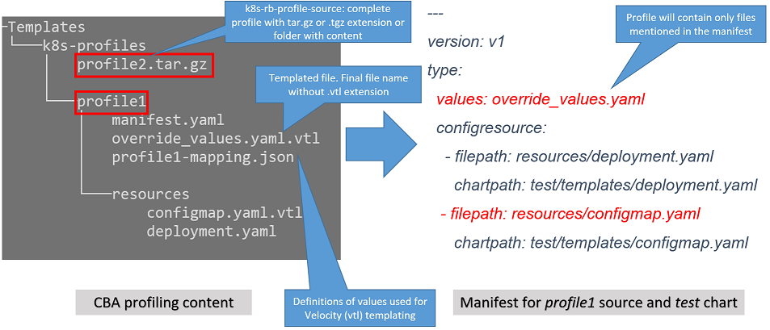

.. This work is licensed under a Creative Commons Attribution 4.0 International License.
.. http://creativecommons.org/licenses/by/4.0
.. Copyright 2021 ONAP

.. _docs_vFW_CNF_CDS:

:orphan:

vFirewall CNF Use Case
----------------------

Source files
~~~~~~~~~~~~
- Heat/Helm/CDS models: `vFW_CNF_CDS Model`_
- Automation Scripts: `vFW_CNF_CDS Automation`_

Description
~~~~~~~~~~~
This use case is a combination of `vFW CDS Dublin`_ and `vFW EDGEX K8S`_ use cases and it is continously improved since Frankfurt release. The aim is to continue improving Kubernetes based Network Functions (a.k.a CNF) support in ONAP. Use case continues where `vFW EDGEX K8S`_ left and brings CDS support into picture like `vFW CDS Dublin`_ did for the old vFW Use case. Predecessor use case is also documented here `vFW EDGEX K8S In ONAP Wiki`_.

This use case shows how to onboard helm packages and to instantiate them with help of ONAP. Following improvements were made in the vFW CNF Use Case:

- vFW Kubernetes Helm charts support overrides (previously mostly hardcoded values)
- SDC accepts Onboarding Package with many helm packages what allows to keep decomposition of service instance similar to `vFW CDS Dublin`_
- Compared to `vFW EDGEX K8S`_ use case **MACRO** workflow in SO is used instead of VNF a'la carte workflow
- No VNF data preloading used, instead resource-assignment feature of CDS is used
- CDS is used to resolve instantiation time parameters (Helm overrides)
  * IP addresses with IPAM
  * Unique names for resources with ONAP naming service
  * CDS is used to create and upload **multicloud/k8s profile** as part of instantiation flow
- Combined all models (Heat, Helm, CBA) in to same git repo and a created single onboarding package `vFW_CNF_CDS Model`_
- vFW CNF status is monitored prior to the completion of the instantiation process.
- It is possible to not only provide overrides for Helm packages but we can modify Helm packages before instantiation or we can modify CNF after its deployment
- Use case does not contain Closed Loop part of the vFW demo.

All changes to related ONAP components and Use Case can be found in the following tickets:

- `REQ-182`_
- `REQ-341`_
- `REQ-458`_
- `REQ-627`_

**Since Guilin ONAP supports Helm packages as a native onboarding artifacts and SO natively orchestrates Helm packages what brings significant advantages in the future. Also since Guilin release ONAP has first mechanisms for monitoring of the status of deployed CNF resources. Since Honolulu release native CNF testing capability was enabled that allows for execution of the dedicated test jobs for each helm package**.

The vFW CNF Use Case
~~~~~~~~~~~~~~~~~~~~
The vFW CNF CDS use case shows how to instantiate multiple CNF instances in similar way as VNFs bringing CNFs closer to first class citizens in ONAP.

One of the biggest practical change compared to the old demos (any ONAP demo) is that whole network function content (user provided content) is collected to one place and more importantly into git repository (`vFW_CNF_CDS Model`_) that provides version control (that is pretty important thing). That is very basic thing but unfortunately this is a common problem when running any ONAP demo and trying to find all content from many different git repositories and even some files only in ONAP wiki.

Demo git directory has also `Data Dictionary`_ file (CDS model time resource) included.

Another founding idea from the start was to provide complete content in single onboarding package available directly from that git repository. Not any revolutionary idea as that's the official package format ONAP supports and all content supposed to be in that same package for single service regardless of the models and closed loops and configurations etc.

Following table describes all the source models to which this demo is based on.

===============  =================       ===========
Model            Git reference           Description
---------------  -----------------       -----------
Heat             `vFW_NextGen`_          Heat templates used in original vFW demo but split into multiple vf-modules
Helm             `vFW_Helm Model`_       Helm templates used in `vFW EDGEX K8S`_ demo
CDS model        `vFW CBA Model`_        CDS CBA model used in `vFW CDS Dublin`_ demo
===============  =================       ===========

.. note::  Since the Guilin release `vFW_CNF_CDS Model`_ contains sources that allow to model and instantiate CNF with VNF/Heat orchestration approach (Frankfurt) and with native Helm orchestration approach (Guilin and beyond). VNF/Heat orchestration approach is deprecated and will not be enhanced in the future. Please follow README.txt description and further documentation here to generate and select appropriate onboarding package which will leverage appropriate SO orchestration path.

Since Honolulu release vFW CNF use case supports three different scenarios where different capabilities of CNF Orchestration in ONAP can be experimented:

   vFW CNF Scenarios

- Scenario 1: simple deployment of vFW CNF instance
- Scenario 2: deployment of vFW CNF instance with enrichment of the Helm deployment with profiling mechanism
- Scenario 3: deployment of vFW CNF instance with Day2 configuration applied and CNF status checked as a prt of config-deploy operation 

The 3rd scenarios present the most comprehensive way of managing the CNF in ONAP, including Day 0/1/2 operations. It shows also how to combine in the Day2 operation information for the AAI and SDNC MDSAL. All scenarios can be supported by execution of the dedicated Healthcheck workflow `3-5 Verification of the CNF Status`_. 

Modeling of Onboarding Package/Helm
...................................

The starting point for this demo was Helm package containing one Kubernetes application, see `vFW_Helm Model`_. In this demo we decided to follow SDC/SO vf-module concept the same way as original vFW demo was split into multiple vf-modules instead of one (`vFW_NextGen`_). The same way we splitted Helm version of vFW into multiple Helm packages each matching one dedicated vf-module.

The Istanbul version of the `vFW_CNF_CDS Model`_ contains files required to create **VSP onboarding packages in two formats**: the **Dummy Heat** (available in Frankfurt release already) one that considers association of each Helm package with dummy heat templates and the **Native Helm** one where each Helm package is standalone and is natively understood in consequence by SO. For both variants of VSP Helm packages are matched to the vf-module concept, so basically each Helm application after instantiation is visible to ONAP as a separate vf-module. The chosen format for onboarding has **crucial** role in the further orchestration approach applied for Helm package instantiation. The **Dummy Heat** will result with orchestration through the **Openstack Adapter** component of SO while **Native Helm** will result with **CNF Adapter**. Both approaches will result with instantiation of the same CNF, however the **Native Helm** approach will be enhanced in the future releases while **Dummy Heat** approach will become deprecated in the future. Read more in `3-1 CNF Orchestration Paths in ONAP`_

Produced **Dummy Heat** VSP onboarding package `Creating Onboarding Package`_ format has following MANIFEST file (package_dummy/MANIFEST.json). The Helm package is delivered as CLOUD_TECHNOLOGY_SPECIFIC_ARTIFACT package through SDC and SO. Dummy heat templates are matched to Helm packages by the same prefix <vf_module_label> of the file name that for both dummy Heat template and for CLOUD_TECHNOLOGY_SPECIFIC_ARTIFACT must be the same, like i.e. *vpg* vf-module in the manifest file below. The name of the CLOUD_TECHNOLOGY_SPECIFIC_ARTIFACT artifact is predefined and needs to match the pattern: <vf_module_label>_cloudtech_k8s_charts.tgz.

::

    {
        "name": "virtualFirewall",
        "description": "",
        "data": [
            {
                "file": "CBA.zip",
                "type": "CONTROLLER_BLUEPRINT_ARCHIVE"
            },
            {
                "file": "base_template.yaml",
                "type": "HEAT",
                "isBase": "true",
                "data": [
                    {
                        "file": "base_template.env",
                        "type": "HEAT_ENV"
                    }
                ]
            },
            {
                "file": "base_template_cloudtech_k8s_charts.tgz",
                "type": "CLOUD_TECHNOLOGY_SPECIFIC_ARTIFACT"
            },
            {
                "file": "vfw.yaml",
                "type": "HEAT",
                "isBase": "false",
                "data": [
                    {
                        "file": "vfw.env",
                        "type": "HEAT_ENV"
                    }
                ]
            },
            {
                "file": "vfw_cloudtech_k8s_charts.tgz",
                "type": "CLOUD_TECHNOLOGY_SPECIFIC_ARTIFACT"
            },
            {
                "file": "vpkg.yaml",
                "type": "HEAT",
                "isBase": "false",
                "data": [
                    {
                        "file": "vpkg.env",
                        "type": "HEAT_ENV"
                    }
                ]
            },
            {
                "file": "vpkg_cloudtech_k8s_charts.tgz",
                "type": "CLOUD_TECHNOLOGY_SPECIFIC_ARTIFACT"
            },
            {
                "file": "vsn.yaml",
                "type": "HEAT",
                "isBase": "false",
                "data": [
                    {
                        "file": "vsn.env",
                        "type": "HEAT_ENV"
                    }
                ]
            },
            {
                "file": "vsn_cloudtech_k8s_charts.tgz",
                "type": "CLOUD_TECHNOLOGY_SPECIFIC_ARTIFACT"
            }
        ]
    }

Produced **Native Helm** VSP onboarding package `Creating Onboarding Package`_ format has following MANIFEST file (package_native/MANIFEST.json). The Helm package is delivered as HELM package through SDC and SO. The *isBase* flag of HELM artifact is ignored by SDC but in the manifest one HELM or HEAT artifacts must be defined as isBase = true. If both HEAT and HELM are present in the same manifest file the base one must be always one of HELM artifacts. Moreover, the name of HELM type artifact must match the specified pattern: *helm_<some_name>* and the HEAT type artifacts, if present in the same manifest, cannot contain keyword *helm*. These limitations are a consequence of current limitations of the SDC onboarding and VSP validation engine and will be adresssed in the future releases.

::

    {
        "name": "virtualFirewall",
        "description": "",
        "data": [
            {
                "file": "CBA.zip",
                "type": "CONTROLLER_BLUEPRINT_ARCHIVE"
            },
            {
                "file": "helm_base_template.tgz",
                "type": "HELM",
                "isBase": "true"
            },
            {
                "file": "helm_vfw.tgz",
                "type": "HELM",
                "isBase": "false"
            },
            {
                "file": "helm_vpkg.tgz",
                "type": "HELM",
                "isBase": "false"
            },
            {
                "file": "helm_vsn.tgz",
                "type": "HELM",
                "isBase": "false"
            }
        ]
    }

.. note::  CDS model (CBA package) is delivered as SDC supported own type CONTROLLER_BLUEPRINT_ARCHIVE but the current limitation of VSP onbarding forces to use the artifact name *CBA.zip* to automaticaly recognize CBA as a CONTROLLER_BLUEPRINT_ARCHIVE.

CDS Model (CBA)
...............

CDS plays a crucial role in the process of CNF instantiation and is responsible for delivery of instantiation parameters, CNF customization, configuration of CBF after the deployment and may be used in the process of CNF status verification.

Creating CDS model was the core of the use case work and also the most difficult and time consuming part. Current template used by use-case should be easily reusable for anyone. Once CDS GUI will be fully working, we think that CBA development should be much easier. For CBA structure reference, please visit it's documentation page `CDS Documentation`_.

At first the target was to keep CDS model as close as possible to `vFW_CNF_CDS Model`_ use case model and only add smallest possible changes to enable also k8s usage. That is still the target but in practice model deviated from the original one already and time pressure pushed us to not care about sync. Basically the end result could be possible much streamlined if wanted to be smallest possible to working only for K8S based network functions.

Base on this example there are demonstrated following features of CDS and CBA model

- resource assignment string, integer and json types
- sourcing of resolved value on vf-module level from vnf level assignment
- extracting data from AAI and MD-SAL during the resource assignment
- custom resource assignment with Kotlin script
- templating of the vtl files
- building of imperative workflows
- utilization of on_succes and on_failure event in imperative workflow
- handling of the failure in the workflow
- implementation of custom workflow logic with Kotlin script
- example of config-assign and config-deploy operation decomposed into many steps
- complex parametrization of config deploy operation
- combination and aggregation of AAI and MD-SAL data in config-assign and config-deploy operations

The prepared CBA model demonstrates also how to utilize CNF specific features of CBA, suited for the deployment of CNF with k8splugin in ONAP:

- building and upload of k8s profile template into k8splugin
- building and upload of k8s configuration template into k8splugin
- parametrization and creation of configuration instance from configuration template
- validation of CNF status with Kotlin script

As K8S application is split into multiple Helm packages to match vf-modules, CBA modeling follows the same and for each vf-module there's own template in CBA package. The list of artifact with the templates is different for **Dummy Heat** and **Native Helm** approach. The second one has artifact names starting with *helm_* prefix, in the same way like names of artifacts in the MANIFEST file of VSP differs. The **Dummy Heat** artifacts' list is following:

::

    "artifacts" : {
      "base_template-template" : {
        "type" : "artifact-template-velocity",
        "file" : "Templates/base_template-template.vtl"
      },
      "base_template-mapping" : {
        "type" : "artifact-mapping-resource",
        "file" : "Templates/base_template-mapping.json"
      },
      "vpkg-template" : {
        "type" : "artifact-template-velocity",
        "file" : "Templates/vpkg-template.vtl"
      },
      "vpkg-mapping" : {
        "type" : "artifact-mapping-resource",
        "file" : "Templates/vpkg-mapping.json"
      },
      "vfw-template" : {
        "type" : "artifact-template-velocity",
        "file" : "Templates/vfw-template.vtl"
      },
      "vfw-mapping" : {
        "type" : "artifact-mapping-resource",
        "file" : "Templates/vfw-mapping.json"
      },
      "vnf-template" : {
        "type" : "artifact-template-velocity",
        "file" : "Templates/vnf-template.vtl"
      },
      "vnf-mapping" : {
        "type" : "artifact-mapping-resource",
        "file" : "Templates/vnf-mapping.json"
      },
      "vsn-template" : {
        "type" : "artifact-template-velocity",
        "file" : "Templates/vsn-template.vtl"
      },
      "vsn-mapping" : {
        "type" : "artifact-mapping-resource",
        "file" : "Templates/vsn-mapping.json"
      }
    }

The **Native Helm** artifacts' list is following:

::

    "artifacts" : {
      "helm_base_template-template" : {
        "type" : "artifact-template-velocity",
        "file" : "Templates/base_template-template.vtl"
      },
      "helm_base_template-mapping" : {
        "type" : "artifact-mapping-resource",
        "file" : "Templates/base_template-mapping.json"
      },
      "helm_vpkg-template" : {
        "type" : "artifact-template-velocity",
        "file" : "Templates/vpkg-template.vtl"
      },
      "helm_vpkg-mapping" : {
        "type" : "artifact-mapping-resource",
        "file" : "Templates/vpkg-mapping.json"
      },
      "helm_vfw-template" : {
        "type" : "artifact-template-velocity",
        "file" : "Templates/vfw-template.vtl"
      },
      "helm_vfw-mapping" : {
        "type" : "artifact-mapping-resource",
        "file" : "Templates/vfw-mapping.json"
      },
      "vnf-template" : {
        "type" : "artifact-template-velocity",
        "file" : "Templates/vnf-template.vtl"
      },
      "vnf-mapping" : {
        "type" : "artifact-mapping-resource",
        "file" : "Templates/vnf-mapping.json"
      },
      "helm_vsn-template" : {
        "type" : "artifact-template-velocity",
        "file" : "Templates/vsn-template.vtl"
      },
      "helm_vsn-mapping" : {
        "type" : "artifact-mapping-resource",
        "file" : "Templates/vsn-mapping.json"
      }
    }

SO requires for instantiation name of the profile in the parameter: *k8s-rb-profile-name* and name of the release of thr application: *k8s-rb-instance-release-name*. The latter one, when not specified, will be replaced with combination of profile name and vf-module-id for each Helm instance/vf-module instantiated. Both values can be found in vtl templates dedicated for vf-modules.

CBA offers possibility of the automatic generation and upload to multicloud/k8s plugin the RB profile content. RB profile is required if you want to deploy your CNF into k8s namesapce other than *default*. Also, if you want to ensure particular templating of your Helm charts, specific to particular version of the cluster into which Helm packages will deployed on, profile is used to specify the version of your cluster.

RB profile can be used to enrich or to modify the content of the original helm package. Profile can be also used to add additional k8s helm templates for helm installation or can be used to modify existing k8s helm templates for each create CNF instance. It opens another level of CNF customization, much more than customization of the Helm package with override values. K8splugin offers also *default* profile without content, for default namespace and default cluster version.

::

  ---
  version: v1
  type:
    values: "override_values.yaml"
    configresource:
      - filepath: resources/deployment.yaml
        chartpath: templates/deployment.yaml

Above we have exemplary manifest file of the RB profile. Since Frankfurt *override_values.yaml* file does not need to be used as instantiation values are passed to the plugin over Instance API of k8s plugin. In the example, profile contains additional k8s Helm template which will be added on demand to the helm package during its installation. In our case, depending on the SO instantiation request input parameters, vPGN helm package can be enriched with additional ssh service. Such service will be dynamically added to the profile by CDS and later on CDS will upload whole custom RB profile to multicloud/k8s plugin.

In order to support generation and upload of profile, our vFW CBA model has enhanced **resource-assignment** workflow which contains additional step: **profile-upload**. It leverages dedicated functionality introduced in Guilin release that can be used to upload predefined profile or to generate and upload content of the profile with Velocity templating mechanism.

::

    "resource-assignment": {
        "steps": {
            "resource-assignment": {
                "description": "Resource Assign Workflow",
                "target": "resource-assignment",
                "activities": [
                    {
                        "call_operation": "ResourceResolutionComponent.process"
                    }
                ],
                "on_success": [
                    "profile-upload"
                ]
            },
            "profile-upload": {
                "description": "Generate and upload K8s Profile",
                "target": "k8s-profile-upload",
                "activities": [
                    {
                        "call_operation": "ComponentScriptExecutor.process"
                    }
                ]
            }
        },

.. note:: In the Frankfurt release profile upload was implemented as a custom Kotlin script included into the CBA. It was responsible for upload of K8S profile into multicloud/k8s plugin. It is still a good example of  the integration of Kotlin scripting into the CBA. For those interested in this functionaliy we recommend to look into the `Frankfurt CBA Definition`_ and `Frankfurt CBA Script`_. Since Honolulu we introduce more advanced use of the Kotlin script for verification of the CNF status or custom resolution of complex parameters over Kotlin script - both can be found in the further part of the documentation.

In our example for vPKG helm package we may select *vfw-cnf-cds-vpkg-profile* profile that is included into CBA as a folder. Profile generation step uses Velocity templates processing embedded CDS functionality on its basis ssh port number (specified in the SO request as *vpg-management-port*).

::

    {
        "name": "vpg-management-port",
        "property": {
            "description": "The number of node port for ssh service of vpg",
            "type": "integer",
            "default": "0"
        },
        "input-param": false,
        "dictionary-name": "vpg-management-port",
        "dictionary-source": "default",
        "dependencies": []
    }

*vpg-management-port* can be included directly into the helm template and such template will be included into vPKG helm package in time of its instantiation.

::

  apiVersion: v1
  kind: Service
  metadata:
    name: {{ .Values.vpg_name_0 }}-ssh-access
    labels:
      vnf-name: {{ .Values.vnf_name }}
      vf-module-name: {{ .Values.vpg_name_0 }}
      release: {{ .Release.Name }}
      chart: {{ .Chart.Name }}
  spec:
    type: NodePort
    ports:
      - port: 22
        nodePort: ${vpg-management-port}
    selector:
      vf-module-name: {{ .Values.vpg_name_0 }}
      release: {{ .Release.Name }}
      chart: {{ .Chart.Name }}

.. warning:: The port value is of Integer type and CDS resolves it as an integer. If the resolved values are returned to SO during the resource resolution phase they are being passed to k8splugin back only as a strings. In consequence, Integer values are passed to the Instantiation API as a strings and then they have go be converted in the helm template to the integer. In order to avoid such conversion it is better to customize override values with Integers in the profile and to skip return of this parameters in the resource resolution phase (they should not be included in the .vtl files).

The mechanism of profile generation and upload requires specific node teamplate in the CBA definition. In our case, it comes with the declaration of two profiles: one static *vfw-cnf-cds-base-profile* in a form of an archive and the second complex *vfw-cnf-cds-vpkg-profile* in a form of a folder for processing and profile generation. Below is the example of the definition of node type for execution of the profile upload operation.

::

    "k8s-profile-upload": {
        "type": "component-k8s-profile-upload",
        "interfaces": {
            "K8sProfileUploadComponent": {
                "operations": {
                    "process": {
                        "inputs": {
                            "artifact-prefix-names": {
                                "get_input": "template-prefix"
                            },
                            "resource-assignment-map": {
                                "get_attribute": [
                                    "resource-assignment",
                                    "assignment-map"
                                ]
                            }
                        }
                    }
                }
            }
        },
        "artifacts": {
            "vfw-cnf-cds-base-profile": {
                "type": "artifact-k8sprofile-content",
                "file": "Templates/k8s-profiles/vfw-cnf-cds-base-profile.tar.gz"
            },
            "vfw-cnf-cds-vpkg-profile": {
                "type": "artifact-k8sprofile-content",
                "file": "Templates/k8s-profiles/vfw-cnf-cds-vpkg-profile"
            },
            "vfw-cnf-cds-vpkg-profile-mapping": {
                "type": "artifact-mapping-resource",
                "file": "Templates/k8s-profiles/vfw-cnf-cds-vpkg-profile/ssh-service-mapping.json"
            }
        }
    }

Artifact file determines a place of the static profile or the content of the complex profile. In the latter case we need a pair of profile folder and mapping file with a declaration of the parameters that CDS needs to resolve first, before the Velocity templating is applied to the .vtl files present in the profile content. After Velocity templating the .vtl extensions will be dropped from the file names. The embedded mechanism will include in the profile only files present in the profile MANIFEST file that needs to contain the list of final names of the files to be included into the profile. The figure below shows the idea of profile templating.

   K8s Profile Templating

SO requires for instantiation name of the profile in the parameter: *k8s-rb-profile-name*. The *component-k8s-profile-upload* that stands behind the profile uploading mechanism has input parameters that can be passed directly (checked in the first order) or can be taken from the *resource-assignment-map* parameter which can be a result of associated *component-resource-resolution* result, like in our case their values are resolved on vf-module level resource assignment. The *component-k8s-profile-upload* inputs are following:

- k8s-rb-definition-name - the name under which RB definition was created - **VF Module Model Invariant ID** in ONAP
- k8s-rb-definition-version - the version of created RB definition name - **VF Module Model Customization ID**  in ONAP
- k8s-rb-profile-name - (mandatory) the name of the profile under which it will be created in k8s plugin. Other parameters are required only when profile must be uploaded because it does not exist yet
- k8s-rb-profile-source - the source of profile content - name of the artifact of the profile. If missing *k8s-rb-profile-name* is treated as a source
- k8s-rb-profile-namespace - the k8s namespace name associated with profile being created
- k8s-rb-profile-kubernetes-version - the version of the cluster on which application will be deployed - it may impact the helm templating process like selection of the api versions for resources.
- resource-assignment-map - result of the associated resource assignment step - it may deliver values of inputs if they are not specified directly
- artifact-prefix-names - (mandatory) the list of artifact prefixes like for resource-assigment step in the resource-assigment workflow or its subset

In the SO request user can pass parameter of name *k8s-rb-profile-name* which in our case may have value: *vfw-cnf-cds-base-profile*, *vfw-cnf-cds-vpkg-profile* or *default*. The *default* profile does not contain any content inside and allows instantiation of CNF without the need to define and upload any additional profiles. *vfw-cnf-cds-vpkg-profile* has been prepared to test instantiation of the second modified vFW CNF instance.

K8splugin allows to specify override parameters (similar to --set behavior of helm client) to instantiated resource bundles. This allows for providing dynamic parameters to instantiated resources without the need to create new profiles for this purpose. This mechanism should be used with *default* profile but may be used also with any custom profile.

The overall flow of helm overrides parameters processing is visible on following figure. When *rb definition* (helm package) is being instantiated for specified *rb profile* K8splugin combines override values from the helm package, *rb profile* and from the instantiation request - in the respective order. It means that the value from the instantiation request (SO request input or CDS resource assignement result) has a precedence over the value from the *rb profile* and value from the *rb profile* has a precedence over the helm package default override value. Similarly, profile can contain resource files that may extend or ammend the existing files for the original helm package content.

.. figure:: files/vFW_CNF_CDS/helm-overrides.png
   :align: center

   The overall flow of helm data processing

Both profile content (4) like the instantiation request values (5) can be generated during the resource assignment process according to its definition for CBA associated with helm package. CBA may generate i.e. names, IP addresses, ports and can use this information to produce the *rb-profile* (3) content. Finally, all three sources of override values, temnplates and additional resources files are merged together (6) by K8splugin in the order exaplained before.

.. figure:: files/vFW_CNF_CDS/helm-overrides-steps.png
   :align: center

   The steps of processing of helm data with help of CDS

Both profile content (4) like the instantiation request values (5) can be generated during the resource assignment process according to its definition for CBA associated with helm package. CBA may generate i.e. names, IP addresses, ports and can use this information to produce the *rb-profile* (3) content. Finally, all three sources of override values, temnplates and additional resources files are merged together (6) by K8splugin in the order exaplained before.

Beside the deployment of Helm application the CBA of vFW demonstrates also how to use deicated features for config-assign (7) and config-deploy (8) operations. In the use case, config-assign and config-deploy operations deal mainly with creation and instantiation of configuration template for k8s plugin. The configuration template has a form of Helm package. When k8s plugin instantiates configuration, it creates or may replace existing resources deployed on k8s cluster. In our case the configuration template is used to provide alternative way of upload of the additional ssh-service but it coud be used to modify configmap of vfw or vpkg vf-modules.

In order to provide configuration instantiation capability standard condfig-assign and config-deploy workflows have been changed into imperative workflows with first step responsible for collection of informatino for configuration templating and configuration instantiation. The source of data for this operations is AAI, MDSAL with data for vnf and vf-modules as config-assign and config-deploy does not receive dedicated input parameters from SO. In consequence both operations need to source from resource-assignent phase and data placed in the AAI and MDSAL.

vFW CNF config-assign workflow is following:

::

    "config-assign": {
        "steps": {
            "config-setup": {
                "description": "Gather necessary input for config template upload",
                "target": "config-setup-process",
                "activities": [
                    {
                        "call_operation": "ResourceResolutionComponent.process"
                    }
                ],
                "on_success": [
                    "config-template"
                ]
            },
            "config-template": {
                "description": "Generate and upload K8s config template",
                "target": "k8s-config-template",
                "activities": [
                    {
                        "call_operation": "K8sConfigTemplateComponent.process"
                    }
                ]
            }
        },

vFW CNF config-deploy workflow is following:

::

    "config-deploy": {
        "steps": {
            "config-setup": {
                "description": "Gather necessary input for config init and status verification",
                "target": "config-setup-process",
                "activities": [
                    {
                        "call_operation": "ResourceResolutionComponent.process"
                    }
                ],
                "on_success": [
                    "config-apply"
                ]
            },
            "config-apply": {
                "description": "Activate K8s config template",
                "target": "k8s-config-apply",
                "activities": [
                    {
                        "call_operation": "K8sConfigTemplateComponent.process"
                    }
                ],
                "on_success": [
                    "status-verification-script"
                ]
            },

In our example configuration template for vFW CNF is a helm package that contains the same resource that we can find in the vPKG *vfw-cnf-cds-vpkg-profile* profile - extra ssh service. This helm package contains Helm encapsulation for ssh-service and the values.yaml file with declaration of all the inputs that may parametrize the ssh-service. The configuration templating step leverages the *component-k8s-config-template* component that prepares the configuration template and uploads it to k8splugin. In consequence, it may be used later on for instatiation of the configuration.

In this use case we have two options with *ssh-service-config* and *ssh-service-config-customizable* as a source of the same configuration template. In consequence, or we take a complete template or we have have the template folder with the content of the helm package and CDS may perform dedicated resource resolution for it with templating of all the files with .vtl extensions. The process is very similar to the one describe for profile upload functionality.

::

    "k8s-config-template": {
        "type": "component-k8s-config-template",
        "interfaces": {
            "K8sConfigTemplateComponent": {
                "operations": {
                    "process": {
                        "inputs": {
                            "artifact-prefix-names": [
                                "helm_vpkg"
                            ],
                            "resource-assignment-map": {
                                "get_attribute": [
                                    "config-setup-process",
                                    "",
                                    "assignment-map",
                                    "config-deploy",
                                    "config-deploy-setup"
                                ]
                            }
                        }
                    }
                }
            }
        },
        "artifacts": {
            "ssh-service-config": {
                "type": "artifact-k8sconfig-content",
                "file": "Templates/k8s-configs/ssh-service.tar.gz"
            },
            "ssh-service-config-customizable": {
                "type": "artifact-k8sconfig-content",
                "file": "Templates/k8s-configs/ssh-service-config"
            },
            "ssh-service-config-customizable-mapping": {
                "type": "artifact-mapping-resource",
                "file": "Templates/k8s-configs/ssh-service-config/ssh-service-mapping.json"
            }
        }
    }

The *component-k8s-config-template* that stands behind creation of configuration template has input parameters that can be passed directly (checked in the first order) or can be taken from the *resource-assignment-map* parameter which can be a result of associated *component-resource-resolution* result, like in vFW CNF use case their values are resolved on vf-module level dedicated for config-assign and config-deploy resource assignment step. The *component-k8s-config-template* inputs are following:

- k8s-rb-definition-name - the name under which RB definition was created - **VF Module Model Invariant ID** in ONAP
- k8s-rb-definition-version - the version of created RB definition name - **VF Module Model Customization ID**  in ONAP
- k8s-rb-config-template-name - (mandatory) the name of the configuration template under which it will be created in k8s plugin. Other parameters are required only when configuration template must be uploaded because it does not exist yet
- k8s-rb-config-template-source - the source of config template content - name of the artifact of the configuration template. If missing *k8s-rb-config-template-name* is treated as a source
- resource-assignment-map - result of the associated resource assignment step - it may deliver values of inputs if they are not specified directly
- artifact-prefix-names - (mandatory) the list of artifact prefixes like for resource-assigment step in the resource-assigment workflow or its subset

In our case the *component-k8s-config-template* component receives all the inputs from the dedicated resource-assignment process  *config-setup* that is responsible for resolution of all the inputs for configuration templating. This process generates data for *helm_vpkg* prefix and such one is specified in the list of prefixes of the configuration template component. It means that configuration template will be prepared only for vPKG function.

::

    "k8s-config-apply": {
        "type": "component-k8s-config-value",
        "interfaces": {
            "K8sConfigValueComponent": {
                "operations": {
                    "process": {
                        "inputs": {
                            "artifact-prefix-names": [
                                "helm_vpkg"
                            ],
                            "k8s-config-operation-type": "create",
                            "resource-assignment-map": {
                                "get_attribute": [
                                    "config-setup-process",
                                    "",
                                    "assignment-map",
                                    "config-deploy",
                                    "config-deploy-setup"
                                ]
                            }
                        }
                    }
                }
            }
        },
        "artifacts": {
            "ssh-service-default": {
                "type": "artifact-k8sconfig-content",
                "file": "Templates/k8s-configs/ssh-service-config/values.yaml"
            },
            "ssh-service-config": {
                "type": "artifact-k8sconfig-content",
                "file": "Templates/k8s-configs/ssh-service-values/values.yaml.vtl"
            },
            "ssh-service-config-mapping": {
                "type": "artifact-mapping-resource",
                "file": "Templates/k8s-configs/ssh-service-values/ssh-service-mapping.json"
            }
        }
    }

The *component-k8s-config-value* that stands behind creation of configuration instance has input parameters that can be passed directly (checked in the first order) or can be taken from the *resource-assignment-map* parameter which can be a result of associated *component-resource-resolution* result, like in vFW CNF use case their values are resolved on vf-module level dedicated for config-assign and config-deploy resource assignment step. The *component-k8s-config-value* inputs are following:

- k8s-rb-config-name - (mandatory) the name of the configuration template under which it will be created in k8s plugin. Other parameters are required only when configuration template must be uploaded because it does not exist yet
- k8s-rb-config-template-name - (mandatory) the name of the configuration template under which it will be created in k8s plugin. Other parameters are required only when configuration template must be uploaded because it does not exist yet
- k8s-rb-config-value-source - the source of config template content - name of the artifact of the configuration template. If missing *k8s-rb-config-name* is treated as a source
- k8s-instance-id - (mandatory) the identifier of the rb instance for which the configuration should be applied
- k8s-config-operation-type - the type of the configuration operation to perform: create, update or delete. By default create operation is performed
- resource-assignment-map - result of the associated resource assignment step - it may deliver values of inputs if they are not specified directly
- artifact-prefix-names - (mandatory) the list of artifact prefixes like for resource-assigment step in the resource-assigment workflow or its subset

Like for the configuration template, the *component-k8s-config-value* component receives all the inputs from the dedicated resource-assignment process *config-setup* that is responsible for resolution of all the inputs for configuration. This process generates data for *helm_vpkg* prefix and such one is specified in the list of prefixes of the configuration values component. It means that configuration instance will be created only for vPKG function (component allows also update or delete of the configuration but in the vFW CNF case it is used only to create configuration instance).

Finally, `Data Dictionary`_ is also included into demo git directory, re-modeling and making changes into model utilizing CDS model time / runtime is easier as used DD is also known.

.. note:: CBA of vFW CNF use case is already enriched and VSP of vFW CNF has CBA included inside. In conequence, when VSP is being onboarded into SDC and service is being distributed, CBA is uploaded into CDS. Anyway, CDS contains in the starter dictionary all data dictionary values used in the use case and enrichment of CBA should work as well.

Instantiation Overview
----------------------

.. note:: Since Guilin release use case is equipped with automated method **<AUTOMATED>** with python scripts to replace Postman method **<MANUAL>** used in Frankfurt. Nevertheless, Postman collection is good to understand the entire process. If a user selects to follow Postman collection, then automation scripts **must not** be used. **For the entire process use only scripts or only Postman collection**. Both options are described in the further steps of this instruction.

The figure below shows all the interactions that take place during vFW CNF instantiation. It's not describing flow of actions (ordered steps) but rather component dependencies.

.. figure:: files/vFW_CNF_CDS/Instantiation_topology.png
   :align: center

   vFW CNF CDS Use Case Runtime interactions.

PART 1 - ONAP Installation
~~~~~~~~~~~~~~~~~~~~~~~~~~

1-1 Deployment components
.........................

In order to run the vFW_CNF_CDS use case, we need ONAP Istanbul Release (or later) with at least following components:

=======================================================   ===========
ONAP Component name                                       Describtion
-------------------------------------------------------   -----------
AAI                                                       Required for Inventory Cloud Owner, Customer, Owning Entity, Service, Generic VNF, VF Module
SDC                                                       VSP, VF and Service Modeling of the CNF
DMAAP                                                     Distribution of the onboarding package including CBA to all ONAP components
SO                                                        Required for Macro Orchestration using the generic building blocks
CDS                                                       Resolution of cloud parameters including Helm override parameters for the CNF. Creation of the multicloud/k8s profile for CNF instantion. Creation of configuration template and its instantiation
SDNC (needs to include netbox and Naming Generation mS)   Provides GENERIC-RESOURCE-API for cloud Instantiation orchestration via CDS.
Policy                                                    Used to Store Naming Policy
AAF                                                       Used for Authentication and Authorization of requests
Portal                                                    Required to access SDC.
MSB                                                       Exposes multicloud interfaces used by SO.
Multicloud                                                K8S plugin part used to pass SO instantiation requests to external Kubernetes cloud region.
Contrib                                                   Chart containing multiple external components. Out of those, we only use Netbox utility in this use-case for IPAM
Robot                                                     Optional. Can be used for running automated tasks, like provisioning cloud customer, cloud region, service subscription, etc ..
Shared Cassandra DB                                       Used as a shared storage for ONAP components that rely on Cassandra DB, like AAI
Shared Maria DB                                           Used as a shared storage for ONAP components that rely on Maria DB, like SDNC, and SO
=======================================================   ===========

1-2 Deployment
..............

In order to deploy such an instance, follow the `ONAP Deployment Guide`_

As we can see from the guide, we can use an override file that helps us customize our ONAP deployment, without modifying the OOM Folder, so you can download this override file here, that includes the necessary components mentioned above.

**override.yaml** file where enabled: true is set for each component needed in demo (by default all components are disabled).

::

  aai:
    enabled: true
  aaf:
    enabled: true
  cassandra:
    enabled: true
  cds:
    enabled: true
  contrib:
    enabled: true
  dmaap:
    enabled: true
  mariadb-galera:
    enabled: true
  msb:
    enabled: true
  multicloud:
    enabled: true
  policy:
    enabled: true
  portal:
    enabled: true
  robot:
    enabled: true
  sdc:
    enabled: true
  sdnc:
    enabled: true
  so:
    enabled: true

Then deploy ONAP with Helm with your override file.

::

    helm deploy onap local/onap --namespace onap -f ~/override.yaml

In case redeployment needed `Helm Healer`_ could be a faster and convenient way to redeploy.

::

    helm-healer.sh -n onap -f ~/override.yaml -s /dockerdata-nfs --delete-all

Or redeploy (clean re-deploy also data removed) just wanted components (Helm releases), cds in this example.

::

    helm-healer.sh -f ~/override.yaml -s /dockerdata-nfs/ -n onap -c onap-cds

There are many instructions in ONAP wiki how to follow your deployment status and does it succeeded or not, mostly using Robot Health checks. One way we used is to skip the outermost Robot wrapper and use directly ete-k8s.sh to able to select checked components easily. Script is found from OOM git repository *oom/kubernetes/robot/ete-k8s.sh*.

::

    {
    failed=
    for comp in {aaf,aai,dmaap,msb,multicloud,policy,portal,sdc,sdnc,so}; do
        if ! ./ete-k8s.sh onap health-$comp; then
            failed=$failed,$comp
        fi
    done
    if [ -n "$failed" ]; then
        echo "These components failed: $failed"
        false
    else
        echo "Healthcheck successful"
    fi
    }

And check status of pods, deployments, jobs etc.

::

    kubectl -n onap get pods | grep -vie 'completed' -e 'running'
    kubectl -n onap get deploy,sts,jobs

1-3 Post Deployment
...................

After completing the first part above, we should have a functional ONAP deployment for the Istanbul Release.

We will need to apply a few modifications to the deployed ONAP Istanbul instance in order to run the use case.

Retrieving logins and passwords of ONAP components
++++++++++++++++++++++++++++++++++++++++++++++++++

Since Frankfurt release hardcoded passwords were mostly removed and it is possible to configure passwords of ONAP components in time of their installation. In order to retrieve these passwords with associated logins it is required to get them with kubectl. Below is the procedure on mariadb-galera DB component example.

::

    kubectl get secret `kubectl get secrets | grep mariadb-galera-db-root-password | awk '{print $1}'` -o jsonpath="{.data.login}" | base64 --decode
    kubectl get secret `kubectl get secrets | grep mariadb-galera-db-root-password | awk '{print $1}'` -o jsonpath="{.data.password}" | base64 --decode

In this case login is empty as the secret is dedicated to root user.

Postman collection setup
++++++++++++++++++++++++

In this demo we have on purpose created all manual ONAP preparation steps (which in real life are automated) by using Postman so it will be clear what exactly is needed. Some of the steps like AAI population is automated by Robot scripts in other ONAP demos (**./demo-k8s.sh onap init**) and Robot script could be used for many parts also in this demo.

Postman collection is used also to trigger instantiation using SO APIs.

Following steps are needed to setup Postman:

- Import this Postman collection zip

  :download:`Postman collection <files/vFW_CNF_CDS/postman.zip>`

- Extract the zip and import Postman collection into Postman. Environment file is provided for reference, it's better to create own environment on your own providing variables as listed in next chapter.
    - `vFW_CNF_CDS.postman_collection.json`
    - `vFW_CNF_CDS.postman_environment.json`

- For use case debugging purposes to get Kubernetes cluster external access to SO CatalogDB (GET operations only), modify SO CatalogDB service to NodePort instead of ClusterIP. You may also create separate own NodePort if you wish, but here we have just edited directly the service with kubectl.

::

    kubectl -n onap edit svc so-catalog-db-adapter
         - .spec.type: ClusterIP
         + .spec.type: NodePort
         + .spec.ports[0].nodePort: 30120

.. note::  The port number 30120 is used in included Postman collection

- You may also want to inspect after SDC distribution if CBA has been correctly delivered to CDS. In order to do it, there are created relevant calls later described in doc, however CDS since Frankfurt doesn't expose blueprints-processor's service as NodePort. This is OPTIONAL but if you'd like to use these calls later, you need to expose service in similar way as so-catalog-db-adapter above:

::

    kubectl edit -n onap svc cds-blueprints-processor-http
          - .spec.type: ClusterIP
          + .spec.type: NodePort
          + .spec.ports[0].nodePort: 30499

.. note::  The port number 30499 is used in included Postman collection

**Postman variables:**

Most of the Postman variables are automated by Postman scripts and environment file provided, but there are few mandatory variables to fill by user.

=====================  ===================
Variable               Description
---------------------  -------------------
k8s                    ONAP Kubernetes host
sdnc_port              port of sdnc service for accessing MDSAL
service-name           name of service as defined in SDC
service-version        version of service defined in SDC (if service wasn't updated, it should be set to "1.0")
service-instance-name  name of instantiated service (if ending with -{num}, will be autoincremented for each instantiation request)
=====================  ===================

You can get the sdnc_port value with

::

    kubectl -n onap get svc sdnc -o json | jq '.spec.ports[]|select(.port==8282).nodePort'

Automation Environment Setup
............................

Whole content of this use case is stored into single git repository and it contains both the required onboarding information as well as automation scripts for onboarding and instantiation of the use case.

::

  git clone --single-branch --branch istanbul "https://gerrit.onap.org/r/demo"
  cd demo/heat/vFW_CNF_CDS/templates

In order to prepare environment for onboarding and instantiation of the use case make sure you have *git*, *make*, *helm* and *pipenv* applications installed.

The automation scripts are based on `Python SDK`_ and are adopted to automate process of service onboarding, instantiation, deletion and cloud region registration. To configure them for further use:

::

  cd demo/heat/vFW_CNF_CDS/automation

1. Install required packages with
::

    pipenv pipenv install

2. Run virtual python environment
::

    pipenv shell --fancy

3. Add kubeconfig files, one for ONAP cluster, and one for k8s cluster that will host vFW

.. note:: Both files can be configured after creation of k8s cluster for vFW instance `2-1 Installation of Managed Kubernetes`_. Make sure that they have configured external IP address properly. If any cluster uses self signed certificates set also *insecure-skip-tls-verify* flag in the config file.

- artifacts/cluster_kubeconfig - IP address must be reachable by ONAP pods, especially *mutlicloud-k8s* pod

- artifacts/onap_kubeconfig - IP address must be reachable by automation scripts

4. Modify config.py file

- SCENARIO - like described in the `The vFW CNF Use Case`_ section
- NATIVE - when enabled (default) **Native Helm** path will be used, otherwise **Dummy Heat** path will be used (deprecated)
- MACRO_INSTANTIATION - instantiation method used: macro (default) or a'la carte. A'la carte only for the purpose of use with other sue cases
- K8S_NAMESPACE - k8s namespace to use for deployment of CNF (vfirewall by default)
- K8S_VERSION - version of the k8s cluster
- K8S_REGION - name of the k8s region from the CLOUD_REGIONS (kud by default)
- CLOUD_REGIONS - configuration of k8s or Openstack regions
- GLOBAL_CUSTOMER_ID - identifier of customer in ONAP
- VENDOR - name of the Vendor in ONAP
- SERVICENAME - **Name of your service model in SDC**
- SKIP_POST_INSTANTIATION - whether post instantiation configuration should be run (it is set indirectly by *SCENARIO*)
- VNF_PARAM_LIST - list of parameters to pass for VNF creation process
- VF_MODULE_PARAM_LIST - list of parameters to pass for VF Module creation

.. note:: For automation script it is necessary to modify only SCENARIO constant. Other constants may be modified if needed.

AAI
...

Some basic entries are needed in ONAP AAI. These entries are needed ones per onap installation and do not need to be repeated when running multiple demos based on same definitions.

Create all these entries into AAI in this order. Postman collection provided in this demo can be used for creating each entry.

**<MANUAL>**
::

    Postman -> Initial ONAP setup -> Create

- Create Customer
- Create Owning-entity
- Create Platform
- Create Project
- Create Line Of Business

Corresponding GET operations in "Check" folder in Postman can be used to verify entries created. Postman collection also includes some code that tests/verifies some basic issues e.g. gives error if entry already exists.

**<AUTOMATED>**

This step is performed jointly with onboarding step `3-2 Onboarding`_

Naming Policy
+++++++++++++

Naming policy is needed to generate unique names for all instance time resources that are wanted to be modeled in the way naming policy is used. Those are normally VNF, VNFC and VF-module names, network names etc. Naming is general ONAP feature and not limited to this use case.

This usecase leverages default ONAP naming policy - "SDNC_Policy.ONAP_NF_NAMING_TIMESTAMP".
To check that the naming policy is created and pushed OK, we can run the command below from inside any ONAP pod.

::

  curl --silent -k --user 'healthcheck:zb!XztG34' -X GET "https://policy-api:6969/policy/api/v1/policytypes/onap.policies.Naming/versions/1.0.0/policies/SDNC_Policy.ONAP_NF_NAMING_TIMESTAMP/versions/1.0.0"

.. note:: Please change credentials respectively to your installation. The required credentials can be retrieved with instruction `Retrieving logins and passwords of ONAP components`_

PART 2 - Installation of managed Kubernetes cluster
~~~~~~~~~~~~~~~~~~~~~~~~~~~~~~~~~~~~~~~~~~~~~~~~~~~

In this demo the target cloud region is a Kubernetes cluster of your choice basically just like with Openstack. ONAP platform is a bit too much hard wired to Openstack and it's visible in many demos.

2-1 Installation of Managed Kubernetes
......................................

In this demo we use Kubernetes deployment used by ONAP multicloud/k8s team to test their plugin features see `KUD github`_. There's also some outdated instructions in ONAP wiki `KUD in Wiki`_.

KUD deployment is fully automated and also used in ONAP's CI/CD to automatically verify all `Multicloud k8s gerrit`_ commits (see `KUD Jenkins ci/cd verification`_) and that's quite good (and rare) level of automated integration testing in ONAP. KUD deployemnt is used as it's installation is automated and it also includes bunch of Kubernetes plugins used to tests various k8s plugin features. In addition to deployement, KUD repository also contains test scripts to automatically test multicloud/k8s plugin features. Those scripts are run in CI/CD.

See `KUD subproject in github`_ for a list of additional plugins this Kubernetes deployment has. In this demo the tested CNF is dependent on following plugins:

- ovn4nfv
- Multus
- Virtlet

Follow instructions in `KUD github`_ and install target Kubernetes cluster in your favorite machine(s), simplest being just one machine. Your cluster nodes(s) needs to be accessible from ONAP Kuberenetes nodes. Make sure your installed *pip* is of **version < 21.0**. Version 21 do not support python 2.7 that is used in *aio.sh* script. Also to avoid performance problems of your k8s cluster make sure you install only necessary plugins and before running *aio.sh* script execute following command
::

    export KUD_ADDONS="virtlet ovn4nfv"

.. warning:: In order to run vFW CNF Use Case deployment test please make sure that this workaround does not have to be applied as well. `KUD Interface Permission`_

2-2 Cloud Registration
......................

Managed Kubernetes cluster is registered here into ONAP as one cloud region. This obviously is done just one time for this particular cloud. Cloud registration information is kept in AAI.

**<MANUAL>**

Postman collection have folder/entry for each step. Execute in this order.
::

    Postman -> K8s Cloud Region Registration -> Create

- Create Complex
- Create Cloud Region
- Create Complex-Cloud Region Relationship
- Create Service
- Create Service Subscription
- Create Cloud Tenant
- Create Availability Zone
- Upload Connectivity Info

.. note:: For "Upload Connectivity Info" call you need to provide kubeconfig file of existing KUD cluster. You can find that kubeconfig on deployed KUD in the directory `~/.kube/config` and this file can be easily copied e.g. via SCP. Please ensure that kubeconfig contains external IP of K8s cluster in kubeconfig and correct it, if it's not.

SO database needs to be (manually) modified for SO to know that this particular cloud region is to be handled by multicloud. Values we insert needs to obviously match to the ones we populated into AAI.

.. note:: Please change credentials respectively to your installation. The required credentials can be retrieved with instruction `Retrieving logins and passwords of ONAP components`_

::

    kubectl -n onap exec onap-mariadb-galera-0 -it -- mysql -uroot -psecretpassword -D catalogdb
        select * from cloud_sites;
        insert into cloud_sites(ID, REGION_ID, IDENTITY_SERVICE_ID, CLOUD_VERSION, CLLI, ORCHESTRATOR) values("k8sregionfour", "k8sregionfour", "DEFAULT_KEYSTONE", "2.5", "clli2", "multicloud");
        select * from cloud_sites;
        exit

.. note:: The configuration of the new k8s cloud site is documented also here `K8s cloud site config`_

**<AUTOMATED>**

Please copy the kubeconfig file of existing KUD cluster to automation/artifacts/cluster_kubeconfig location `Automation Environment Setup`_ - step **3**. You can find that kubeconfig on deployed KUD in the directory `~/.kube/config` and this file can be easily copied e.g. via SCP. Please ensure that kubeconfig contains external IP of K8s cluster in kubeconfig and correct it, if it's not.

::

    python create_k8s_region.py

PART 3 - Execution of the Use Case
~~~~~~~~~~~~~~~~~~~~~~~~~~~~~~~~~~

This part contains all the steps to run the use case by using ONAP GUIs, Postman or Python automation scripts.

3-1 CNF Orchestration Paths in ONAP
...................................

Following pictures describe the overall sequential flow of the use case in two scenarios: **Dummy Heat** path (with OpenStack adapter) and **Native Helm** path (with CNF Adapter)

Dummy Heat CNF Orchestration (Obsolete)
.......................................

.. warning:: This path is not developed in ONAP since Honolulu release, however ONAP OOM gating process with basic_cnf use case makes sure that basic CNF instantiation with Dummy Heat approach still works. New features from `_REQ-458` and `REQ-627` are integrated and tested only in the Native path.

This orchestration method stands on the grounds of Heat template orchestration mechanisms. In SDC onboarding package needs to contains simple Heat templates that are associated with additional Cloud artifacts. SDC distributes Heat templates to SO and Helm packages to K8sPlugin directly. SO orchestrates the Heat templates without any knowledge about their existence, however the OpenStack adater in SO understands k8s region type for which communication over MSB/Mutlicloud is provided - it handles interaction with K8sPlugin for CNF instantiation.

.. figure:: files/vFW_CNF_CDS/Dummy_Heat_Flow.png
   :align: center

   vFW CNF CDS Use Case sequence flow for *Dummy Heat* (Frankfurt) path.

Native Helm CNF Orchestration
.............................

Introduced in the Guilin release CNF orchestration method brings native distribution of Helm packages from SDC and native orchestration of CNFs (Helm packages) with SO. SO leverages CNF adapter to interact with K8sPlugin that takes resposnibility for the communication with k8s clusters. Heat templates are not required in the SDC onboarding package and thanks to the fact that SO knows about Helm package orchestration synchronization of data between k8s clusters and AAI is possible. Only in this path since Istanbul release k8s-resource object is created in relation to tenantm vf-module and generic-vnf objects in AAI. SO Cnf adapter is resposobile for synchronization of data between AAI and k8s cluster, however currently it happens only once - after creation of CNF by SO, so any further changes (like new pods) will not be synchronized into AAI.

   vFW CNF CDS Use Case sequence flow for *Native Helm* (Guilin+) path.

Kubernetes and Helm Compatibility
.................................

K8sPlugin in Istanbul release supports Helm packages that can be validated by Helm 3.5 application. It means that new Helm fetures introduced after Helm 3.5 version are not supported currently. Moreover, K8sPlugin implementation of Helm does not support upgrade operation and such flow is not supported in ONAP orxhestration workflows. 

K8sPlugin Utilizes also v0.19.4 version of K8s client and its compatibility matrix with k8s clusters can be found here `K8s Client Compatibility`_, Compatibility Matrix section.

3-2 Onboarding
..............

.. note:: Make sure you have performed `Automation Environment Setup`_ steps before following actions here.

Creating Onboarding Package
+++++++++++++++++++++++++++

Content of the onboarding package can be created with provided Makefile in the *template* folder.

Complete content of both Onboarding Packages for **Dummy Heat**  and **Native Helm** is packaged to the following VSP onboarding package files:

- **Dummy Heat** path: **vfw_k8s_demo.zip**

- **Native Helm** path: **native_vfw_k8s_demo.zip**

.. note::  Procedure requires *make* and *helm* applications installed

::

  git clone --single-branch --branch istanbul "https://gerrit.onap.org/r/demo"
  cd demo/heat/vFW_CNF_CDS/templates
  make

The result of make operation execution is following:
::

    make clean
    make[1]: Entering directory '/mnt/c/Users/advnet/Desktop/SOURCES/demo/heat/vFW_CNF_CDS/templates'
    rm -rf package_dummy/
    rm -rf package_native/
    rm -rf cba_dummy
    rm -f vfw_k8s_demo.zip
    rm -f native_vfw_k8s_demo.zip
    make[1]: Leaving directory '/mnt/c/Users/advnet/Desktop/SOURCES/demo/heat/vFW_CNF_CDS/templates'
    make all
    make[1]: Entering directory '/mnt/c/Users/advnet/Desktop/SOURCES/demo/heat/vFW_CNF_CDS/templates'
    mkdir package_dummy/
    mkdir package_native/
    make -C helm
    make[2]: Entering directory '/mnt/c/Users/advnet/Desktop/SOURCES/demo/heat/vFW_CNF_CDS/templates/helm'
    rm -f base_template-*.tgz
    rm -f helm_base_template.tgz
    rm -f base_template_cloudtech_k8s_charts.tgz
    helm package base_template
    Successfully packaged chart and saved it to: /mnt/c/Users/advnet/Desktop/SOURCES/demo/heat/vFW_CNF_CDS/templates/helm/base_template-0.2.0.tgz
    mv base_template-*.tgz helm_base_template.tgz
    cp helm_base_template.tgz base_template_cloudtech_k8s_charts.tgz
    rm -f vpkg-*.tgz
    rm -f helm_vpkg.tgz
    rm -f vpkg_cloudtech_k8s_charts.tgz
    helm package vpkg
    Successfully packaged chart and saved it to: /mnt/c/Users/advnet/Desktop/SOURCES/demo/heat/vFW_CNF_CDS/templates/helm/vpkg-0.2.0.tgz
    mv vpkg-*.tgz helm_vpkg.tgz
    cp helm_vpkg.tgz vpkg_cloudtech_k8s_charts.tgz
    rm -f vfw-*.tgz
    rm -f helm_vfw.tgz
    rm -f vfw_cloudtech_k8s_charts.tgz
    helm package vfw
    Successfully packaged chart and saved it to: /mnt/c/Users/advnet/Desktop/SOURCES/demo/heat/vFW_CNF_CDS/templates/helm/vfw-0.2.0.tgz
    mv vfw-*.tgz helm_vfw.tgz
    cp helm_vfw.tgz vfw_cloudtech_k8s_charts.tgz
    rm -f vsn-*.tgz
    rm -f helm_vsn.tgz
    rm -f vsn_cloudtech_k8s_charts.tgz
    helm package vsn
    Successfully packaged chart and saved it to: /mnt/c/Users/advnet/Desktop/SOURCES/demo/heat/vFW_CNF_CDS/templates/helm/vsn-0.2.0.tgz
    mv vsn-*.tgz helm_vsn.tgz
    cp helm_vsn.tgz vsn_cloudtech_k8s_charts.tgz
    make[2]: Leaving directory '/mnt/c/Users/advnet/Desktop/SOURCES/demo/heat/vFW_CNF_CDS/templates/helm'
    mv helm/helm_*.tgz package_native/
    mv helm/*.tgz package_dummy/
    cp base_dummy/* package_dummy/
    cp base_native/* package_native/
    cp -r cba cba_dummy
    sed -i 's/"helm_/"/g' cba_dummy/Definitions/vFW_CNF_CDS.json
    cd cba_dummy/ && zip -r CBA.zip . -x pom.xml .idea/\* target/\*
    adding: Definitions/ (stored 0%)
    adding: Definitions/artifact_types.json (deflated 69%)
    adding: Definitions/data_types.json (deflated 88%)
    adding: Definitions/node_types.json (deflated 90%)
    adding: Definitions/policy_types.json (stored 0%)
    adding: Definitions/relationship_types.json (stored 0%)
    adding: Definitions/resources_definition_types.json (deflated 94%)
    adding: Definitions/vFW_CNF_CDS.json (deflated 87%)
    adding: Scripts/ (stored 0%)
    adding: Scripts/kotlin/ (stored 0%)
    adding: Scripts/kotlin/README.md (stored 0%)
    adding: Templates/ (stored 0%)
    adding: Templates/base_template-mapping.json (deflated 89%)
    adding: Templates/base_template-template.vtl (deflated 87%)
    adding: Templates/k8s-profiles/ (stored 0%)
    adding: Templates/k8s-profiles/vfw-cnf-cds-base-profile.tar.gz (stored 0%)
    adding: Templates/k8s-profiles/vfw-cnf-cds-vpkg-profile/ (stored 0%)
    adding: Templates/k8s-profiles/vfw-cnf-cds-vpkg-profile/manifest.yaml (deflated 35%)
    adding: Templates/k8s-profiles/vfw-cnf-cds-vpkg-profile/override_values.yaml (stored 0%)
    adding: Templates/k8s-profiles/vfw-cnf-cds-vpkg-profile/ssh-service-mapping.json (deflated 51%)
    adding: Templates/k8s-profiles/vfw-cnf-cds-vpkg-profile/ssh-service-template.yaml.vtl (deflated 56%)
    adding: Templates/nf-params-mapping.json (deflated 88%)
    adding: Templates/nf-params-template.vtl (deflated 44%)
    adding: Templates/vfw-mapping.json (deflated 89%)
    adding: Templates/vfw-template.vtl (deflated 87%)
    adding: Templates/vnf-mapping.json (deflated 89%)
    adding: Templates/vnf-template.vtl (deflated 93%)
    adding: Templates/vpkg-mapping.json (deflated 89%)
    adding: Templates/vpkg-template.vtl (deflated 87%)
    adding: Templates/vsn-mapping.json (deflated 89%)
    adding: Templates/vsn-template.vtl (deflated 87%)
    adding: TOSCA-Metadata/ (stored 0%)
    adding: TOSCA-Metadata/TOSCA.meta (deflated 37%)
    cd cba/ && zip -r CBA.zip . -x pom.xml .idea/\* target/\*
    adding: Definitions/ (stored 0%)
    adding: Definitions/artifact_types.json (deflated 69%)
    adding: Definitions/data_types.json (deflated 88%)
    adding: Definitions/node_types.json (deflated 90%)
    adding: Definitions/policy_types.json (stored 0%)
    adding: Definitions/relationship_types.json (stored 0%)
    adding: Definitions/resources_definition_types.json (deflated 94%)
    adding: Definitions/vFW_CNF_CDS.json (deflated 87%)
    adding: Scripts/ (stored 0%)
    adding: Scripts/kotlin/ (stored 0%)
    adding: Scripts/kotlin/README.md (stored 0%)
    adding: Templates/ (stored 0%)
    adding: Templates/base_template-mapping.json (deflated 89%)
    adding: Templates/base_template-template.vtl (deflated 87%)
    adding: Templates/k8s-profiles/ (stored 0%)
    adding: Templates/k8s-profiles/vfw-cnf-cds-base-profile.tar.gz (stored 0%)
    adding: Templates/k8s-profiles/vfw-cnf-cds-vpkg-profile/ (stored 0%)
    adding: Templates/k8s-profiles/vfw-cnf-cds-vpkg-profile/manifest.yaml (deflated 35%)
    adding: Templates/k8s-profiles/vfw-cnf-cds-vpkg-profile/override_values.yaml (stored 0%)
    adding: Templates/k8s-profiles/vfw-cnf-cds-vpkg-profile/ssh-service-mapping.json (deflated 51%)
    adding: Templates/k8s-profiles/vfw-cnf-cds-vpkg-profile/ssh-service-template.yaml.vtl (deflated 56%)
    adding: Templates/nf-params-mapping.json (deflated 88%)
    adding: Templates/nf-params-template.vtl (deflated 44%)
    adding: Templates/vfw-mapping.json (deflated 89%)
    adding: Templates/vfw-template.vtl (deflated 87%)
    adding: Templates/vnf-mapping.json (deflated 89%)
    adding: Templates/vnf-template.vtl (deflated 93%)
    adding: Templates/vpkg-mapping.json (deflated 89%)
    adding: Templates/vpkg-template.vtl (deflated 87%)
    adding: Templates/vsn-mapping.json (deflated 89%)
    adding: Templates/vsn-template.vtl (deflated 87%)
    adding: TOSCA-Metadata/ (stored 0%)
    adding: TOSCA-Metadata/TOSCA.meta (deflated 37%)
    mv cba/CBA.zip package_native/
    mv cba_dummy/CBA.zip package_dummy/
    cd package_dummy/ && zip -r vfw_k8s_demo.zip .
    adding: base_template.env (deflated 22%)
    adding: base_template.yaml (deflated 59%)
    adding: base_template_cloudtech_k8s_charts.tgz (stored 0%)
    adding: CBA.zip (stored 0%)
    adding: MANIFEST.json (deflated 84%)
    adding: vfw.env (deflated 23%)
    adding: vfw.yaml (deflated 60%)
    adding: vfw_cloudtech_k8s_charts.tgz (stored 0%)
    adding: vpkg.env (deflated 13%)
    adding: vpkg.yaml (deflated 59%)
    adding: vpkg_cloudtech_k8s_charts.tgz (stored 0%)
    adding: vsn.env (deflated 15%)
    adding: vsn.yaml (deflated 59%)
    adding: vsn_cloudtech_k8s_charts.tgz (stored 0%)
    cd package_native/ && zip -r native_vfw_k8s_demo.zip .
    adding: CBA.zip (stored 0%)
    adding: helm_base_template.tgz (stored 0%)
    adding: helm_vfw.tgz (stored 0%)
    adding: helm_vpkg.tgz (stored 0%)
    adding: helm_vsn.tgz (stored 0%)
    adding: MANIFEST.json (deflated 71%)
    mv package_dummy/vfw_k8s_demo.zip .
    mv package_native/native_vfw_k8s_demo.zip .
  $

Import this package into SDC and follow onboarding steps.

Service Creation with SDC
+++++++++++++++++++++++++

**<MANUAL>**

Service Creation in SDC is composed of the same steps that are performed by most other use-cases. For reference, you can relate to `vLB use-case`_

Onboard VSP

- Remember during VSP onboard to choose "Network Package" Onboarding procedure

Create VF and Service
Service -> Properties Assignment -> Choose VF (at right box):

- sdnc_artifact_name - vnf
- sdnc_model_name - vFW_CNF_CDS
- sdnc_model_version - 8.0.0
- skip_post_instantiation_configuration - True

.. note:: Since Honolulu skip_post_instantiation_configuration flag can be set to *False* if we want to run config-assign/config-deploy operations.

**<AUTOMATED>**
.. note:: The onboarding packages for **Dummy Heat** and **Native Helm** path contain different CBA packages but with the same version and number. In consequence, when one VSP is distributed it replaces the CBA package of the other one and you can instantiate service only for the vFW CNF service service model distributed as a last one. If you want to instantiate vFW CNF service, make sure you have fresh distribution of vFW CNF service model.

::

    python onboarding.py

Distribution Of Service
+++++++++++++++++++++++

**<MANUAL>**

Distribute service.

Verify in SDC UI if distribution was successful. In case of any errors (sometimes SO fails on accepting CLOUD_TECHNOLOGY_SPECIFIC_ARTIFACT), try redistribution. You can also verify distribution for few components manually:

- SDC:

    SDC Catalog database should have our service now defined.

    ::

        Postman -> LCM -> [SDC] Catalog Service

    ::

        {
            "uuid": "64dd38f3-2307-4e0a-bc98-5c2cbfb260b6",
            "invariantUUID": "cd1a5c2d-2d4e-4d62-ac10-a5fe05e32a22",
            "name": "vfw_cnf_cds_svc",
            "version": "1.0",
            "toscaModelURL": "/sdc/v1/catalog/services/64dd38f3-2307-4e0a-bc98-5c2cbfb260b6/toscaModel",
            "category": "Network L4+",
            "lifecycleState": "CERTIFIED",
            "lastUpdaterUserId": "cs0008",
            "distributionStatus": "DISTRIBUTED"
        }

    Listing should contain entry with our service name **vfw_cnf_cds_svc**.

.. note:: Note that it's an example name, it depends on how your model is named during Service design in SDC and must be kept in sync with Postman variables.

- SO:

    SO Catalog database should have our service NFs defined now.

    ::

        Postman -> LCM -> [SO] Catalog DB Service xNFs

    ::

        {
            "serviceVnfs": [
                {
                    "modelInfo": {
                        "modelName": "VfVfwK8sDemoCnfMc202109231",
                        "modelUuid": "70edaca8-8c79-468a-aa76-8224cfe686d0",
                        "modelInvariantUuid": "7901fc89-a94d-434a-8454-1e27b99dc0e2",
                        "modelVersion": "1.0",
                        "modelCustomizationUuid": "86dc8af4-aa17-4fc7-9b20-f12160d99718",
                        "modelInstanceName": "vfw_cnf_cds_vsp 0"
                    },
                    "toscaNodeType": "org.openecomp.resource.vf.VfwCnfCdsVsp",
                    "nfFunction": null,
                    "nfType": null,
                    "nfRole": null,
                    "nfNamingCode": null,
                    "multiStageDesign": "false",
                    "vnfcInstGroupOrder": null,
                    "resourceInput": "TBD",
                    "vfModules": [
                        {
                            "modelInfo": {
                                "modelName": "VfVfwK8sDemoCnfMc202109231..helm_base_template..module-4",
                                "modelUuid": "a9f5d65f-20c3-485c-8cf9-eda9ea94300e",
                                "modelInvariantUuid": "7888f606-3ee8-4edb-b96d-467fead6ee4f",
                                "modelVersion": "1",
                                "modelCustomizationUuid": "b9faba47-d03d-4ba1-a117-4c19632b2136"
                            },
                            "isBase": false,
                            "vfModuleLabel": "base_template",
                            "initialCount": 1,
                            "hasVolumeGroup": false
                        },
                        {
                            "modelInfo": {
                                "modelName": "VfVfwK8sDemoCnfMc202109293..helm_vsn..module-1",
                                "modelUuid": "8e72ed23-4842-471a-ad83-6a4d285c48e1",
                                "modelInvariantUuid": "4f5a8a02-0dc6-4387-b86e-bd352f711e18",
                                "modelVersion": "1",
                                "modelCustomizationUuid": "ab5614d6-25c2-4863-bad3-93e354b4d5ba"
                            },
                            "isBase": false,
                            "vfModuleLabel": "vsn",
                            "initialCount": 0,
                            "hasVolumeGroup": false
                        },
                        {
                            "modelInfo": {
                                "modelName": "VfVfwK8sDemoCnfMc202109293..helm_vpkg..module-2",
                                "modelUuid": "64f9d622-a8c1-4992-ba35-abdc13f87660",
                                "modelInvariantUuid": "88d8d71a-30c9-4e00-a6b9-bd86bae7ed37",
                                "modelVersion": "1",
                                "modelCustomizationUuid": "37ab4199-19aa-4f63-9a11-d31b8c25ce46"
                            },
                            "isBase": false,
                            "vfModuleLabel": "vpkg",
                            "initialCount": 0,
                            "hasVolumeGroup": false
                        },
                        {
                            "modelInfo": {
                                "modelName": "VfVfwK8sDemoCnfMc202109293..helm_vfw..module-3",
                                "modelUuid": "f6f62096-d5cc-474e-82c7-655e7d6628b2",
                                "modelInvariantUuid": "6077ce70-3a1d-47e6-87a0-6aed6a29b089",
                                "modelVersion": "1",
                                "modelCustomizationUuid": "879cda5e-7af9-43d2-bd6c-50e330ab328e"
                            },
                            "isBase": false,
                            "vfModuleLabel": "vfw",
                            "initialCount": 0,
                            "hasVolumeGroup": false
                        }
                    ],
                    "groups": []
                }
            ]
        }

.. note:: For **Native Helm** path both modelName will have prefix *helm_* i.e. *helm_vfw* and vfModuleLabel will have *helm_* keyword inside i.e. *VfVfwK8sDemoCnfMc202109293..helm_vfw..module-3*

- SDNC:

    SDNC should have it's database updated with *sdnc_* properties that were set during service modeling.

.. note:: Please change credentials respectively to your installation. The required credentials can be retrieved with instruction `Retrieving logins and passwords of ONAP components`_

::

    kubectl -n onap exec onap-mariadb-galera-0 -it -- sh
    mysql -uroot -psecretpassword -D sdnctl
            MariaDB [sdnctl]> select sdnc_model_name, sdnc_model_version, sdnc_artifact_name from VF_MODEL WHERE customization_uuid = '86dc8af4-aa17-4fc7-9b20-f12160d99718';
            +-----------------+--------------------+--------------------+
            | sdnc_model_name | sdnc_model_version | sdnc_artifact_name |
            +-----------------+--------------------+--------------------+
            | vFW_CNF_CDS     | 8.0.0              | vnf                |
            +-----------------+--------------------+--------------------+
            1 row in set (0.00 sec)

.. note:: customization_uuid value is the modelCustomizationUuid of the VNF (serviceVnfs response in 2nd Postman call from SO Catalog DB)

- CDS:

    CDS should onboard CBA uploaded as part of VF.

    ::

        Postman -> Distribution Verification -> [CDS] List CBAs

    ::

                [
                        {
                                "blueprintModel": {
                                        "id": "c505e516-b35d-4181-b1e2-bcba361cfd0a",
                                        "artifactUUId": null,
                                        "artifactType": "SDNC_MODEL",
                                        "artifactVersion": "8.0.0",
                                        "artifactDescription": "Controller Blueprint for vFW_CNF_CDS:8.0.0",
                                        "internalVersion": null,
                                        "createdDate": "2020-05-29T06:02:20.000Z",
                                        "artifactName": "vFW_CNF_CDS",
                                        "published": "N",
                                        "updatedBy": "Samuli Silvius <s.silvius@partner.samsung.com>",
                                        "tags": "Samuli Silvius, Lukasz Rajewski, vFW_CNF_CDS"
                                }
                        }
                ]

    The list should have the matching entries with SDNC database:

    - sdnc_model_name == artifactName
    - sdnc_model_version == artifactVersion

    You can also use Postman to download CBA for further verification but it's fully optional.

    ::

        Postman -> Distribution Verification -> [CDS] CBA Download

- K8splugin:

    K8splugin should onboard 4 resource bundles related to helm resources:

    ::

        Postman -> Distribution Verification -> [K8splugin] List Resource Bundle Definitions

    ::

                [
                    {
                        "rb-name": "a9f5d65f-20c3-485c-8cf9-eda9ea94300e",
                        "rb-version": "b9faba47-d03d-4ba1-a117-4c19632b2136",
                        "chart-name": "base_template",
                        "description": "",
                        "labels": {
                            "vf_module_model_name": "VfVfwK8sDemoCnfMc202109231..helm_base_template..module-4",
                            "vf_module_model_uuid": "7888f606-3ee8-4edb-b96d-467fead6ee4f"
                        }
                    },
                    {
                        "rb-name": "f6f62096-d5cc-474e-82c7-655e7d6628b2",
                        "rb-version": "879cda5e-7af9-43d2-bd6c-50e330ab328e",
                        "chart-name": "vfw",
                        "description": "",
                        "labels": {
                            "vf_module_model_name": "VfVfwK8sDemoCnfMc202109293..helm_vfw..module-3",
                            "vf_module_model_uuid": "6077ce70-3a1d-47e6-87a0-6aed6a29b089"
                        }
                    },
                    {
                        "rb-name": "8e72ed23-4842-471a-ad83-6a4d285c48e1",
                        "rb-version": "ab5614d6-25c2-4863-bad3-93e354b4d5ba",
                        "chart-name": "vsn",
                        "description": "",
                        "labels": {
                            "vf_module_model_name": "VfVfwK8sDemoCnfMc202109293..helm_vsn..module-1",
                            "vf_module_model_uuid": "4f5a8a02-0dc6-4387-b86e-bd352f711e18"
                        }
                    },
                    {
                        "rb-name": "64f9d622-a8c1-4992-ba35-abdc13f87660",
                        "rb-version": "37ab4199-19aa-4f63-9a11-d31b8c25ce46",
                        "chart-name": "vpkg",
                        "description": "",
                        "labels": {
                            "vf_module_model_name": "VfVfwK8sDemoCnfMc202109293..helm_vpkg..module-2",
                            "vf_module_model_uuid": "88d8d71a-30c9-4e00-a6b9-bd86bae7ed37"
                        }
                    }
                ]

**<AUTOMATED>**

Distribution is a part of the onboarding step and at this stage is performed

3-3 CNF Instantiation
.....................

This is the whole beef of the use case and furthermore the core of it is that we can instantiate any amount of instances of the same CNF each running and working completely of their own. Very basic functionality in VM (VNF) side but for Kubernetes and ONAP integration this is the first milestone towards other normal use cases familiar for VNFs.

**<MANUAL>**

Postman collection is automated to populate needed parameters when queries are run in correct order. If you did not already run following 2 queries after distribution (to verify distribution), run those now:

::

    Postman -> LCM -> 1.[SDC] Catalog Service

::

    Postman -> LCM -> 2. [SO] Catalog DB Service xNFs

Now actual instantiation can be triggered with:

::

    Postman -> LCM -> 3. [SO] Self-Serve Service Assign & Activate

**<AUTOMATED>**

Required inputs for instantiation process are taken from the *config.py* file.
::

    python instantiation.py

Finally, to follow the progress of instantiation request with SO's GET request:

**<MANUAL>**

::

    Postman -> LCM -> 4. [SO] Infra Active Requests

The successful reply payload in that query should start like this:

::

    {
      "requestStatus": "COMPLETE",
      "statusMessage": "Macro-Service-createInstance request was executed correctly.",
      "flowStatus": "Successfully completed all Building Blocks",
      "progress": 100,
      "startTime": 1590996766000,
      "endTime": 1590996945000,
      "source": "Postman",
      "vnfId": "93b3350d-ed6f-413b-9cc5-a158c1676eb0",
      "tenantId": "aaaa",
      "requestBody": "**REDACTED FOR READABILITY**",
      "lastModifiedBy": "CamundaBPMN",
      "modifyTime": "2020-06-01T07:35:45.000+0000",
      "cloudRegion": "k8sregionfour",
      "serviceInstanceId": "8ead0480-cf44-428e-a4c2-0e6ed10f7a72",
      "serviceInstanceName": "vfw-cnf-16",
      "requestScope": "service",
      "requestAction": "createInstance",
      "requestorId": "11c2ddb7-4659-4bf0-a685-a08dcbb5a099",
      "requestUrl": "http://infra:30277/onap/so/infra/serviceInstantiation/v7/serviceInstances",
      "tenantName": "k8stenant",
      "cloudApiRequests": [],
      "requestURI": "6a369c8e-d492-4ab5-a107-46804eeb7873",
      "_links": {
        "self": {
          "href": "http://infra:30277/infraActiveRequests/6a369c8e-d492-4ab5-a107-46804eeb7873"
        },
        "infraActiveRequests": {
          "href": "http://infra:30277/infraActiveRequests/6a369c8e-d492-4ab5-a107-46804eeb7873"
        }
      }
    }

Progress can be also followed also with `SO Monitoring`_ dashboard.

Service Instance Termination
++++++++++++++++++++++++++++

Service instance can be terminated with the following postman call:

**<MANUAL>**
::

    Postman -> LCM -> 5. [SO] Service Delete

**<AUTOMATED>**
::

    python delete.py

.. note:: Automated service deletion mecvhanism takes information about the instantiated service instance from the *config.py* file and *SERVICE_INSTANCE_NAME* variable. If you modify this value before the deletion of existing service instance then you will loose opportunity to easy delete already created service instance.

Second Service Instance Instantiation
+++++++++++++++++++++++++++++++++++++

To finally verify that all the work done within this demo, it should be possible to instantiate second vFW instance successfully.

Trigger new instance createion. You can use previous call or a separate one that will utilize profile templating mechanism implemented in CBA:

**<MANUAL>**
::

    Postman -> LCM -> 6. [SO] Self-Serve Service Assign & Activate - Second

**<AUTOMATED>**

Before second instance of service is created you need to modify *config.py* file changing the *SERVICENAME* and *SERVICE_INSTANCE_NAME* to different values and by changing the value or *k8s-rb-profile-name* parameter for *vpg* module from value *default* or *vfw-cnf-cds-base-profile* to *vfw-cnf-cds-vpkg-profile* what will result with instantiation of additional ssh service for *vpg* module. Second onboarding in automated case is required due to the existing limitations of *python-sdk* librarier that create vf-module instance name base on the vf-module model name. For manual Postman option vf-module instance name is set on service instance name basis what makes it unique.
::

    python onboarding.py
    python instantiation.py

3-4 Results and Logs
....................

Now multiple instances of Kubernetes variant of vFW are running in target VIM (KUD deployment).

.. figure:: files/vFW_CNF_CDS/vFW_Instance_In_Kubernetes.png
   :align: center

   vFW Instance In Kubernetes

**<MANUAL>**

To review situation after instantiation from different ONAP components, most of the info can be found using Postman queries provided. For each query, example response payload(s) is/are saved and can be found from top right corner of the Postman window.

::

    Postman -> Instantiation verification**

Execute example Postman queries and check example section to see the valid results.

==========================    =================
Verify Target                 Postman query
--------------------------    -----------------
Service Instances in AAI      **Postman -> Instantiation verification -> [AAI] List Service Instances**
Service Instances in MDSAL    **Postman -> Instantiation verification -> [SDNC] GR-API MD-SAL Services**
K8S Instances in KUD          **Postman -> Instantiation verification -> [K8splugin] List Instances**
==========================    =================

.. note:: "[AAI] List vServers <Empty>" Request won't return any vserver info from AAI, as currently such information are not provided during instantiation process.

Query also directly from VIM:

::

    #
    ubuntu@kud-host:~$ kubectl get pods,svc,networks,cm,network-attachment-definition,deployments
    NAME                                                            READY   STATUS    RESTARTS   AGE
    pod/vfw-17f6f7d3-8424-4550-a188-cd777f0ab48f-7cfb9949d9-8b5vg   1/1     Running   0          22s
    pod/vfw-19571429-4af4-49b3-af65-2eb1f97bba43-75cd7c6f76-4gqtz   1/1     Running   0          11m
    pod/vpg-5ea0d3b0-9a0c-4e88-a2e2-ceb84810259e-f4485d485-pln8m    1/1     Running   0          11m
    pod/vpg-8581bc79-8eef-487e-8ed1-a18c0d638b26-6f8cff54d-dvw4j    1/1     Running   0          32s
    pod/vsn-8e7ac4fc-2c31-4cf8-90c8-5074c5891c14-5879c56fd-q59l7    2/2     Running   0          11m
    pod/vsn-fdc9b4ba-c0e9-4efc-8009-f9414ae7dd7b-5889b7455-96j9d    2/2     Running   0          30s

    NAME                                                              TYPE        CLUSTER-IP      EXTERNAL-IP   PORT(S)          AGE
    service/vpg-5ea0d3b0-9a0c-4e88-a2e2-ceb84810259e-management-api   NodePort    10.244.43.245   <none>        2831:30831/TCP   11m
    service/vpg-8581bc79-8eef-487e-8ed1-a18c0d638b26-management-api   NodePort    10.244.1.45     <none>        2831:31831/TCP   33s
    service/vsn-8e7ac4fc-2c31-4cf8-90c8-5074c5891c14-darkstat-ui      NodePort    10.244.16.187   <none>        667:30667/TCP    11m
    service/vsn-fdc9b4ba-c0e9-4efc-8009-f9414ae7dd7b-darkstat-ui      NodePort    10.244.20.229   <none>        667:31667/TCP    30s

    NAME                                                                                    AGE
    network.k8s.plugin.opnfv.org/55118b80-8470-4c99-bfdf-d122cd412739-management-network    40s
    network.k8s.plugin.opnfv.org/55118b80-8470-4c99-bfdf-d122cd412739-protected-network     40s
    network.k8s.plugin.opnfv.org/55118b80-8470-4c99-bfdf-d122cd412739-unprotected-network   40s
    network.k8s.plugin.opnfv.org/567cecc3-9692-449e-877a-ff0b560736be-management-network    11m
    network.k8s.plugin.opnfv.org/567cecc3-9692-449e-877a-ff0b560736be-protected-network     11m
    network.k8s.plugin.opnfv.org/567cecc3-9692-449e-877a-ff0b560736be-unprotected-network   11m

    NAME                                                           DATA   AGE
    configmap/vfw-17f6f7d3-8424-4550-a188-cd777f0ab48f-configmap   6      22s
    configmap/vfw-19571429-4af4-49b3-af65-2eb1f97bba43-configmap   6      11m
    configmap/vpg-5ea0d3b0-9a0c-4e88-a2e2-ceb84810259e-configmap   6      11m
    configmap/vpg-8581bc79-8eef-487e-8ed1-a18c0d638b26-configmap   6      33s
    configmap/vsn-8e7ac4fc-2c31-4cf8-90c8-5074c5891c14-configmap   2      11m
    configmap/vsn-fdc9b4ba-c0e9-4efc-8009-f9414ae7dd7b-configmap   2      30s

    NAME                                                                                       AGE
    networkattachmentdefinition.k8s.cni.cncf.io/55118b80-8470-4c99-bfdf-d122cd412739-ovn-nat   40s
    networkattachmentdefinition.k8s.cni.cncf.io/567cecc3-9692-449e-877a-ff0b560736be-ovn-nat   11m

    NAME                                                             READY   UP-TO-DATE   AVAILABLE   AGE
    deployment.extensions/vfw-17f6f7d3-8424-4550-a188-cd777f0ab48f   1/1     1            1           22s
    deployment.extensions/vfw-19571429-4af4-49b3-af65-2eb1f97bba43   1/1     1            1           11m
    deployment.extensions/vpg-5ea0d3b0-9a0c-4e88-a2e2-ceb84810259e   1/1     1            1           11m
    deployment.extensions/vpg-8581bc79-8eef-487e-8ed1-a18c0d638b26   1/1     1            1           33s
    deployment.extensions/vsn-8e7ac4fc-2c31-4cf8-90c8-5074c5891c14   1/1     1            1           11m
    deployment.extensions/vsn-fdc9b4ba-c0e9-4efc-8009-f9414ae7dd7b   1/1     1            1           30s

Component Logs From The Execution
+++++++++++++++++++++++++++++++++

**<MANUAL>**

All logs from the use case execution can be retrieved with following

::

    kubectl -n onap logs `kubectl -n onap get pods -o go-template --template '{{range .items}}{{.metadata.name}}{{"\n"}}{{end}}' | grep -m1 <COMPONENT_NAME>` -c <CONTAINER>

where <COMPONENT_NAME> and <CONTAINER> should be replaced with following keywords respectively:

- so-bpmn-infra, so-bpmn-infra
- so-openstack-adapter, so-openstack-adapter
- so-cnf-adapter, so-cnf-adapter
- sdnc-0, sdnc

  From karaf.log all requests (payloads) to CDS can be found by searching following string:

  ``'Sending request below to url http://cds-blueprints-processor-http:8080/api/v1/execution-service/process'``

- cds-blueprints-processor, cds-blueprints-processor
- multicloud-k8s, multicloud-k8s
- network-name-gen, network-name-gen, 

**Debug log**

In case more detailed logging is needed, here's instructions how to setup DEBUG logging for few components.

- SDNC

  ::

    kubectl -n onap exec -it onap-sdnc-0 -c sdnc /opt/opendaylight/bin/client log:set DEBUG

- CDS Blueprint Processor

  ::

    # Edit configmap
    kubectl -n onap edit configmap onap-cds-blueprints-processor-configmap

    # Edit logback.xml content change root logger level from info to debug.
    <root level="debug">
        <appender-ref ref="STDOUT"/>
    </root>

    # Delete the Pods to make changes effective
    kubectl -n onap delete pods -l app=cds-blueprints-processor

3-5 Verification of the CNF Status
..................................

**<MANUAL>**

The Guilin introduced new API for verification of the status of instantiated resouces in k8s cluster. The API gives result similar to *kubectl describe* operation for all the resources created for particular *rb-definition*. Status API can be used to verify the k8s resources after instantiation but also can be used leveraged for synchronization of the information with external components, like AAI. To use Status API call

::

    curl -i http://${K8S_NODE_IP}:30280/api/multicloud-k8s/v1/v1/instance/{rb-instance-id}/status

where {rb-instance-id} can be taken from the list of instances resolved the following call or from AAI *heat-stack-id* property of created *vf-module* associated with each Helm package from onboarded VSP which holds the *rb-instance-id* value.

The same API can be accessed over cnf-adapter endpoint (ClusterIP):

::

    curl -i http://${K8S_NODE_IP}:30280/api/multicloud-k8s/v1/v1/instance/{rb-instance-id}/status

The similar to Status API is Query API, avaialble since Honolulu, that allows to fetch specific resources that belong to the created instance. The Query API allows to filter resources by Name, Kind, APiVersion, Namespace and Labels. The k8splugin endpoint is:

::

    curl -i http://${K8S_NODE_IP}:30280/api/multicloud-k8s/v1/v1/instance/{rb-instance-id}/query?ApiVersion=v1&Kind=Deployment&Name=vfw-1-vfw&Namespace=vfirewall

and cnf-adapter endpoint is:

::

    curl -i http://${K8S_NODE_IP}:8090/api/cnf-adapter/v1/instance/{rb-instance-id}/query?ApiVersion=v1&Kind=Deployment&Name=vfw-1-vfw&Namespace=vfirewall

Examplary output of Status API is shown below (full result of test vFW CNF helm package in the attached file). It shows the list of GVK resources created for requested *rb-instance* (Helm and vf-module in the same time) with assocated describe result for all of them.

  :download:`Full Status API Result <files/vFW_CNF_CDS/status-response.json>`

::

    {
        "request": {
            "rb-name": "vfw",
            "rb-version": "plugin_test",
            "profile-name": "test_profile",
            "release-name": "",
            "cloud-region": "kud",
            "labels": {
                "testCaseName": "plugin_fw.sh"
            },
            "override-values": {
                "global.onapPrivateNetworkName": "onap-private-net-test"
            }
        },
        "ready": true,
        "resourceCount": 1,
        "resourcesStatus": [
            {
                "name": "sink-configmap",
                "GVK": {
                    "Group": "",
                    "Version": "v1",
                    "Kind": "ConfigMap"
                },
                "status": {
                    "apiVersion": "v1",
                    "data": {
                        "protected_net_gw": "192.168.20.100",
                        "protected_private_net_cidr": "192.168.10.0/24"
                    },
                    "kind": "ConfigMap",
                    "metadata": {
                        "creationTimestamp": "2020-09-29T13:36:25Z",
                        "labels": {
                            "k8splugin.io/rb-instance-id": "practical_nobel"
                        },
                        "name": "sink-configmap",
                        "namespace": "plugin-tests-namespace",
                        "resourceVersion": "10720771",
                        "selfLink": "/api/v1/namespaces/plugin-tests-namespace/configmaps/sink-configmap",
                        "uid": "46c8bec4-980c-455b-9eb0-fb84ac8cc450"
                    }
                }
            }
        ]
    }

**<AUTOMATED>**

Since Honolulu release vFW CNF Use Case is equipped with dedicated mechanisms for verification of the CNF status automatically, during the instantiation. The process utilizes the k8sPlugin Status and Healtcheck APIs that both are natively exposed in the CDS and can be executed from the script execution functionality in the CDS. 

   vFW CNF Healthcheck flow concept

There is exposed a dedicated workflow in CBA, where Status API result verification is run with *status-verification-script* step and execution of the healthcheck job is run with *health-check-process*. The first one verifies if all pods have *Running* state. If yes, then verification of the health is started by execution of the dedicated Helm tests which are a jobs that verify connectivity in each component.

::

    "health-check": {
        "steps": {
            "config-setup": {
                "description": "Gather necessary input for config init and status verification",
                "target": "config-setup-process",
                "activities": [
                    {
                        "call_operation": "ResourceResolutionComponent.process"
                    }
                ],
                "on_success": [
                    "config-apply"
                ],
                "on_failure": [
                    "handle_error"
                ]
            },
            "status-verification-script": {
                "description": "Simple status verification script",
                "target": "simple-status-check",
                "activities": [
                    {
                        "call_operation": "ComponentScriptExecutor.process"
                    }
                ],
                "on_success": [
                    "health-check-process"
                ],
                "on_failure": [
                    "handle_error"
                ]
            },
            "health-check-process": {
                "description": "Start health check script",
                "target": "health-check-script",
                "activities": [
                    {
                        "call_operation": "ComponentScriptExecutor.process"
                    }
                ],
                "on_success": [
                    "collect-results"
                ],
                "on_failure": [
                    "handle_error"
                ]
            },
            "handle_error": {
                "description": "Simple error verification script",
                "target": "simple-error-check",
                "activities": [
                    {
                        "call_operation": "ComponentScriptExecutor.process"
                    }
                ],
                "on_success": [
                    "collect-results"
                ]
            },
            "collect-results": {
                "description": "Final collection of results",
                "target": "collect-results"
            }
        },

Since Istanbul release, SO is equipped with dedicated workflow for verification of the CNF status. It works similarly to the workflow introduced in Honolulu, however basic CNF Status Verification step utilizes "Ready" flag of the StatusAPI response to check if k8s resources created from Helm package are up and running. Ready flag works properly in k8splugin 0.9.1 or higher. Both operations are performed by ControllerExecutionBB in SO and are realized by cnf-adapter component in SO. This workflow can be triggered by dedicated endpoint documented here: `CNF Health Check`_. This workflow is not yet integrated into automation scripts.

3-6 Synchronization of created k8s resources into AAI
.....................................................

Since Istanbul release `AAI v24 schema`_ version is used to store basic information about k8s resources deployed from each helm package. The AAI change is described in `K8s Resource in AAI`_. The information stored in AAI lets to identify all the deployed k8s resoureces but the details about them have to be fetched from the k8s cluster on demand. Such design is motivated by high frequency of k8s resource status change and the plethora of resource types avaialble in k8s - including the CRDs that extend the predefined resource typs available in k8s. In consequence, there was no sense to store in AAI full runtime picture of the k8s resources as the synchronization of them would be impossible.

K8s-Resource object is stored in the cloud-infrastructure set of AAI APIs and it belongs to the tenant, and is related with both generic-vnf and vf-module. Each k8s-resource object created in AAI has selflink for cnf-adapter Query API, described in `3-5 Verification of the CNF Status`_, that allows to fetch actual information about the resource in k8s. The examplary set of k8s-resources with related generic-vnf and vf-modules for vFW CNF use case is in the files attached below.

  :download:`List of K8s Resources <files/vFW_CNF_CDS/k8s-resources-response.json>`

  :download:`Generic VNF with modules <files/vFW_CNF_CDS/status-response.json>`

  :download:`vPKG VF-Module with related k8s-resource relations <files/vFW_CNF_CDS/vpkg-vf-module-aai.json>`

Currently AAI synchronization is run just after creation  of the vf-module by SO. If any changes occurs after, like new Pods created or some deleted, we do not have this information in AAI by default. In order to force the update of AAI information about the concrete Helm package, the following API can be used with properly modified body (all except the callbackUrl).

::

    curl -i -X POST http://${K8S_NODE_IP}:8090/api/cnf-adapter/v1/aai-update

::

    {
        "instanceId": "keen_darwin",
        "cloudRegion": "kud",
        "cloudOwner": "K8sCloudOwner",
        "tenantId": "dca807fa-0d3e-4fb1-85eb-b9e1c03108a3",
        "callbackUrl": "http://example",
        "genericVnfId": "8b3af2e0-fd66-460d-b928-22f5dac517a6",
        "vfModuleId": "a0161551-9d13-47c2-ba4f-896d4ee401d4"
    }

PART 4 - Future improvements needed
~~~~~~~~~~~~~~~~~~~~~~~~~~~~~~~~~~~

Future development areas for this use case:

- Include Closed Loop part of the vFW CNF demo.
- vFW service with Openstack VNF (KUD) and Kubernetes CNF

Future development areas for CNF support:

- Extraction of override values in time of the package onboarding.
- Update of the information in AAI after creation
- Upgrade of the vFW CNF similar to Helm Upgrade through the SDC and SO
- Use multicloud/k8S API v2 (EMCO)

Some of the features from the list above are covered by the Jakarta roadmap described in `REQ-890`_. 

.. _ONAP Deployment Guide: https://docs.onap.org/projects/onap-oom/en/guilin/oom_quickstart_guide.html
.. _CDS Documentation: https://docs.onap.org/projects/onap-ccsdk-cds/en/guilin/index.html
.. _vLB use-case: https://wiki.onap.org/pages/viewpage.action?pageId=71838898
.. _vFW_CNF_CDS Model: https://git.onap.org/demo/tree/heat/vFW_CNF_CDS/templates?h=guilin
.. _vFW_CNF_CDS Automation: https://git.onap.org/demo/tree/heat/vFW_CNF_CDS/automation?h=guilin
.. _vFW CDS Dublin: https://wiki.onap.org/display/DW/vFW+CDS+Dublin
.. _vFW CBA Model: https://git.onap.org/ccsdk/cds/tree/components/model-catalog/blueprint-model/service-blueprint/vFW?h=elalto
.. _vFW_Helm Model: https://git.onap.org/multicloud/k8s/tree/kud/demo/firewall?h=elalto
.. _vFW_NextGen: https://git.onap.org/demo/tree/heat/vFW_NextGen?h=elalto
.. _vFW EDGEX K8S: https://docs.onap.org/en/elalto/submodules/integration.git/docs/docs_vfw_edgex_k8s.html
.. _vFW EDGEX K8S In ONAP Wiki: https://wiki.onap.org/display/DW/Deploying+vFw+and+EdgeXFoundry+Services+on+Kubernets+Cluster+with+ONAP
.. _KUD github: https://github.com/onap/multicloud-k8s/tree/honolulu/kud/hosting_providers/baremetal
.. _KUD in Wiki: https://wiki.onap.org/display/DW/Kubernetes+Baremetal+deployment+setup+instructions
.. _Multicloud k8s gerrit: https://gerrit.onap.org/r/q/status:open+project:+multicloud/k8s
.. _KUD subproject in github: https://github.com/onap/multicloud-k8s/tree/honolulu/kud
.. _KUD Interface Permission: https://jira.onap.org/browse/MULTICLOUD-1310
.. _Frankfurt CBA Definition: https://git.onap.org/demo/tree/heat/vFW_CNF_CDS/templates/cba/Definitions/vFW_CNF_CDS.json?h=frankfurt
.. _Frankfurt CBA Script: https://git.onap.org/demo/tree/heat/vFW_CNF_CDS/templates/cba/Scripts/kotlin/KotlinK8sProfileUpload.kt?h=frankfurt
.. _SO-3403: https://jira.onap.org/browse/SO-3403
.. _SO-3404: https://jira.onap.org/browse/SO-3404
.. _REQ-182: https://jira.onap.org/browse/REQ-182
.. _REQ-341: https://jira.onap.org/browse/REQ-341
.. _REQ-458: https://jira.onap.org/browse/REQ-458
.. _REQ-627: https://jira.onap.org/browse/REQ-627
.. _REQ-890: https://jira.onap.org/browse/REQ-890
.. _Python SDK: https://docs.onap.org/projects/onap-integration/en/guilin/integration-tooling.html?highlight=python-sdk#python-onapsdk
.. _KUD Jenkins ci/cd verification: https://jenkins.onap.org/job/multicloud-k8s-master-kud-deployment-verify-shell/
.. _K8s cloud site config: https://docs.onap.org/en/guilin/guides/onap-operator/cloud_site/k8s/index.html
.. _SO Monitoring: https://docs.onap.org/projects/onap-so/en/guilin/developer_info/Working_with_so_monitoring.html
.. _Data Dictionary: https://git.onap.org/demo/tree/heat/vFW_CNF_CDS/templates/cba-dd.json?h=guilin
.. _Helm Healer: https://git.onap.org/oom/offline-installer/tree/tools/helm-healer.sh?h=frankfurt
.. _infra_workload: https://docs.onap.org/projects/onap-multicloud-framework/en/latest/specs/multicloud_infra_workload.html?highlight=multicloud
.. _K8s Client Compatibility: https://github.com/kubernetes/client-go
.. _CNF Health Check: https://docs.onap.org/projects/onap-so/en/latest/api/apis/serviceInstances-api.html#healthcheck
.. _K8s Resource in AAI: https://jira.onap.org/browse/ONAPMODEL-37
.. _AAI v24 schema: https://nexus.onap.org/service/local/repositories/releases/archive/org/onap/aai/schema-service/aai-schema/1.9.2/aai-schema-1.9.2.jar/!/onap/aai_swagger_html/aai_swagger_v24.html
