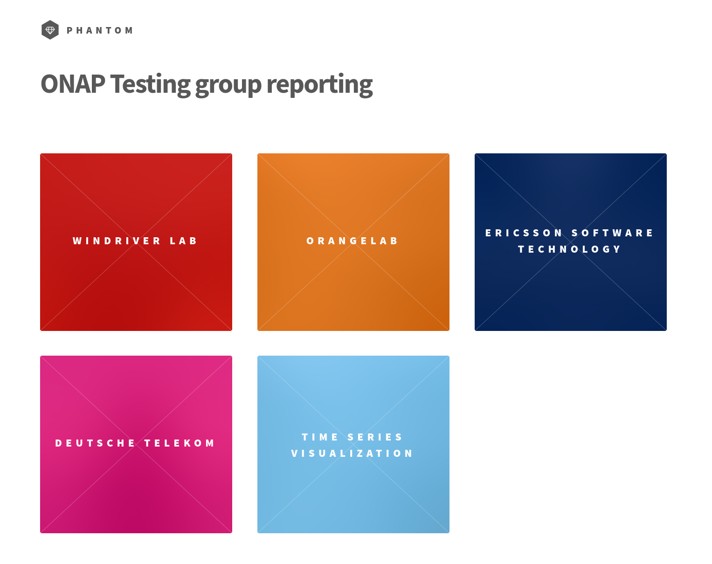
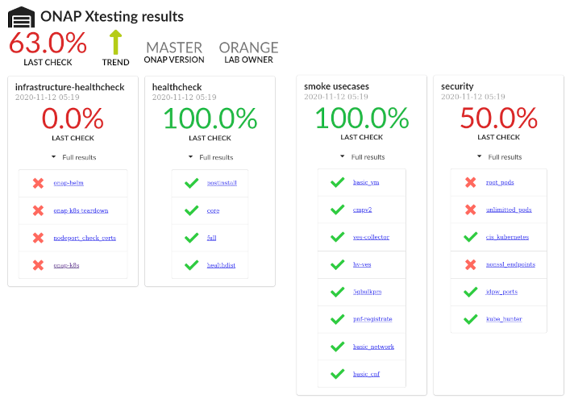
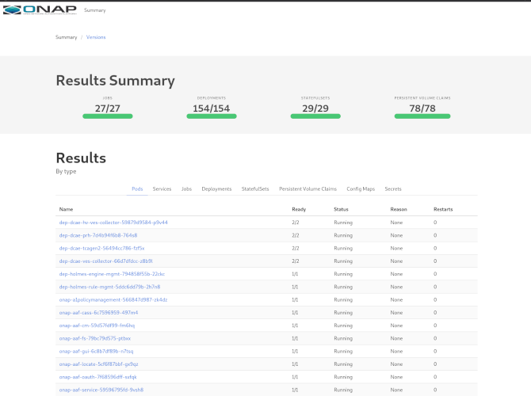

.. This work is licensed under a
   Creative Commons Attribution 4.0 International License.

.. _master_index:

.. toctree::
   :maxdepth: 4
   :hidden:

INTEGRATION
===========

Integration missions
---------------------

The Integration project is in charge of:

- Providing testing environment
- Supporting the use case teams
- Managing ONAP CI/CD chains
- Developing tests
- Providing baseline images
- Validating the ONAP release

.. figure:: files/integration-project.png

For each release, the integration team provides the following artifacts:

- A daily CI chain corresponding to the release
- Test suites and tools to check the various ONAP components
- Use-case documentation and artifacts
- A testsuite docker included in ONAP cluster to execute the tests
- Baseline JAVA and Python images
- oparent library to manage Java dependencies
- Configuration files (scripts, Heat templates, csa files) to help installing
  and testing ONAP

The main wiki page of the Integration team can be found in
https://wiki.onap.org/display/DW/Integration+Project, you will find different
menus, Q&As, as well as a page dedicated to each release, summarizing the
follow-up and activities of the Integration team during the release life cycle.

For Guilin, please have a look at https://wiki.onap.org/display/DW/Integration+G+Release.

Integration repositories
------------------------

Most of the repositories are internal ONAP repositories.

Integration project is responsible of several ONAP repositories:

- integration/*
- testsuite/*
- oparent
- demo

Integration
~~~~~~~~~~~

The integration repository is the historical repository.
As a consequence it includes several elements:

- deployment scripts (deployment directory)
- tests: the first non robot tests (security, vCPE,..)
- simulators/emulators (test/mocks)
- integration and use cases documentation (docs)
- tools (bootstrap, S3Ptools)

Since Frankfurt, we created more smaller repositories especially for the use
cases and the simulators.
It shall help to improve the maintenance of the different elements.
It shall also help identifying, leveraging and adopting existing simulators
rather than systematically re-inventing the wheel.

There are now several sub repositories under integration group. The new
repositories introduced for Guilin are:

- 5G-core-nf-simulator
- terraform
- terragrunt

.. csv-table:: Integration repositories table
    :file: repo-integration.csv
    :widths: 30,50,20
    :delim: ;
    :header-rows: 1

Testsuite
~~~~~~~~~

The testsuite repository and it sub repositories deal excelusively with tests.
The testsuite repository includes all the robotframework scripts.
The robot pod that can be installed as part of the ONAP cluster is build from
this repository.

Several tooling repositories are associated with the robot tests (heatbridge,
robot-python-testing-utils). For Guilin 3 new sub repositories have been created:

- testsuite/cds
- pythonsdk-test
- robot-utils

.. csv-table:: Testsuite repositories table
    :file: repo-testsuite.csv
    :widths: 30,50,20
    :delim: ;
    :header-rows: 1

Demo
~~~~

In this repository you will find any artifacts needed for demo, PoC and use cases
if they do not have their own repository.

.. csv-table:: Demo repositories table
    :file: repo-demo.csv
    :widths: 30,50,20
    :delim: ;
    :header-rows: 1

Oparent
~~~~~~~

.. csv-table:: Oparent repositories table
    :file: repo-oparent.csv
    :widths: 30,50,20
    :delim: ;
    :header-rows: 1

Additionnaly, we also deal with external repositories.

.. csv-table:: Integration external repositories table
    :file: repo-integration-external.csv
    :widths: 30,50,20
    :delim: ;
    :header-rows: 1

The python-onapsdk has been developped out of ONAP as gitlab provided more
enhanced built-in features for this kind of developments.

The xtesting-onap repository is also hosted in gitlab.com as the CD part of
Integration work is fully managed in public gitlab-ci.

Integration resources
----------------------

Integration portal
~~~~~~~~~~~~~~~~~~

A portal is built to report the status of the different labs collaborating in
Integration, see http://testresults.opnfv.org/onap-integration/

The code of this web site is shared on a public gitlab project.

Integration Test database
~~~~~~~~~~~~~~~~~~~~~~~~~

The integration team shares a Test Result Database with the OPNFV project. All
the test results of the CD are automatically pushed in this database.
It is possible to retrieve the results through the Test API associated with this
test Database.

The following information are available:

- list of pods allowed to push results: http://testresults.opnfv.org/onap/api/v1/pods
- list of projects that declared test cases for CI/CD: http://testresults.opnfv.org/onap/api/v1/projects
- list of test cases per projects:
  http://testresults.opnfv.org/onap/api/v1/projects/integration/cases
  http://testresults.opnfv.org/onap/api/v1/projects/security/cases
- results: http://testresults.opnfv.org/onap/api/v1/results?last=3

It is possible to get results according to several criteria (version, case name,
lab, period, last, CI id,..)
The API is described in https://wiki.opnfv.org/pages/viewpage.action?pageId=2926452

Any company running Integration tests can be referenced to push results in this
database.
This Database is hosted on a LF OPNFV server. Results are backuped daily.
Integration committers can have access to this server.

VNF demo Artifacts
~~~~~~~~~~~~~~~~~~

They are hosted in teh demo repositories and published in
https://nexus.onap.org/content/repositories/releases/org/onap/demo/vnf/.

Communication channels
~~~~~~~~~~~~~~~~~~~~~~

The main communication channel for real time support is the rocket chat channel
http://team.onap.eu, you can also send a mail to onap-discuss AT lists.onap.org
with [ONAP] [Integration] prefix in the title.

ONAP Integration Labs
---------------------

Integration team is dealing with community labs:

- the Windriver/Intel lab
- The Azure staging lab
- The CD Labs
- The Orange openlab

Additionnaly integration contributor may deal with their own lab pushing results
in the integration portal (See DT http://testresults.opnfv.org/onap-integration/dt/dt.html)

Windriver/Intel lab
~~~~~~~~~~~~~~~~~~~

This lab is the historical lab of ONAP integration team based on Openstack Ocata.

During Guilin, it has been audited and performance issues have been reported
(RAM and CPU).
A reinstallation has to be planned.

The figure hereafter shows all the ONAP project consuming Windriver/Intel lab
resources.

.. figure:: files/windriver/windriver_servers.png
   :align: center

In order to avoid disturbing the projects, the reinstallation has been postponed
after Guilin.
A huge cleanup has been done in order to save the resources.
The historical CI/CD chains based on a stand alone jenkins VM hosted in Windriver
have been stopped.

For guilin only SB-00 has been kept and re-installed for the use case support.

If you want to use this lab, you need a VPN access. The procedure is described in
the wiki.

Environment Installation
........................

In addition of the official OOM scripts, Integration provides some guidelines to
install your OpenStack configuration thanks to a heat template.
See :ref:`Integration heat guideline <integration-installation>` for details.

Azure staging lab
~~~~~~~~~~~~~~~~~

An additional Azure staging lab has been created for Guilin. It is installed as
any daily/weekly/gating labs (see CI/CD sections).

You can ask for an access, the procedure is on the wiki.

Orange openlab
~~~~~~~~~~~~~~

This lab is a community use lab. It is always provided the last stable version,
so the frankfurt release during Guilin release time.
Please note that such labs do not provide admin rights and is shared with all
the users. It can be used to discover ONAP.

See access procedure on the wiki.

CI/CD
-----

Integration team deals with 2 different CI/CD systems.
The first one is based on jenkins, is managed by LF IT (CI) and integration
(CD). The second one is based on gitlab-ci.

CI
~~

The CI part provides the following features:

- repository Verification
- patchset verification thank to json/yaml/python/go/rst/md linters. These jenkins
  verification jobs are hosted in the ci-management repository. They can vote
  +1/-1 on patchset submission. Integration team systematically enables linters
  on any new repository
- docker build: Integration team builds testsuite dockers and xtesting dockers.
  These dockers are built then pushed to Nexus through a jjb also hosted in the
  ci-management repository.

CD
~~

There are 2 Continuous Deployment architecture.

Jenkins CD on Windriver/Intel lab
.................................

The CD part on windriver/Intel is based on jenkins.

It is based on a standalone VM hosting a jenkins server.
The credentials of this VM as well as the jenkins server have been provided to
integration committers.

Several jobs can be triggered from this jenkins interface.
Historically several chains were run daily (staging/release) but due to
performance issues, they have all been stopped.
Only SB-00 has been kept for use case support.
The jenkins interface was however used to launch the installation of SB-00.

This jenkins script is leveraging resources available in OOM or integration
repositories.

It was planned to replaced this CD by a gitlab runner based CD to unify the CD
management. But due to performance issue in the DC it was not possible to
finalize the operation in Guilin.

Gitlab CD
..........

This CD is leveraging public gitlab-ci mechanism and used to deploy several ONAP
labs:

- Daily Master: run daily using OOM Master
- Daily Frankfurt: run daily using the last stable version during Guilin Release
  processing
- Weekly Master: run once a week with longer tests
- Gating: run on OOM, clamp or SO patchset submission. It means a full ONAP
  deployment on demand based on new patchset declared in gerrit.

See :ref:`Integration CI guideline  <integration-ci>` for details.

Tests
-----

Integration is in charged of several types of tests:

- Use Cases: developped by use case teams, usually complex, demonstrating
  high value capabilities ofr ONAP. They may be partially automated and even
  integrated in CD.
- CSIT: functional tests created by the projects, partially hosted in sit repository
- Automatic Test Cases: this use cases are usually more simple and aims to validate
  that ONAP is working properly. These tests have been developed to validate ONAP
  as a software solution. In theory all the main function sshall be convered by
  such tests in order to have more robust CI/CD and then avoid regressions.
  These tests are usually developed and maintained by the integration team.

We may also indicate that when the integration developed a test framework,
unit/functional/integration tests are expected as any other development.
As an example python-onapsdk requires a unit test coverage of 98% before merging
a new feature, which is far above the project criteria in SonarCLoud today.

Use Cases
~~~~~~~~~

The use cases are described in <docs-usecases>.

CSIT Tests
~~~~~~~~~~

The CSIT tests are functional tests executed by the projects on mocked
environement to validate their components.
Historically it was hosted in a CSIT repository.

Integration team invited the projects to bring back such tests bacdk to home
repository for 2 main reasons:

- integration cannot be a bottleneck: +2/merge from integration needed for each
  project
- most of the tests are abandonned and not maintained when hosted in a third party
  repository leading to  CI/CD time waste and misleading test reporting

In Guilin a PoC to help the project to re-insource their functional tests have
been initiated. See https://wiki.onap.org/display/DW/Maximizing+Benefits+of+CSIT+in+ONAP+Development.

Automatic Tests
~~~~~~~~~~~~~~~

These tests are run daily/weekly on each new gate (new patchset in OOM, clamp
or SO). They can be in any language (bash, go, python,...), leveraging any test
framework (robotframework, MTS, python-onapsdk).
They are all embedded in xtesting dockers.

They are currently divided in 4 different categories:

- infrastructure-healthcheck: tests from OOM checking the ONAP namespace, certificates,..
- healthcheck
- smoke tests
- security tests

A dashboard summarizing the status and providing the links to the test result
page or the logs is automatically created at the end of the execution of the
tests.

All the pages and artifacts are pushed to LF backend:

- Daily chaines: https://logs.onap.org/onap-integration/daily
- Weekly chains: https://logs.onap.org/onap-integration/weekly
- Gating chains: https://logs.onap.org/onap-integration/gating

Infrastructure Healthcheck Tests
.................................

The tests can be described as follows:

.. csv-table:: Infrastructure Healthcheck Tests
    :file: tests-infrastructure-healthcheck.csv
    :widths: 20,40,20,20
    :delim: ;
    :header-rows: 1

See https://git.onap.org/integration/xtesting/tree/infra-healthcheck/README.md
to adapt then run infrastructure healthcheck tests on your own system.

Please note that the onap-k8s is run 2 times in CD chains. It is run just after
the installation (onap-k8s) and at the end of the test execution (onap-k8s-teardown)
in order to collect the logs of the different components during the test execution.

Healhcheck Tests
................

The tests can be described as follows:

.. csv-table:: Healthcheck Tests
    :file: tests-healthcheck.csv
    :widths: 20,40,20,20
    :delim: ;
    :header-rows: 1

See https://git.onap.org/integration/xtesting/tree/healthcheck/README.md to
adapt then run healthcheck tests on your own system.

Smoke Tests
...........

The tests can be described as follows:

.. csv-table:: Smoke Tests
    :file: tests-smoke.csv
    :widths: 20,40,20,20
    :delim: ;
    :header-rows: 1

See  to https://git.onap.org/integration/xtesting/tree/smoke-usecases-robot/README.md
adapt and run robot based smoke tests.

See https://git.onap.org/integration/xtesting/tree/smoke-usecases-pythonsdk/README.md
to adapt and run pythonsdk based smoke tests.

An html page is generated by the pythonsdk-test tests.

.. figure:: files/tests/test-basic-cnf.png

Security Tests
..............

The tests can be described as follows:

.. csv-table:: Security Tests
    :file: tests-security.csv
    :widths: 20,40,20,20
    :delim: ;
    :header-rows: 1

See https://git.onap.org/integration/xtesting/tree/security/README.md to adapt
then run the security tests on your own system.

Note for security tests, integration team follows SECCOM recommendation and
apply waivers granted by SECCOM if needed through xfail lists.
See https://git.onap.org/integration/seccom/tree/ for details.

Stability Testing
~~~~~~~~~~~~~~~~~

Ensuring the stability of ONAP is one of the missions of the Integration team.
CI chains and stability tests are performed to help stabilising the release.
See :ref:`Integration stability tests  <integration-s3p>` for details.
