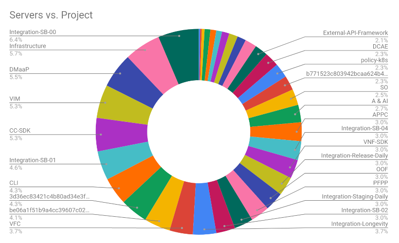

.. This work is licensed under a
   Creative Commons Attribution 4.0 International License.
.. integration-labs:

.. integration_main-doc:

Integration Labs
================

.. important::
   The Integration team deals with several community labs:

   - The Windriver/Intel lab
   - The Azure staging lab
   - The Orange openlab
   - The DT lab
   - The Nokia dualstack lab

Additionally integration contributors may deal with their own lab pushing results
in the integration portal (See DT http://testresults.opnfv.org/onap-integration/dt/dt.html)

Windriver/Intel lab
-------------------

The Historical Community Lab
............................

This lab is the historical lab of ONAP integration team based on OpenStack Ocata.

The figure hereafter shows all the ONAP projects consuming Windriver/Intel lab
resources (April 2020).

This lab is mainly used by the projects for the development.
A staging lab named SB-00 is also available.

If you want to use this lab, you need a VPN access. The procedure is described in
the `wiki <https://wiki.onap.org/pages/viewpage.action?pageId=29787070>`_.

Environment Installation Scripts
................................

In addition to the official OOM scripts, Integration used to provide some
extra scripts/guidelines to install your OpenStack infrastructure thanks to a
heat template. See :ref:`Integration heat guideline <integration-installation>`
for details. These scripts were used mainly in Windriver labs but are not actively
maintained.

.. caution:
   The official reference for installation is the OOM documentation.

Azure staging lab
-----------------

An additional Azure staging lab has been created for Guilin. It is installed as
any daily/weekly/gating labs (see CI/CD sections).
Contact the Integration team to get an access.

Orange Openlab
--------------

This lab is for community use. It is always provided with the last stable version,
i.e. Honolulu release during Istanbul development time.

See `Orange Openlab access procedure <https://wiki.onap.org/display/DW/Orange+OpenLab>`_
for details.

DT lab
------

The DT lab reported Master daily results in addition of Istanbul daily results.
Results are shared with the community in
`<https://logs.onap.org/onap-integration/daily/onap-master-daily-dell/>`_

Nokia lab
---------

Nokia setup a lab to support the dual stack IPv4/IPv6 tests. Results are shared
with the community in
`<https://logs.onap.org/onap-integration/daily/onap_daily_nokia_dualstack_master/>`_
