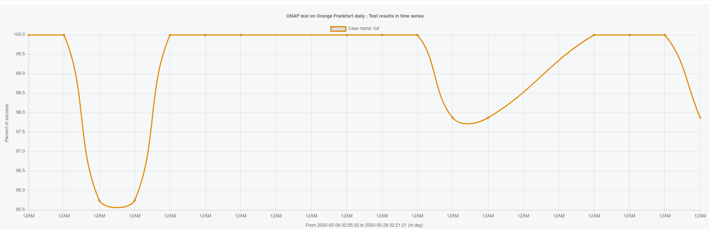
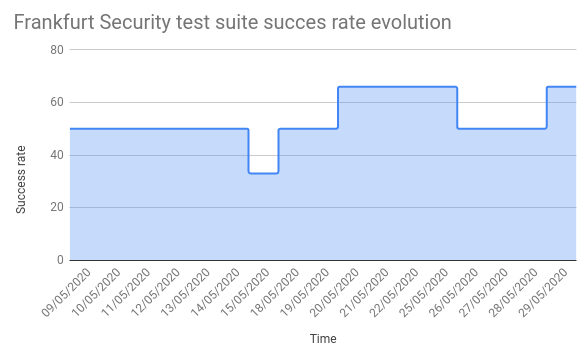

.. _integration-s3p:

ONAP Maturity Testing Notes
---------------------------

Historically integration team used to execute specific stability and resilience
tests on target release. For frankfurt a stability test was executed.
Openlab, based on  Frankfurt RC0 dockers was also observed a long duration
period to evaluate the overall stability.
Finally the CI daily chain created at Frankfurt RC0 was also a precious indicator
to estimate the solution stability.

No resilience or stress tests have been executed due to a lack of resources
and late availability of the release. The testing strategy shall be amended in
Guilin, several requirements have been created to improve the S3P testing domain.

Stability
=========

ONAP stability was tested through a 72 hour test.
The intent of the 72 hour stability test is not to exhaustively test all
functions but to run a steady load against the system and look for issues like
memory leaks that cannot be found in the short duration install and functional
testing during the development cycle.

Integration Stability Testing verifies that the ONAP platform remains fully
functional after running for an extended amounts of time.
This is done by repeated running tests against an ONAP instance for a period of
72 hours.

The 72 hour stability run result was **PASS**.

The onboard and instantiate tests ran for over 115 hours before environment
issues stopped the test. There were errors due to both tooling and environment
errors.

The overall memory utilization only grew about 2% on the work nodes despite
the environment issues. Interestingly the kubernetes ochestration node memory
grew more which could mean we are over driving the API's in some fashion.

We did not limit other tenant activities in Windriver during this test run and
we saw the impact from things like the re-installation of SB00 in the tenant
and general network latency impacts that caused openstack to be slower to
instantiate.
For future stability runs we should go back to the process of shutting down
non-critical tenants in the test environment to free up host resources for
the test run (or other ways to prevent other testing from affecting the stability
run).

The control loop tests were **100% successful** and the cycle time for the loop was
fairly consistent despite the environment issues. Future control loop stability
tests should consider doing more policy edit type activites and running more
control loop if host resources are available. The 10 second VES telemetry event
is quite aggressive so we are sending more load into the VES collector and TCA
engine during onset events than would be typical so adding additional loops
should factor that in. The jenkins jobs ran fairly well although the instantiate
Demo vFWCL took longer than usual and should be factored into future test planning.

Methodology
~~~~~~~~~~~

The Stability Test has two main components:

- Running "ete stability72hr" Robot suite periodically.  This test suite
  verifies that ONAP can instantiate vDNS, vFWCL, and VVG.
- Set up vFW Closed Loop to remain running, then check periodically that the
  closed loop functionality is still working.

The integration-longevity tenant in Intel/Windriver environment was used for the
72 hour tests.

The onap-ci job for  "Project windriver-longevity-release-manual" was used for
the deployment with the OOM set to frankfurt and Integration branches set to
master. Integration master was used so we could catch the latest updates to
integration scripts and vnf heat templates.

The jenkins job needs a couple of updates for each release:

- Set the integration branch to 'origin/master'
- Modify the parameters to deploy.sh to specify "-i master" and "-o frankfurt"
  to get integration master an oom frankfurt clones onto the nfs server.

The path for robot logs on dockerdata-nfs  changed in Frankfurt so the
/dev-robot/ becomes /dev/robot

The stability tests used robot container image  **1.6.1-STAGING-20200519T201214Z**.

robot container updates: API_TYPE was set to GRA_API since we have deprecated
VNF_API.

Shakedown consists of creating some temporary tags for stability72hrvLB,
stability72hrvVG,stability72hrVFWCL to make sure each sub test ran successfully
(including cleanup) in the environment before the jenkins job started with the
higher level testsuite tag stability72hr that covers all three test types.

Clean out the old buid jobs using a jenkins console script (manage jenkins)

::

  def jobName = "windriver-longevity-stability72hr"=
  def job = Jenkins.instance.getItem(jobName)
  job.getBuilds().each { it.delete() }
  job.nextBuildNumber = 1
  job.save()

appc.properties updated to apply the fix for DMaaP message processing to call
http://localhost:8181 for the streams update.

Results: 100% PASS
~~~~~~~~~~~~~~~~~~
=================== ======== ========== ======== ========= =========
Test Case           Attempts Env Issues Failures Successes Pass Rate
=================== ======== ========== ======== ========= =========
Stability 72 hours  77       19         0        58        100%
vFW Closed Loop     60       0          0        100       100%
**Total**           137      19         0        158       **100%**
=================== ======== ========== ======== ========= =========

Detailed results can be found at https://wiki.onap.org/display/DW/Frankfurt+Stability+Run+Notes

.. note::
 - Overall results were good. All of the test failures were due to
   issues with the unstable environment and tooling framework.
 - JIRAs were created for readiness/liveness probe issues found while
   testing under the unstable environment. Patches applied to oom and
   testsuite during the testing helped reduce test failures due to
   environment and tooling framework issues.
 - The vFW Closed Loop test was very stable and self recovered from
   environment issues.

Resources overview
~~~~~~~~~~~~~~~~~~
============ ====================== =========== ========== ==========
Date          #1 CPU                #1 RAM      CPU*       RAM**
============ ====================== =========== ========== ==========
May 20 18:45 dcae-tca-anaytics:511m appc:2901Mi 1649       36092
May 21 12:33 dcae-tca-anaytics:664m appc:2901Mi 1605       38221
May 22 09:35 dcae-tca-anaytics:425m appc:2837Mi 1459       38488
May 23 11:01 cassandra-1:371m       appc:2849Mi 1829       39431
============ ====================== =========== ========== ==========

.. note::
  - Results are given from the command "kubectl -n onap top pods | sort -rn -k 3
    | head -20"
  - * sum of the top 20 CPU consumption
  - ** sum of the top 20 RAM consumption

CI results
==========

A daily Frankfurt CI chain has been created after RC0.

The evolution of the full healthcheck test suite can be described as follows:

|image1|

Full healthcheck testsuite verifies the status of each components. It is
composed of 47 tests. The success rate from the 9th to the 28th was never under
95%.

4 categories were defined:

- infrastructure healthcheck: test of ONAP kubernetes cluster and help chart status
- healthcheck tests: verification of the components in the target deployment
  environment
- smoke tests: vasic VM tests (including onboarding/distribution/instantiation),
  and automated use cases (pnf-registrate, hvves, 5gbulkpm)
- security tests

The security target (66% for Frankfurt) was reached after the RC1. A regression
due to the automation of the hvves use case (triggering the exposition of a
public port in HTTP) was fixed on the 28th of May.

|image2|

Resilience
==========

The resilience test executed in El Alto was not realized in Frankfurt.

