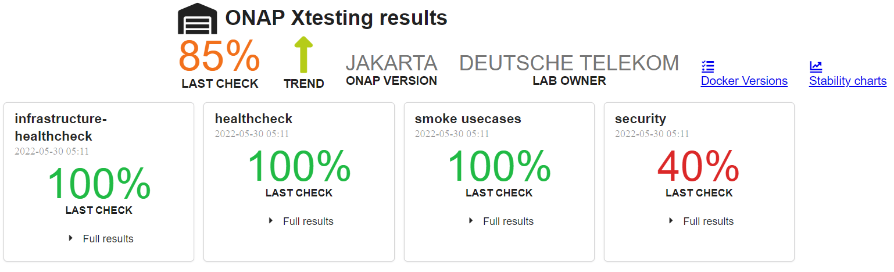
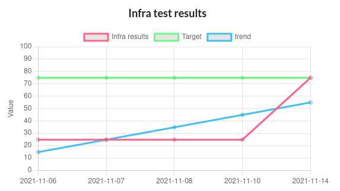
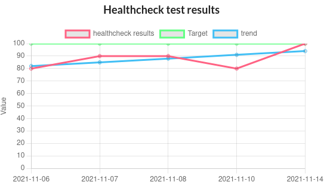
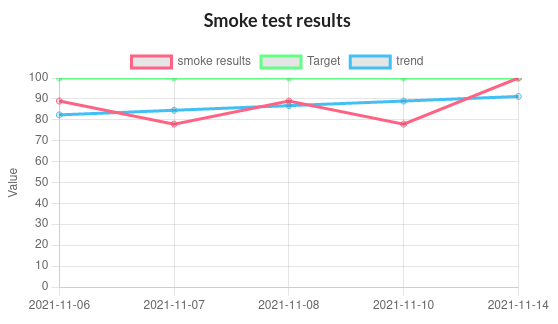
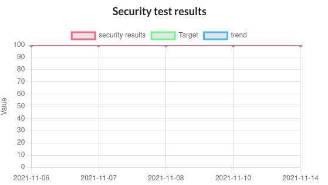
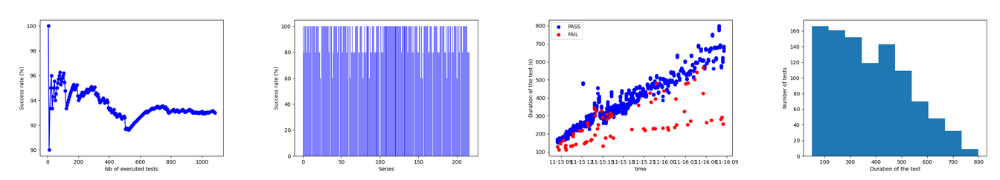
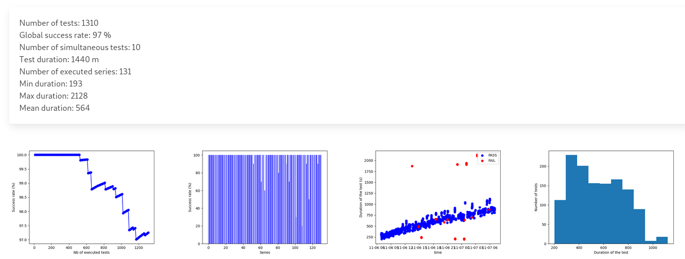

.. This work is licensed under a
   Creative Commons Attribution 4.0 International License.
.. _integration-s3p:

Stability
=========

.. important::
    The Release stability has been evaluated by:

    - The daily Jakarta CI/CD chain
    - Stability tests

.. note:
    The scope of these tests remains limited and does not provide a full set of
    KPIs to determinate the limits and the dimensioning of the ONAP solution.

CI results
----------

As usual, a daily CI chain dedicated to the release is created after RC0.

The daily results can be found in `LF Orange lab daily results web site
<https://logs.onap.org/onap-integration/daily/onap_daily_pod4_master/>`_ and
`LF DT lab daily results web site <https://logs.onap.org/onap-integration/daily/onap-daily-dt-oom-master/>`_.

Infrastructure Healthcheck Tests
~~~~~~~~~~~~~~~~~~~~~~~~~~~~~~~~

These tests deal with the Kubernetes/Helm tests on ONAP cluster.

The global expected criteria is **100%**.

The onap-k8s and onap-k8s-teardown, providing a snapshop of the onap namespace
in Kubernetes, as well as the onap-helm tests are expected to be PASS.

Healthcheck Tests
~~~~~~~~~~~~~~~~~

These tests are the traditionnal robot healthcheck tests and additional tests
dealing with a single component.

The expectation is **100% OK**.

Smoke Tests
~~~~~~~~~~~

These tests are end to end and automated use case tests.
See the :ref:`the Integration Test page <integration-tests>` for details.

The expectation is **100% OK**.

Security Tests
~~~~~~~~~~~~~~

These tests are tests dealing with security.
See the  :ref:`the Integration Test page <integration-tests>` for details.

Waivers have been granted on different projects for the different tests.
The list of waivers can be found in
https://git.onap.org/integration/seccom/tree/waivers?h=jakarta.

nodeport_check_certs test is expected to fail. Even tremendous progress have
been done in this area, some certificates (unmaintained, upstream or integration
robot pods) are still not correct due to bad certificate issuers (Root CA
certificate non valid) or extra long validity. Most of the certificates have
been installed using cert-manager and will be easily renewable.

The expectation is **80% OK**. The criteria is met.

Stability tests
---------------

Stability tests have been performed on Istanbul release:

- SDC stability test
- Parallel instantiation test

The results can be found in the weekly backend logs
https://logs.onap.org/onap-integration/weekly/onap_weekly_pod4_istanbul.

SDC stability test
~~~~~~~~~~~~~~~~~~

In this test, we consider the basic_onboard automated test and we run 5
simultaneous onboarding procedures in parallel during 24h.

The basic_onboard test consists in the following steps:

- [SDC] VendorOnboardStep: Onboard vendor in SDC.
- [SDC] YamlTemplateVspOnboardStep: Onboard vsp described in YAML file in SDC.
- [SDC] YamlTemplateVfOnboardStep: Onboard vf described in YAML file in SDC.
- [SDC] YamlTemplateServiceOnboardStep: Onboard service described in YAML file
  in SDC.

The test has been initiated on the Istanbul weekly lab on the 14th of November.

As already observed in daily|weekly|gating chain, we got race conditions on
some tests (https://jira.onap.org/browse/INT-1918).

The success rate is expected to be above 95% on the 100 first model upload
and above 80% until we onboard more than 500 models.

We may also notice that the function test_duration=f(time) increases
continuously. At the beginning the test takes about 200s, 24h later the same
test will take around 1000s.
Finally after 36h, the SDC systematically answers with a 500 HTTP answer code
explaining the linear decrease of the success rate.

The following graphs provides a good view of the SDC stability test.

.. csv-table:: S3P Onboarding stability results
    :file: ./files/csv/s3p-sdc.csv
    :widths: 60,20,20,20
    :delim: ;
    :header-rows: 1

.. important::
   The onboarding duration increases linearly with the number of on-boarded
   models, which is already reported and may be due to the fact that models
   cannot be deleted. In fact the test client has to retrieve the list of
   models, which is continuously increasing. No limit tests have been
   performed.
   However 1085 on-boarded models is already a vry high figure regarding the
   possible ONAP usage.
   Moreover the mean duration time is much lower in Istanbul.
   It explains why it was possible to run 35% more tests within the same
   time frame.

Parallel instantiations stability test
~~~~~~~~~~~~~~~~~~~~~~~~~~~~~~~~~~~~~~

The test is based on the single test (basic_vm) that can be described as follows:

- [SDC] VendorOnboardStep: Onboard vendor in SDC.
- [SDC] YamlTemplateVspOnboardStep: Onboard vsp described in YAML file in SDC.
- [SDC] YamlTemplateVfOnboardStep: Onboard vf described in YAML file in SDC.
- [SDC] YamlTemplateServiceOnboardStep: Onboard service described in YAML file
  in SDC.
- [AAI] RegisterCloudRegionStep: Register cloud region.
- [AAI] ComplexCreateStep: Create complex.
- [AAI] LinkCloudRegionToComplexStep: Connect cloud region with complex.
- [AAI] CustomerCreateStep: Create customer.
- [AAI] CustomerServiceSubscriptionCreateStep: Create customer's service
  subscription.
- [AAI] ConnectServiceSubToCloudRegionStep: Connect service subscription with
  cloud region.
- [SO] YamlTemplateServiceAlaCarteInstantiateStep: Instantiate service described
  in YAML using SO a'la carte method.
- [SO] YamlTemplateVnfAlaCarteInstantiateStep: Instantiate vnf described in YAML
  using SO a'la carte method.
- [SO] YamlTemplateVfModuleAlaCarteInstantiateStep: Instantiate VF module
  described in YAML using SO a'la carte method.

10 instantiation attempts are done simultaneously on the ONAP solution during 24h.

The results can be described as follows:

.. csv-table:: S3P Instantiation stability results
    :file: ./files/csv/s3p-instantiation.csv
    :widths: 60,20,20,20
    :delim: ;
    :header-rows: 1

The results are good with a success rate above 95%. After 24h more than 1300
VNF have been created and deleted.

As for SDC, we can observe a linear increase of the test duration. This issue
has been reported since Guilin. For SDC as it is not possible to delete the
models, it is possible to imagine that the duration increases due to the fact
that the database of models continuously increases. Therefore the client has
to retrieve an always bigger list of models.
But for the instantiations, it is not the case as the references
(module, VNF, service) are cleaned at the end of each test and all the tests
use the same model. Then the duration of an instantiation test should be
almost constant, which is not the case. Further investigations are needed.

.. important::
  The test has been executed with the mariadb-galera replicaset set to 1
  (3 by default). With this configuration the results during 24h are very
  good. When set to 3, the error rate is higher and after some hours
  most of the instantiation are failing.
  However, even with a replicaset set to 1, a test on Master weekly chain
  showed that the system is hitting another limit after about 35h
  (https://jira.onap.org/browse/SO-3791).
