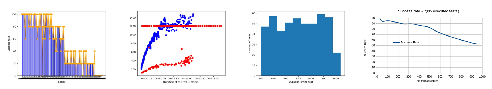

.. This work is licensed under a
   Creative Commons Attribution 4.0 International License.
.. _integration-s3p:

Stability/Resiliency
====================

.. important::
    The Release stability has been evaluated by:

    - The daily Honolulu CI/CD chain
    - Stability tests
    - Resiliency tests

.. note:
    The scope of these tests remains limited and does not provide a full set of
    KPIs to determinate the limits and the dimensioning of the ONAP solution.

CI results
----------

As usual, a daily CI chain dedicated to the release is created after RC0.
A Honolulu chain has been created on the 6th of April 2021.

The daily results can be found in `LF daily results web site
<https://logs.onap.org/onap-integration/daily/onap_daily_pod4_honolulu/2021-04/>`_.

Infrastructure Healthcheck Tests
~~~~~~~~~~~~~~~~~~~~~~~~~~~~~~~~

These tests deal with the Kubernetes/Helm tests on ONAP cluster.

The global expected criteria is **75%**.
The onap-k8s and onap-k8s-teardown  providing a snapshop of the onap namespace in
kubernetes as well as the onap-helm test are expected to be PASS.

nodeport_check_certs test is expected to fail. Even tremendous progress have
been done in this area, some certificates (unmaintained, upstream or integration
robot pods) are still not correct due to bad certificate issuers (Root CA
certificate non valid) or extra long validity. Most of the certificates have
been installed using cert-manager and will be easily renewable.

Healthcheck Tests
~~~~~~~~~~~~~~~~~

These tests are the traditionnal robot healthcheck tests and additional tests
dealing with a single components.

Some tests (basic_onboard, basic_cds) may fail episodically due to the fact that
the startup of the SDC is sometimes not fully completed.

The same test is run as first step of smoke tests and is usually PASS.
The mechanism to detect that all the components are fully operational may be
improved, timer based solutions are not robust enough.

The expectation is **100% OK**.

Smoke Tests
~~~~~~~~~~~

These tests are end to end and automated use case tests.
See the :ref:`the Integration Test page <integration-tests>` for details.

The expectation is **100% OK**.

An error has been detected on the SDNC preventing the basic_vm_macro to work.
See `SDNC-1529 <https://jira.onap.org/browse/SDNC-1529/>`_ for details.
We may also notice that SO timeouts occured more frequently than in Guilin.
See `SO-3584 <https://jira.onap.org/browse/SO-3584>`_ for details.

Security Tests
~~~~~~~~~~~~~~

These tests are tests dealing with security.
See the  :ref:`the Integration Test page <integration-tests>` for details.

The expectation is **66% OK**. The criteria is met.

It may even be above as 2 fail tests are almost correct:

- The unlimited pod test is still fail due testing pod (DCAE-tca).
- The nonssl tests is FAIL due to so and so-etsi-sol003-adapter, which were
  supposed to be managed with the ingress (not possible for this release) and
  got a waiver in Frankfurt. The pods cds-blueprints-processor-http and aws-web
  are used for tests.

Resiliency tests
----------------

The goal of the resiliency testing was to evaluate the capability of the
honolulu solution to survive to a stop or restart of a kubernetes control or
worker node.

Controller node resiliency
~~~~~~~~~~~~~~~~~~~~~~~~~~

By default the ONAP solution is installed with 3 controllers for high
availability. The test for controller resiliency can be described as follows:

- Run tests: check that they are PASS
- Stop a controller node: check that the node appears in NotReady state
- Run tests: check that they are PASS

2 tests were performed on the weekly honolulu lab. No problem was observed on
controller shutdown, tests were still PASS with a stoped controller node.

More details can be found in <https://jira.onap.org/browse/TEST-309>.

Worker node resiliency
~~~~~~~~~~~~~~~~~~~~~~

In community weekly lab, the ONAP pods are distributed on 12 workers. The goal
of the test was to evaluate the behavior of the pod on a worker restart
(disaster scenario assuming that the node was mode accidentally from Ready to
NotReady state).
The original conditions of such tests may be different as the kubernetes
scheduler does not distribute the pods on the same worker from an installation
to another.

The test procedure can be described as follows:

- Run tests: check that they are PASS (Healthcheck and basic_vm used)
- Check that all the workers are in ready state
  ::
    $ kubectl get nodes
    NAME                      STATUS   ROLES    AGE   VERSION
    compute01-onap-honolulu   Ready    <none>   18h   v1.19.9
    compute02-onap-honolulu   Ready    <none>   18h   v1.19.9
    compute03-onap-honolulu   Ready    <none>   18h   v1.19.9
    compute04-onap-honolulu   Ready    <none>   18h   v1.19.9
    compute05-onap-honolulu   Ready    <none>   18h   v1.19.9
    compute06-onap-honolulu   Ready    <none>   18h   v1.19.9
    compute07-onap-honolulu   Ready    <none>   18h   v1.19.9
    compute08-onap-honolulu   Ready    <none>   18h   v1.19.9
    compute09-onap-honolulu   Ready    <none>   18h   v1.19.9
    compute10-onap-honolulu   Ready    <none>   18h   v1.19.9
    compute11-onap-honolulu   Ready    <none>   18h   v1.19.9
    compute12-onap-honolulu   Ready    <none>   18h   v1.19.9
    control01-onap-honolulu   Ready    master   18h   v1.19.9
    control02-onap-honolulu   Ready    master   18h   v1.19.9
    control03-onap-honolulu   Ready    master   18h   v1.19.9

- Select a worker, list the impacted pods
  ::
    $ kubectl get pod -n onap --field-selector spec.nodeName=compute01-onap-honolulu
    NAME                                             READY   STATUS        RESTARTS   AGE
    onap-aaf-fs-7b6648db7f-shcn5                     1/1     Running   1          22h
    onap-aaf-oauth-5896545fb7-x6grg                  1/1     Running   1          22h
    onap-aaf-sms-quorumclient-2                      1/1     Running   1          22h
    onap-aai-modelloader-86d95c994b-87tsh            2/2     Running   2          22h
    onap-aai-schema-service-75575cb488-7fxs4         2/2     Running   2          22h
    onap-appc-cdt-58cb4766b6-vl78q                   1/1     Running   1          22h
    onap-appc-db-0                                   2/2     Running   4          22h
    onap-appc-dgbuilder-5bb94d46bd-h2gbs             1/1     Running   1          22h
    onap-awx-0                                       4/4     Running   4          22h
    onap-cassandra-1                                 1/1     Running   1          22h
    onap-cds-blueprints-processor-76f8b9b5c7-hb5bg   1/1     Running   1          22h
    onap-dmaap-dr-db-1                               2/2     Running   5          22h
    onap-ejbca-6cbdb7d6dd-hmw6z                      1/1     Running   1          22h
    onap-kube2msb-858f46f95c-jws4m                   1/1     Running   1          22h
    onap-message-router-0                            1/1     Running   1          22h
    onap-message-router-kafka-0                      1/1     Running   1          22h
    onap-message-router-kafka-1                      1/1     Running   1          22h
    onap-message-router-kafka-2                      1/1     Running   1          22h
    onap-message-router-zookeeper-0                  1/1     Running   1          22h
    onap-multicloud-794c6dffc8-bfwr8                 2/2     Running   2          22h
    onap-multicloud-starlingx-58f6b86c55-mff89       3/3     Running   3          22h
    onap-multicloud-vio-584d556876-87lxn             2/2     Running   2          22h
    onap-music-cassandra-0                           1/1     Running   1          22h
    onap-netbox-nginx-8667d6675d-vszhb               1/1     Running   2          22h
    onap-policy-api-6dbf8485d7-k7cpv                 1/1     Running   1          22h
    onap-policy-clamp-be-6d77597477-4mffk            1/1     Running   1          22h
    onap-policy-pap-785bd79759-xxhvx                 1/1     Running   1          22h
    onap-policy-xacml-pdp-7d8fd58d59-d4m7g           1/1     Running   6          22h
    onap-sdc-be-5f99c6c644-dcdz8                     2/2     Running   2          22h
    onap-sdc-fe-7577d58fb5-kwxpj                     2/2     Running   2          22h
    onap-sdc-wfd-fe-6997567759-gl9g6                 2/2     Running   2          22h
    onap-sdnc-dgbuilder-564d6475fd-xwwrz             1/1     Running   1          22h
    onap-sdnrdb-master-0                             1/1     Running   1          22h
    onap-so-admin-cockpit-6c5b44694-h4d2n            1/1     Running   1          21h
    onap-so-etsi-sol003-adapter-c9bf4464-pwn97       1/1     Running   1          21h
    onap-so-sdc-controller-6899b98b8b-hfgvc          2/2     Running   2          21h
    onap-vfc-mariadb-1                               2/2     Running   4          21h
    onap-vfc-nslcm-6c67677546-xcvl2                  2/2     Running   2          21h
    onap-vfc-vnflcm-78ff4d8778-sgtv6                 2/2     Running   2          21h
    onap-vfc-vnfres-6c96f9ff5b-swq5z                 2/2     Running   2          21h

- Stop the worker (shutdown the machine for baremetal or the VM if you installed
  your kubernetes on top of an OpenStack solution)
- Wait for the pod eviction procedure completion (5 minutes)
  ::
    $ kubectl get nodes
    NAME                      STATUS     ROLES    AGE   VERSION
    compute01-onap-honolulu   NotReady   <none>   18h   v1.19.9
    compute02-onap-honolulu   Ready      <none>   18h   v1.19.9
    compute03-onap-honolulu   Ready      <none>   18h   v1.19.9
    compute04-onap-honolulu   Ready      <none>   18h   v1.19.9
    compute05-onap-honolulu   Ready      <none>   18h   v1.19.9
    compute06-onap-honolulu   Ready      <none>   18h   v1.19.9
    compute07-onap-honolulu   Ready      <none>   18h   v1.19.9
    compute08-onap-honolulu   Ready      <none>   18h   v1.19.9
    compute09-onap-honolulu   Ready      <none>   18h   v1.19.9
    compute10-onap-honolulu   Ready      <none>   18h   v1.19.9
    compute11-onap-honolulu   Ready      <none>   18h   v1.19.9
    compute12-onap-honolulu   Ready      <none>   18h   v1.19.9
    control01-onap-honolulu   Ready      master   18h   v1.19.9
    control02-onap-honolulu   Ready      master   18h   v1.19.9
    control03-onap-honolulu   Ready      master   18h   v1.19.9

- Run the tests: check that they are PASS

.. warning::
  In these conditions, **the tests will never be PASS**. In fact several components
  will remeain in INIT state.
  A procedure is required to ensure a clean restart.

List the non running pods::

  $ kubectl get pods -n onap --field-selector status.phase!=Running | grep -v Completed
  NAME                                             READY   STATUS      RESTARTS   AGE
  onap-appc-dgbuilder-5bb94d46bd-sxmmc             0/1     Init:3/4    15         156m
  onap-cds-blueprints-processor-76f8b9b5c7-m7nmb   0/1     Init:1/3    0          156m
  onap-portal-app-595bd6cd95-bkswr                 0/2     Init:0/4    84         23h
  onap-portal-db-config-6s75n                      0/2     Error       0          23h
  onap-portal-db-config-7trzx                      0/2     Error       0          23h
  onap-portal-db-config-jt2jl                      0/2     Error       0          23h
  onap-portal-db-config-mjr5q                      0/2     Error       0          23h
  onap-portal-db-config-qxvdt                      0/2     Error       0          23h
  onap-portal-db-config-z8c5n                      0/2     Error       0          23h
  onap-sdc-be-5f99c6c644-kplqx                     0/2     Init:2/5    14         156
  onap-vfc-nslcm-6c67677546-86mmj                  0/2     Init:0/1    15         156m
  onap-vfc-vnflcm-78ff4d8778-h968x                 0/2     Init:0/1    15         156m
  onap-vfc-vnfres-6c96f9ff5b-kt9rz                 0/2     Init:0/1    15         156m

Some pods are not rescheduled (i.e. onap-awx-0 and onap-cassandra-1 above)
because they are part of a statefulset. List the statefulset objects::

  $ kubectl get statefulsets.apps -n onap | grep -v "1/1" | grep -v "3/3"
  NAME                            READY   AGE
  onap-aaf-sms-quorumclient       2/3     24h
  onap-appc-db                    2/3     24h
  onap-awx                        0/1     24h
  onap-cassandra                  2/3     24h
  onap-dmaap-dr-db                2/3     24h
  onap-message-router             0/1     24h
  onap-message-router-kafka       0/3     24h
  onap-message-router-zookeeper   2/3     24h
  onap-music-cassandra            2/3     24h
  onap-sdnrdb-master              2/3     24h
  onap-vfc-mariadb                2/3     24h

For the pods being part of the statefulset, a forced deleteion is nrequired.
As an example if we consider the statefulset onap-sdnrdb-master, we must follow
the procedure::

  $ kubectl get pods -n onap -o wide |grep onap-sdnrdb-master
  onap-sdnrdb-master-0  1/1  Terminating 1  24h  10.42.3.92   node1
  onap-sdnrdb-master-1  1/1  Running     1  24h  10.42.1.122  node2
  onap-sdnrdb-master-2  1/1  Running     1  24h  10.42.2.134  node3

  $ kubectl delete -n onap pod onap-sdnrdb-master-0 --force
  warning: Immediate deletion does not wait for confirmation that the running
  resource has been terminated. The resource may continue to run on the cluster
  indefinitely.
  pod "onap-sdnrdb-master-0" force deleted

  $ kubectl get pods |grep onap-sdnrdb-master
  onap-sdnrdb-master-0  0/1  PodInitializing   0  11s
  onap-sdnrdb-master-1  1/1  Running           1  24h
  onap-sdnrdb-master-2  1/1  Running           1  24h

  $ kubectl get pods |grep onap-sdnrdb-master
  onap-sdnrdb-master-0  1/1  Running  0  43s
  onap-sdnrdb-master-1  1/1  Running  1  24h
  onap-sdnrdb-master-2  1/1  Running  1  24h

One all the statefulset properly restarted, the other components shall continue
their restart properly.
Once the restart of the pods is completed, the tests are PASS.

.. important::

  K8s node reboots/shutdown is showing some deficiencies in ONAP components in
  regard of their availability measured with HC results. Some pods may
  still fail to initialize after reboot/shutdown(pod rescheduled).

  However cluster as a whole behaves as expected, pods are rescheduled after
  node shutdown (except pods being part of statefulset which need to be deleted
  forcibly - normal kubernetes behavior)

  On rebooted node, should its downtime not exceed eviction timeout, pods are
  restarted back after it is again available.

Please see `Integration Resiliency page <https://jira.onap.org/browse/TEST-308>`_
for details.

Stability tests
---------------

Three stability tests have been performed in Honolulu:

- SDC stability test
- Simple instantiation test (basic_vm)
- Parallel instantiation test

SDC stability test
~~~~~~~~~~~~~~~~~~

In this test, we consider the basic_onboard automated test and we run 5
simultaneous onboarding procedures in parallel during 72h.

The basic_onboard test consists in the following steps:

- [SDC] VendorOnboardStep: Onboard vendor in SDC.
- [SDC] YamlTemplateVspOnboardStep: Onboard vsp described in YAML file in SDC.
- [SDC] YamlTemplateVfOnboardStep: Onboard vf described in YAML file in SDC.
- [SDC] YamlTemplateServiceOnboardStep: Onboard service described in YAML file
  in SDC.

The test has been initiated on the honolulu weekly lab on the 19th of April.

As already observed in daily|weekly|gating chain, we got race conditions on
some tests (https://jira.onap.org/browse/INT-1918).

The success rate is above 95% on the 100 first model upload and above 80%
until we onboard more than 500 models.

We may also notice that the function test_duration=f(time) increases
continuously. At the beginning the test takes about 200s, 24h later the same
test will take around 1000s.
Finally after 36h, the SDC systematically answers with a 500 explaining the
linear decrease of the success rate.

The following graphs provides a good view of the SDC stability test.

.. important::
   SDC can support up to 100s models onboarding.
   The onbaording duration increases linearly with the number of onboarded
   models
   After a while, the SDC is no more usable.
   No major Cluster resource issues have been detected during the test. The
   memory consumption is however relatively high regarding the load.

Simple stability test
~~~~~~~~~~~~~~~~~~~~~

This test consists on running the test basic_vm continuously during 72h.

We observe the cluster metrics as well as the evolution of the test duration.

The test basic_vm is described in :ref:`the Integration Test page <integration-tests>`.

The basic_vm test consists in the different following steps:

- [SDC] VendorOnboardStep: Onboard vendor in SDC.
- [SDC] YamlTemplateVspOnboardStep: Onboard vsp described in YAML file in SDC.
- [SDC] YamlTemplateVfOnboardStep: Onboard vf described in YAML file in SDC.
- [SDC] YamlTemplateServiceOnboardStep: Onboard service described in YAML file
  in SDC.
- [AAI] RegisterCloudRegionStep: Register cloud region.
- [AAI] ComplexCreateStep: Create complex.
- [AAI] LinkCloudRegionToComplexStep: Connect cloud region with complex.
- [AAI] CustomerCreateStep: Create customer.
- [AAI] CustomerServiceSubscriptionCreateStep: Create customer's service
  subscription.
- [AAI] ConnectServiceSubToCloudRegionStep: Connect service subscription with
  cloud region.
- [SO] YamlTemplateServiceAlaCarteInstantiateStep: Instantiate service described
  in YAML using SO a'la carte method.
- [SO] YamlTemplateVnfAlaCarteInstantiateStep: Instantiate vnf described in YAML
  using SO a'la carte method.
- [SO] YamlTemplateVfModuleAlaCarteInstantiateStep: Instantiate VF module
  described in YAML using SO a'la carte method.

The test has been initiated on the honolulu weekly lab on the 26th of April.
This test has been run after the test described in the next section.
A first error occured after few hours (mariadbgalera), then the system
automatically recovered for some hours before a full crash of the mariadb
galera.

::

  debian@control01-onap-honolulu:~$ kubectl get pod -n onap |grep mariadb-galera
  onap-mariadb-galera-0  1/2  CrashLoopBackOff   625   5d16h
  onap-mariadb-galera-1  1/2  CrashLoopBackOff   1134  5d16h
  onap-mariadb-galera-2  1/2  CrashLoopBackOff   407   5d16h

It was unfortunately not possible to collect the root cause (logs of the first
restart of onap-mariadb-galera-1).

Community members reported that they already faced such issues and suggest to
deploy a single maria instance instead of using mariadb galera.
Moreover, in Honolulu there were some changes in order to allign Camunda (SO)
requirements for mariadb galera..

During the limited valid window, the success rate was about 78% (85% for the
same test in Guilin).
The duration of the test remain very variable as also already reported in Guilin
(https://jira.onap.org/browse/SO-3419). The duration of the same test may vary
from 500s to 2500s as illustrated in the following graph:

The changes in mariadb galera seems to have introduced some issues leading to
more unexpected timeouts.
A troubleshooting campaign has been launched to evaluate possible evolutions in
this area.

Parallel instantiations stability test
~~~~~~~~~~~~~~~~~~~~~~~~~~~~~~~~~~~~~~

Still based on basic_vm, 5 instantiation attempts are done simultaneously on the
ONAP solution during 48h.

The results can be described as follows:

For this test, we have to restart the SDNC once. The last failures are due to
a certificate infrastructure issue and are independant from ONAP.

Cluster metrics
~~~~~~~~~~~~~~~

.. important::
   No major cluster resource issues have been detected in the cluster metrics

The metrics of the ONAP cluster have been recorded over the full week of
stability tests:

.. csv-table:: CPU
   :file: ./files/csv/stability_cluster_metric_cpu.csv
   :widths: 20,20,20,20,20
   :delim: ;
   :header-rows: 1

The Top Ten for CPU consumption is given in the table below:

.. csv-table:: CPU
  :file: ./files/csv/stability_top10_cpu.csv
  :widths: 20,15,15,20,15,15
  :delim: ;
  :header-rows: 1

CPU consumption is negligeable and not dimensioning. It shall be reconsider for
use cases including extensive computation (loops, optimization algorithms).

The Top Ten for Memory consumption is given in the table below:

.. csv-table:: Memory
  :file: ./files/csv/stability_top10_memory.csv
  :widths: 20,15,15,20,15,15
  :delim: ;
  :header-rows: 1

Without surprise, the cassandra databases are using most of the memory.

The Top Ten for Network consumption is given in the table below:

.. csv-table:: Network
  :file: ./files/csv/stability_top10_net.csv
  :widths: 10,15,15,15,15,15,15
  :delim: ;
  :header-rows: 1
