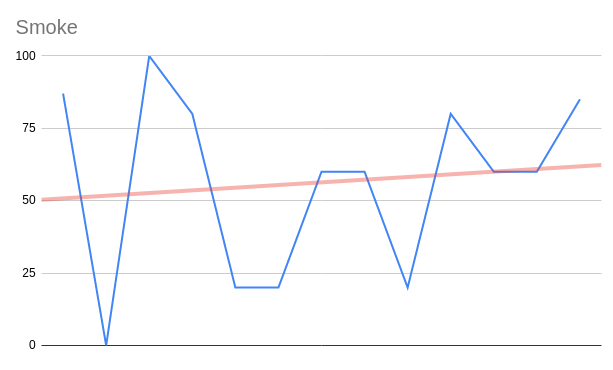
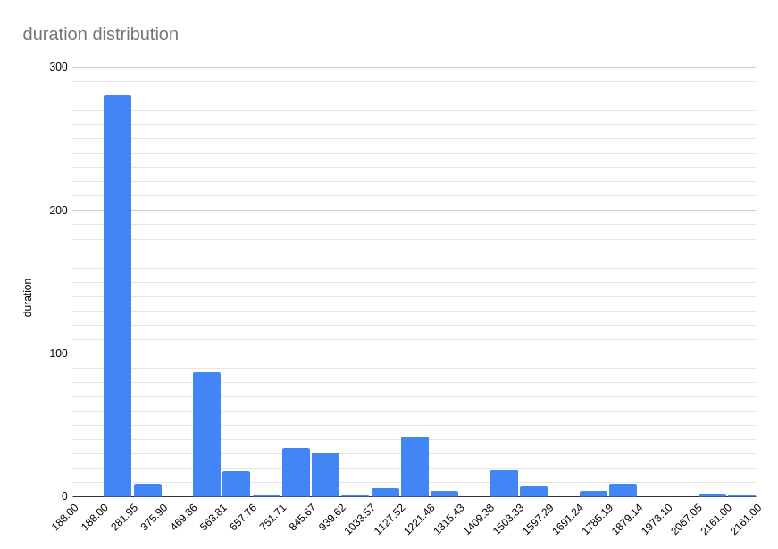

.. _integration-s3p:

:orphan:

ONAP Maturity Testing Notes
---------------------------

.. important::
    The Release stability has been evaluated by:

    - The Daily Guilin CI/CD chain
    - A simple 24h healthcheck verification
    - A 7 days stability test

.. note:
    The scope of these tests remains limited and does not provide a full set of
    KPIs to determinate the limits and the dimensioning of the ONAP solution.

CI results
==========

As usual, a daily CI chain dedicated to the release is created after RC0.
A Daily Guilin has been created on the 18th of November 2020.

Unfortunately several technical issues disturbed the chain:

- Due to policy changes in dockerhub (new quotas), the installation chain was
  not stable as the quota limit was rapidly reached. As a consequence the
  installation was incomplete and most of the tests were failing. The problem
  was fixed by the subscription of unlimitted account on dockerhub.
- Due to an upgrade of the Git jenkins plugin done by LF IT, the synchronization
  of the miror of the xtesting repository, used daily to generate the test suite
  dockers was corrupted. The dockers were built daily from jenkins but with an
  id from the 25th of September. As a consequence the tests reported lots of
  failure because they were corresponding to frankfurt tests without the
  adaptations done for Guilin. The problem was fixed temporarily by moving to
  gitlab.com docker registry then by the downgrade of the plugin executed by LF
  IT during Thanksgiving break.

The first week of the Daily Guilin reults are therefore not really usable.
Most of the results from the `daily Guilin result portal
<https://logs.onap.org/onap-integration/daily/onap_daily_pod4_guilin/>`_
are not trustable and may be misleading.
The results became more stable from the the 6th of December.

The graphs given hereafter are based on the data collected until the 8th of
december. This Daily chain will be maintained during the Honolulu development
cycle (Daily Master) and can be audited at any time. In case of reproducible
errors, the integration team will open JIRA on Guilin.

Several public Daily Guilin chains have been put in place, one in Orange
(helm v2) and one in DT (helm v3). DT results are pushed in the test DB and can
be observed in
`ONAP Testing DT lab result page <http://testresults.opnfv.org/onap-integration/dt/dt.html>`_.

Infrastructure Healthcheck Tests
................................

These tests deal with the kubernetes/helm tests on ONAP cluster.
The global expected criteria is **50%** when installing with helm 2.
The onap-k8s and onap-k8s-teardown providing a snapshop of the onap namespace in
kubernetes are expected to be PASS but two tests are expected to fail:

- onap-helm (32/33 OK) due to the size of the SO helm chart (too big for Helm2).
- nodeport_check_certs due to bad certificate issuers (Root CA certificate non
  valid). In theory all the certificate shall be genertaed during the installation
  and be valid for the 364 days after the installation. It is still not the case.
  However, for the first time, no certificate was expired. Next certificates to
  renew are:
    - Music (2021-02-03)
    - VID (2021-03-17)
    - Message-router-external (2021-03-25)
    - CDS-UI (2021-02-18)
    - AAI and AAI-SPARKY-BE (2021-03-17)

Healthcheck Tests
.................

These tests are the traditionnal robot healthcheck tests and additional tests
dealing with a single component.

The expectation is **100% OK**.

Smoke Tests
...........

These tests are end to end tests.
See the :ref:`the Integration Test page <integration-tests>` for details.

The expectation is **100% OK**.

An error has been detected on the SDC when performing parallel tests.
See `SDC-3366 <https://jira.onap.org/browse/SDC-3366>`_ for details

Security Tests
..............

These tests are tests dealing with security.
See the  :ref:`the Integration Test page <integration-tests>` for details.

The expectation is **66% OK**. The criteria is met.

It may even be above as 2 fail tests are almost correct:

- the unlimited pod test is still fail due to only one pod: onap-ejbca.
- the nonssl tests is FAIL due to so and os-vnfm adapter, which were supposed to
  be managed with the ingress (not possible for this release) and got a waiver
  in frankfurt.

A simple 24h healthcheck verification
=====================================

This test consists in running the Healthcheck tests every 10 minutes during
24h.

The test was run from the 6th of december to the 7th of december.

The success rate was 100%.

The results are stored in the
`test database <http://testresults.opnfv.org/onap/api/v1/results?pod_name=onap_daily_pod4_master-ONAP-oom&case_name=full>`_

A 6 days stability test
=======================

This test consists on running the test basic_vm continuously during 1 week.

We observe the cluster metrics as well as the evolution of the test duration.
The test basic_vm is describe in :ref:`the Integration Test page <integration-tests>`.

Within a long duration test context, the test will onboard a service once then
instantiate this service multiple times. Before instantiating, it will
systematically contact the SDC and the AAI to verify that the resources already
exist. In this context the most impacted component is SO, which was delivered
relatively late compared to the other components.

Basic_vm test
.............

The basic_vm test consists in the different following steps:

- [SDC] VendorOnboardStep: Onboard vendor in SDC.
- [SDC] YamlTemplateVspOnboardStep: Onboard vsp described in YAML file in SDC.
- [SDC] YamlTemplateVfOnboardStep: Onboard vf described in YAML file in SDC.
- [SDC] YamlTemplateServiceOnboardStep: Onboard service described in YAML file
  in SDC.
- [AAI] RegisterCloudRegionStep: Register cloud region.
- [AAI] ComplexCreateStep: Create complex.
- [AAI] LinkCloudRegionToComplexStep: Connect cloud region with complex.
- [AAI] CustomerCreateStep: Create customer.
- [AAI] CustomerServiceSubscriptionCreateStep: Create customer's service
  subscription.
- [AAI] ConnectServiceSubToCloudRegionStep: Connect service subscription with
  cloud region.
- [SO] YamlTemplateServiceAlaCarteInstantiateStep: Instantiate service described
  in YAML using SO a'la carte method.
- [SO] YamlTemplateVnfAlaCarteInstantiateStep: Instantiate vnf described in YAML
  using SO a'la carte method.
- [SO] YamlTemplateVfModuleAlaCarteInstantiateStep: Instantiate VF module
  described in YAML using SO a'la carte method.

The test has been initiated on a weekly lab on the 2nd of december.
The results provided hereafter correspond to the period from 2020-12-02 to
2020-12-08.

.. csv-table:: Basic_vm results
   :file: ./files/csv/stability_basic_vm.csv
   :widths: 70, 30
   :delim: ;
   :header-rows: 1

.. note::

   The corrected success rate excludes the FAIL results obtained during the SDNC
   saturation phase.
   The cause of the errors shall be analyzed more in details. The huge majority of
   errors (79%) occurs on SO service creation, 18% on VNF creation and 3% on
   module creation.

.. important::
   The test success rate is about 86%.
   CPU consumption is low (see next section).
   Memory consumption is high.

   After ~ 24-48h, the test is systematically FAIL. The trace shows that the SDNC
   is no more responding. This error required the manual restart of the SDNC.
   It seems that the SDNC exceeds its limits set in OOM. The simple manual
   restart (delete of the pod was enough, the test after the restart is PASS,
   and keep most of the time PASS for the next 24-48h)

We can observe the consequences of the manual restart of the SDNC on its memory
graph as well as the memory threshold.

The duration of the test is increasing slowly over the week and can be described
as follows:

If we consider the histogram, we can see the distribution of the duration.

As a conclusion, the solution seems stable.

The memory issue detected in the SDNC may be due to a bad sizing of the limits
and requests in OOM but a problem of light memory leak cannot be exclude.
The workaround consisting in restarting of the SDNC seems to fix the issue.
The issue is tracked in `SDNC-1430 <https://jira.onap.org/browse/SDNC-1430>`_.
Further study shall be done on this topic to consildate the detection of the
root cause.

Cluster metrics
...............

The Metrics of the ONAP cluster on this 6 days period are given by the
following tables:

.. csv-table:: CPU
   :file: ./files/csv/stability_cluster_metric_cpu.csv
   :widths: 20,10,10,10,10,10,10,10
   :delim: ;
   :header-rows: 1

.. csv-table:: Memory
  :file: ./files/csv/stability_cluster_metric_memory.csv
  :widths: 20,10,10,10,10,10,10,10
  :delim: ;
  :header-rows: 1

.. csv-table:: Network
   :file: ./files/csv/stability_cluster_metric_network.csv
   :widths: 10,15,15,15,15,15,15
   :delim: ;
   :header-rows: 1

The Top Ten for Memory consumption is given in the table below:

.. csv-table:: Memory
  :file: ./files/csv/stability_top10_memory.csv
  :widths: 20,15,15,20,15,15
  :delim: ;
  :header-rows: 1

At least 9 components exceeds their Memory Requests. And 7 are over the Memory
limits set in OOM: the 2 Opendaylight controllers and the cassandra Databases.

As indicated CPU consumption is negligeable and not dimensioning.
It shall be reconsider for use cases including extensive computiation (loops,
optimization algorithm)
