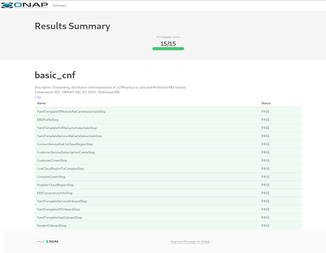

.. This work is licensed under a
   Creative Commons Attribution 4.0 International License.
.. _integration-tests:

Tests
=====

.. important::
   Integration is in charge of several types of tests:

   - Use Cases: developed by use case teams, usually complex, demonstrating high value capabilities of ONAP. They may be partially automated and even
     integrated in CD.
   - CSIT Tests: functional tests created by the projects, partially hosted in CSIT repository
   - Automatic Test Cases: these use cases are usually more simple and aim to validate that ONAP is working properly.
     These tests have been developed to validate ONAP as a software solution.
     In theory all the main functions shall be covered by such tests in order to have more robust CI/CD and then avoid regressions.
     These tests are usually developed and maintained by the integration team.

We may also indicate that when the development of the test framework python-onapsdk
follows standard development quality rules and imposes the creation of
unit/functional/integration tests.
As an example python-onapsdk requires a unit test coverage of 98% before merging
a new feature, which is far above the project criteria in SonarCloud today.

Use Cases
---------

The use cases of the last release are described in
:ref:`Verified Use cases <docs_usecases_release>`.

The history of the different use cases across the different releases can be
found in :ref:`Use Cases page <docs_usecases>`.

CSIT Tests
----------

The CSIT tests are functional tests executed by the projects on mocked
environment to validate their components.
Historically it was hosted in a CSIT repository.

Integration team invited the projects to bring back such tests back to home
repository for 2 main reasons:

- integration cannot be a bottleneck: +2/merge from integration needed for each
  project
- most of the tests are abandoned and not maintained when hosted in a third party
  repository leading to CI/CD resource waste and misleading test reporting

Automatic Tests
---------------

These tests are run daily/weekly on each new gate (new patchset in OOM, CLAMP
or SO). They can be in any language (bash, go, python,...), leveraging any test
framework (robotframework, MTS, python-onapsdk).
They are all embedded in `xtesting <https://pypi.org/project/xtesting/>`_ dockers.

.. hint::
   Automatic tests are currently divided in 4 different categories:

   - infrastructure-healthcheck: tests from OOM checking the ONAP namespace, certificates...
   - healthcheck: basic tests on components
   - smoke tests: end to end tests
   - security tests

A dashboard summarizing the status and providing the links to the test result
page or the logs is automatically created at the end of the execution of the
tests.

.. figure:: files/tests/test-dashboard.png

   Test dashboard (Guilin version)

All the pages and artifacts are pushed to LF backend:

- Daily chains: https://logs.onap.org/onap-integration/daily
- Weekly chains: https://logs.onap.org/onap-integration/weekly
- Gating chains: https://logs.onap.org/onap-integration/gating

A video has been recorded to help launching some of the automated tests on ONAP Guilin.
See `Running ONAP tests in Guilin Video <https://www.youtube.com/watch?v=ABvuJfyGDmw>`_

Infrastructure Healthcheck Tests
................................

.. csv-table:: Infrastructure Healthcheck Tests
    :file: ./files/csv/tests-infrastructure-healthcheck.csv
    :widths: 20,40,20,20
    :delim: ;
    :header-rows: 1

See `Infrastructure Healthcheck README <https://git.onap.org/integration/xtesting/tree/infra-healthcheck/README.md>`_
to adapt then run infrastructure healthcheck tests on your own system.

Please note that the onap-k8s is run 2 times in CD chains. It is run just after
the installation (onap-k8s) and at the end of the test execution (onap-k8s-teardown)
in order to collect the logs of the different components during the test execution.

.. figure:: files/tests/test-onap-k8s.png

Healthcheck Tests
.................

.. csv-table:: Healthcheck Tests
    :file: ./files/csv/tests-healthcheck.csv
    :widths: 20,40,20,20
    :delim: ;
    :header-rows: 1

See `Healthcheck README <https://git.onap.org/integration/xtesting/tree/healthcheck/README.md>`_
to adapt then run healthcheck tests on your own system.

Smoke Tests
...........

.. csv-table:: Smoke Tests
    :file: ./files/csv/tests-smoke.csv
    :widths: 20,40,20,20
    :delim: ;
    :header-rows: 1

There are 2 main families of smoke tests:

* RobotFramework based tests, usually run from inside the cluster as a k8s job
* Pythonsdk based tests. These tests (also known as onaptests) are consuming
  several SDKs: the Openstack and Kubernetes SDK for the management of the cloud
  resources and the python ONAP SDK for the interactions with ONAP

To launch the the robot based tests, please see
`Robot smoke test README <https://git.onap.org/integration/xtesting/tree/smoke-usecases-robot/README.md>`_
Standard Robot html pages are generated. See :ref:`Robot page <docs_robot>`.

To launch the pythonsdk based tests, please see
`Python smoke test README <https://git.onap.org/integration/xtesting/tree/smoke-usecases-pythonsdk/README.md>`_

.. note:
    Please note that the OpenStack minimal version is pike.

An html page is generated by the pythonsdk-test tests.

Security Tests
...............

.. csv-table:: Security Tests
    :file: ./files/csv/tests-security.csv
    :widths: 20,40,20,20
    :delim: ;
    :header-rows: 1

See `Security test README <https://git.onap.org/integration/xtesting/tree/security/README.md>`_
to adapt then run the security tests on your own system.

Note for security tests, integration team follows `SECCOM recommendations and
apply waivers granted by SECCOM if needed through xfail lists <https://git.onap.org/integration/seccom/tree/>`_.

Stability Testing
-----------------

Ensuring the stability of ONAP is one of the missions of the Integration team.
CI chains and stability tests are performed to help stabilising the release.
See :ref:`Integration stability tests  <integration-s3p>` for details.
