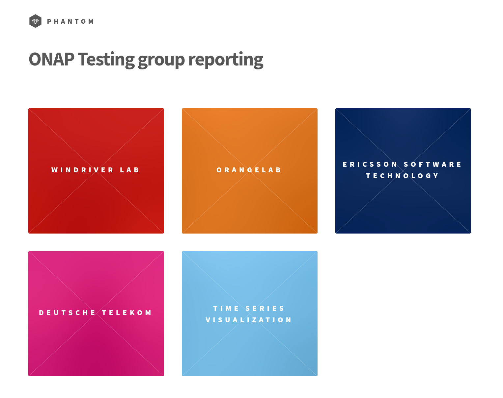

.. This work is licensed under a
   Creative Commons Attribution 4.0 International License.
.. integration-tooling:

Tooling
=======

.. important::
   Integration team deals with lots of tools to complete its missions. The goal
   of this section is to highlight some of them and redirect to their official
   documentation. These tools can be used for CI/CD, Testing or platform management.

   **Upstream tools** are privileged but when needed specific developments can be done.

   Please note that none of these tools are imposed to test developers, in other
   words, any kind of test is accepted and can be integrated, the list of tools
   is just indicative.

Integration Project
-------------------

Integration portal
~~~~~~~~~~~~~~~~~~

A portal is built to report the status of the different labs collaborating in
Integration, see http://testresults.opnfv.org/onap-integration/

The code of this web site is shared on a public gitlab project.

Communication channels
~~~~~~~~~~~~~~~~~~~~~~

The main communication channel for real time support is the official ONAP
Slack #integration-team chan (https://onapproject.slack.com/).

You can also send a mail to onap-discuss AT lists.onap.org
with [ONAP] [Integration] prefix in the title.

Repository management
~~~~~~~~~~~~~~~~~~~~~

Since Integration team manages few dozens of different repositories a tool was provided to aid the process of mass editing the INFO.yaml files. It can be found `here <https://git.onap.org/integration/tree/ptl/edit_committers_info>`__.

Testing
-------

Test frameworks
~~~~~~~~~~~~~~~

Robotframework
..............

`robotframework <https://robotframework.org/>`_ is a well known test framework.
Lots of ONAP tests are leveraging this framework.
This framework is fully developed upstream even if some extensions (python
modules) were created especially to deal with OpenStack (see
`python-testing-utils project <https://git.onap.org/testsuite/python-testing-utils/>`_).

Some GUI tests (using Robotframework Selenium extension) had been initiated but
not maintained, as a consequence they are not integrated in CI/CD.

Python ONAP SDK
...............

The Openstack and Kubernetes python SDK are references widely adopted by the
developers and the industry. Developing a python ONAP SDK aimed to follow the
examples of the infrastructure SDK with the same expectations in term of code
quality.
After an evaluation of the CLI project (JAVA SDK re-exposing primitives through
python system calls), and a first prototype (onap_tests used until Frankfurt for
end to end tests) it was decided to develop a new python SDK.

This SDK has been developed in gitlab.com to benefit from the numerous built-in
options offered by gitlab and ensure the best possible code quality.

- `python SDK repositoy <https://gerrit.onap.org/r/admin/repos/integration/python-onapsdk>`_
- `python SDK documentation <https://python-onapsdk.readthedocs.io/en/latest/?badge=develop>`_

The project is fully Open Source, released under the Apache v2 license.
Integration committers are invited to join the project. The main maintainers are
ONAP integration and OOM committers.

Any new feature shall respect the code quality criteria:

- unit test coverage > 98%
- functional tests (several components mock objects have been developed)

.. attention::
    Python-onapsdk is a **SDK**, it means it is a tool allowing to communicate
    with ONAP. It is a **middleware** that can be used by test projects but it is
    **NOT a test**.

A companion project has been created in ONAP:
`pythonsdk-tests <https://git.onap.org/testsuite/pythonsdk-tests/>`_.

The pythonsdk-test project defines tests based on python-onapsdk.

The tests are hosted in this repository. They consume the different needed SDK:
python-onapsdk but also the kubernetes, the OpenStack SDK and or any needed
additional middlewares.
The project developed the notion of steps that can been combined and reorganized
as need to design a test. This project interacts with ONAP only through the
python-onapsdk library.
The tests are described in :ref:`The Integration Test page <integration-tests>`.

The available steps are:

- [CLAMP] OnboardClampStep: Onboard a SDC including a TCA blueprint
- [CDS] ExposeCDSBlueprintprocessorNodePortStep: expose CDS blueprint nodeport (Guilin workaround)
- [CDS] BootstrapBlueprintprocessor: Bootstrap a blueprint processor
- [CDS] DataDictionaryUploadStep: Upload a Data Dictionary to CDS
- [CDZ] CbaEnrichStep: Enrich CBA
- [K8S plugin] K8SProfileStep: Create K8S profile
- [SO] YamlTemplateVfModuleAlaCarteInstantiateStep: Instantiate VF module described in YAML using SO a'la carte method
- [SO] YamlTemplateVlAlaCarteInstantiateStep: Instantiate network link described in YAML using SO a'la carte method.
- [SO] YamlTemplateVfModuleAlaCarteInstantiateStep: Instantiate VF module described in YAML using SO a'la carte method
- [SO] YamlTemplateVnfAlaCarteInstantiateStep: Instantiate vnf described in YAML using SO a'la carte method
- [SO] YamlTemplateServiceAlaCarteInstantiateStep: Instantiate service described in YAML using SO a'la carte method
- [AAI] ConnectServiceSubToCloudRegionStep: Connect service subscription with cloud region
- [AAI] CustomerServiceSubscriptionCreateStep: Create customer's service subscription
- [AAI] CustomerCreateStep: Create customer
- [AAI] LinkCloudRegionToComplexStep: Connect cloud region with complex
- [AAI] ComplexCreateStep: Create complex
- [AAI] RegisterCloudRegionStep: Register cloud region
- [SDC] YamlTemplateServiceOnboardStep: Onboard service described in YAML file in SDC
- [SDC] YamlTemplateVfOnboardStep: Onboard vf described in YAML file in SDC
- [SDC] YamlTemplateVspOnboardStep: Onboard vsp described in YAML file in SDC
- [SDC] VendorOnboardStep: Onboard vendor in SDC

You can reuse the existing steps to compose your test and/or code your own step
if it is not supported yet.

The procedure to start a test is described in `pythonsdk-test README <https://git.onap.org/testsuite/pythonsdk-tests/tree/README.md>`_

CI/CD
-----

The CI/CD is key for integration. It consolidates the trustability in the solution
by the automated verification of the deployment and the execution of tests.
Integration tests complete the component tests (unit and functional known as
CSIT tests).

Xtesting
~~~~~~~~

As the tests can be very heterogeneous (framework, language, outputs), the
integration team integrates the tests in simple isolated execution context based
on docker called **xtesting dockers**.

Xtesting is a python library harmonizing the way to setup, run, teardown,
manage the artifacts, manage the reporting of the tests (automatic push of the
results on a DB backend). It was developed by
`OPNFV functest project <https://git.opnfv.org/functest-xtesting/>`_.
This python library is included in an alpine docker and contains the needed
tests, their associated libraries as well as a testcases.yaml listing these tests.
These docker files are built on any change in the integration/xtesting repository
and daily to take into account the upstream changes.

The integration project manages 5 xtesting dockers, see
:ref:`Integration Test page <integration-tests>`.

.. important::
    **xtesting is a CI/CD framework, neither a test nor a test framework**

    Testers can provide tests independently from xtesting.
    However to be part of the CI/CD chains, an integration of the test in xtesting
    will be required.

The configuration files are provided as volumes and defined in each docker.
The use of this CI/CD abstraction for the tests simplify the integration
of the test suites in any CI/CD systems and harmonize the inputs and the outputs.

The official documentation can be found on
`xtesting official web site <https://xtesting.readthedocs.io/en/latest/>`_

Integration Test database
~~~~~~~~~~~~~~~~~~~~~~~~~

The integration team shares a Test Result Database with the OPNFV project. All
the test results of the CD are automatically pushed to this database.
It is possible to retrieve the results through the Test API associated with this
test Database.

The following information are available:

- List of pods allowed to push results: http://testresults.opnfv.org/onap/api/v1/pods
- List of projects that declared test cases for CI/CD: http://testresults.opnfv.org/onap/api/v1/projects
- List of integration test cases:
  http://testresults.opnfv.org/onap/api/v1/projects/integration/cases
- List of security test cases:
  http://testresults.opnfv.org/onap/api/v1/projects/security/cases
- Results with lots of possible filter combinations: http://testresults.opnfv.org/onap/api/v1/results?last=3

It is possible to get results according to several criteria (version, case name,
lab, period, last, CI id,..)
See the "OPNFV test API documentation".

Any company running ONAP Integration tests can be referenced to push their results
to this database.
This Database is hosted on a LF OPNFV server. Results are backuped daily.
Integration committers can have access to this server.

VNF demo Artifacts
~~~~~~~~~~~~~~~~~~

VNF demo artifacts are hosted in the demo repositories and published in
https://nexus.onap.org/content/repositories/releases/org/onap/demo/vnf/.
