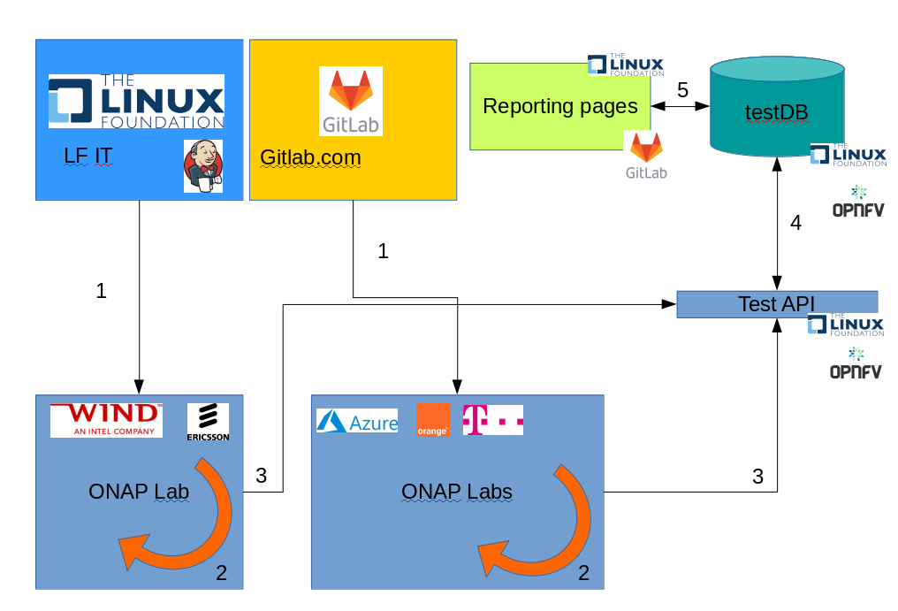
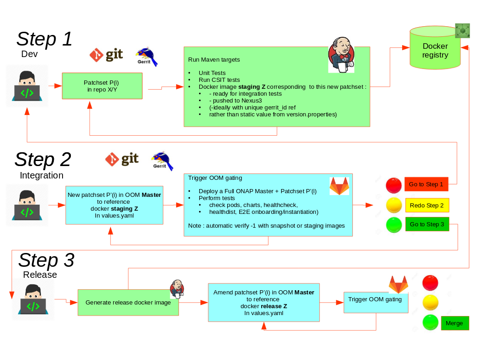
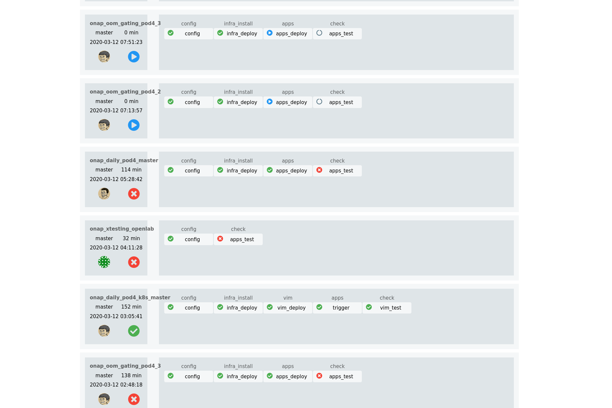
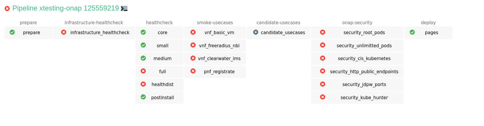
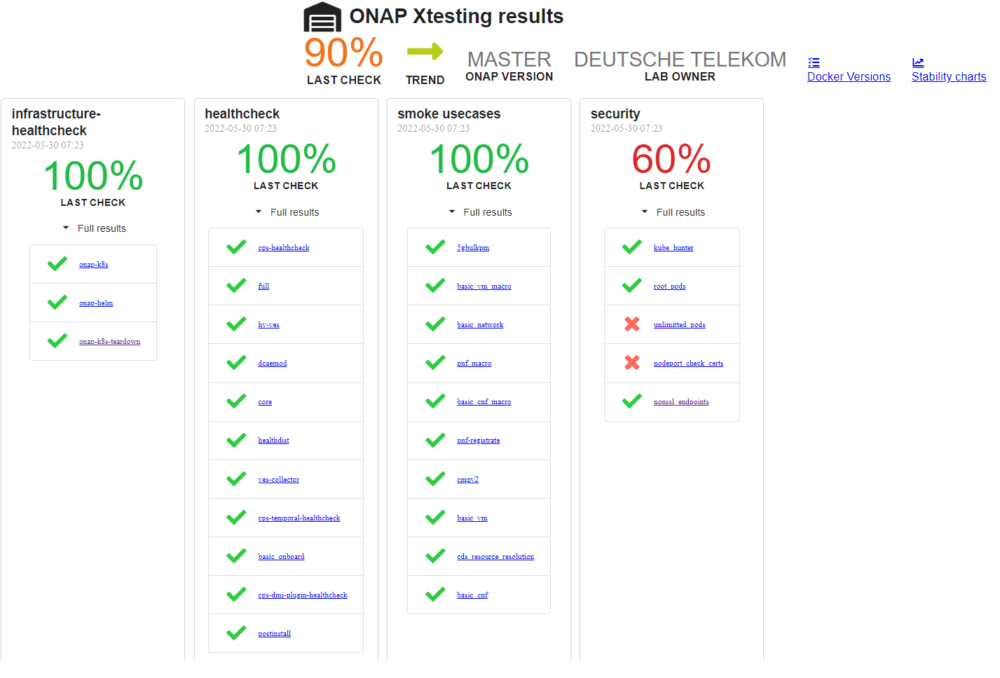
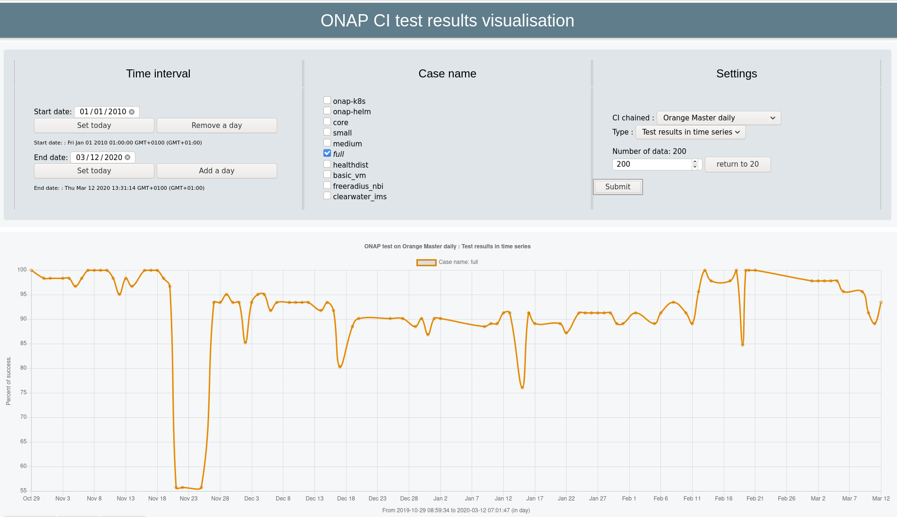

.. _integration-ci:

Integration Continuous Integration Guide
----------------------------------------

.. important::
   Continuous Integration is key due to the complexity of the ONAP projects.
   Several chains have been created:

  - Daily stable chain
  - Daily master chain
  - Gating: On demand deployment of a full ONAP solution to validate patchsets

They are run on different environments (Orange labs, DT labs, Azure Cloud).

The following document will detail these chains and how you could set up such
chains and/or provide test results to the community.

Integration CI Ecosystem
------------------------

Overview
~~~~~~~~

The global ecosystem can de described as follows:

Several chains are run in ONAP.
The CI chains are triggered from different CI systems (Jenkins or gitlab-ci) (1)
on different target environments hosted on community labs (Windriver,
Orange, DT, E///) or Azure clouds. Jobs (installation, tests) are executed on
these labs (2). At the end, the results are pushed through the OPNFV test API (3)
to a test database (4) hosted by Linux Foundation on
http://testresults.opnfv.org.
Results can be reported in different web pages hosted on LF or on gitlab.com (5).

Daily Chains
~~~~~~~~~~~~

CI daily chains (Master and last Stable) are run on Orange, DT using gitlab-ci
jobs and Ericsson using jenkins jobs.

Gating
~~~~~~

OOM gating has been introduced for El Alto. It consists of a deployment followed
by a set of tests on patchsets submitted to OOM repository.

The CI part is managed on gitlab.com and the deployment is executed on ONAP
Orange lab and Azure clouds.
The goal is to provide a feedback - and ultimately to vote - on code change
prior to merge to consolidate the OOM Master branch.

The developer can evaluate the consequences of his/her patchset on a fresh
installation.

The gating is triggered in 2 scenarios:

 - new patchset in OOM
 - comment with the magic word **oom_redeploy** is posted in the Gerrit's comment
   section

The procedure to submit new feature in CI is done in 3 steps as described in the
figure below:

Visualization of the CI pipelines
~~~~~~~~~~~~~~~~~~~~~~~~~~~~~~~~~

As the CI chains are triggered from different systems, several web interfaces
can be used to visualize them.

A web site has been created to centralize the links on http://testresults.opnfv.org/onap-integration/index.html

For Gating and gitlab.com based CI chains, the pipelines consist in pipelines of
pipelines managed through the chaining of .gitlab-ci.yml file thanks to an Open
Source deployment called chained-ci (https://gitlab.com/Orange-OpenSource/lfn/ci_cd/chained-ci).
A visualization tool is available to list all your chains as described in the
figure below:

If you click on any element of the chain, you will open a new window:

In order to provide the logs to the developer an additional web page has been
created to summarize the tests and grant access to their associated logs:

Additionnaly, for the daily chain, another page displays the results as time
series, allowing to see the evolution of the tests over time.

Setup Your Own CI Chains
------------------------

If you want to setup a gitlab.com based CI chain, and want to use chained-ci,
you can follow the tutorial on  https://gitlab.com/Orange-OpenSource/lfn/ci_cd/chained-ci-handson

You should be able to chain your automation projects:

* Create resources
* Deployment of Kubernetes
* Test of your Kubernetes (using OPNFV functest-k8s tests)
* Deployment of your ONAP (you can use your own automatic installation
  procedure or https://gitlab.com/Orange-OpenSource/lfn/onap/onap_oom_automatic_installation/)
* Test ONAP thanks to the differnet ONAP xtesting dockers covering infrastructure
  healthcheck, components healthcheck tests, end to end tests, security tests.

If you want to report your results to the community, do not hesitate to contact
the integration team. The Test database is public but the pods must be declared
to be allowed to report results from third party labs.
