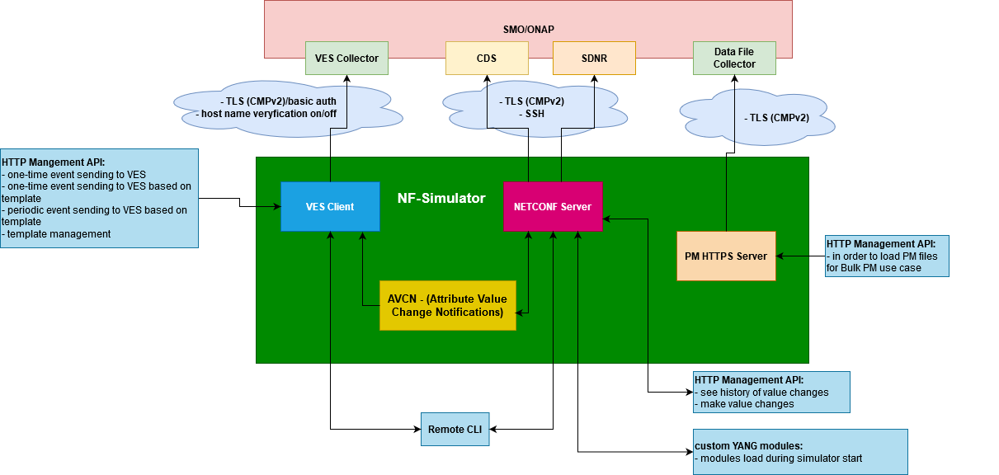

.. This work is licensed under a Creative Commons Attribution 4.0
.. International License. http://creativecommons.org/licenses/by/4.0

.. _nf_simulator:

:orphan:

NF Simulator
============

Description
-----------
An idea behind NF (Network Function) Simulator is to introduce simulator, which supports ORAN defined O1 interface (reporting of NF events to Service Management Orchestrators).
Within the use-case, it is expected, that an NF configuration change, happening due to multiple reasons (network mechanism triggered change - e.g. discovery of neighbours) is reported to the network management system, using ONAP`s VES REST events.
The simulator is expected to cover planned NF behaviour - receive the config change via a NetConf protocol and report that change (also potentially other related changes) to the network management system using ONAP`s VES event.

|image1|

**Figure 1. Architecture Overview**

1. NF Simulator code is stored in https://github.com/onap/integration-simulators-nf-simulator and all it's sub repos are:

   - for VES Client - https://github.com/onap/integration-simulators-nf-simulator-ves-client
   - for Netconf Server - https://github.com/onap/integration-simulators-nf-simulator-netconf-server
   - for AVCN Manager - https://github.com/onap/integration-simulators-nf-simulator-avcn-manager
   - for PM HTTPS Server - https://github.com/onap/integration-simulators-nf-simulator-pm-https-server

2. For above components have been prepared:

   - docker images in ONAP Nexus:

     - VES Client image - nexus3.onap.org:10001/onap/org.onap.integration.nfsimulator.vesclient
     - AVCN Manager image - nexus3.onap.org:10001/onap/org.onap.integration.nfsimulator.avcnmanager
     - PM HTTPS Server image - nexus3.onap.org:10001/onap/org.onap.integration.nfsimulator.pmhttpsserver
     - Netconf Server images - nexus3.onap.org:10001/onap/org.onap.integration.nfsimulator.netconfserver

   - example helm charts:

     - `Helm charts <https://github.com/onap/integration-simulators-nf-simulator/tree/master/helm>`_

**VES Client, Netconf Server and PM HTTPS Server can be used and deployed separately depending on needs.**

Only AVCN Manger connects VES Client with Netconf Server in order to support O1 interface.

1. VES Client:
--------------

1. Purpose of VES Client

   Application that generates VES events on demand.

2. What does it do?

   - Supports both basic auth and TLS CMPv2 method of authentication.
   - Allows to turn on and turn off hostname, verification in SSL.
   - Allows to send one-time event and periodic events, based on event templates.
   - Exposes API to manage VES Client
   - Provides template mechanism (Template is a draft event. Merging event with patch will result in valid VES event.
     Template itself should be a correct VES event as well as valid json object. )
   - Patching - User is able to provide patch in request, which will be merged into template.
   - Simulator supports corresponding keywords in templates: RandomInteger(start,end), RandomPrimitiveInteger(start,end), RandomInteger,
     RandomString(length), RandomString, Timestamp, TimestampPrimitive, Increment
   - In place variables support - Simulator supports dynamic keywords e.g. #dN to automatically substitute selected phrases in defined json schema.
   - Logging - Every start of simulator will generate new logs that can be found in docker ves-client container.
   - Swagger - Detailed view of simulator REST API is available via Swagger UI
   - History - User is able to view events history.

2. Netconf Server:
------------------

1. Purpose of Netconf Server

   This server uses sysrepo to simulate network configuration.
   It is based on sysrepo-netopeer2 image.

2. What does it do?

   Server allows to:

   - install custom configuration models on start up.
   - change configuration of that modules on runtime.
   - use TLS custom certificates
   - configure change subscription for particular YANG modules (Netconf server image run python application on the startup.)
   - manage netconf server using REST interface, with endpoints:

     - GET /healthcheck returns 200 "UP" if server is up and running
     - POST /readiness return 200 "Ready" if server is ready, if not, returns 503 "Not Ready"
     - POST /change_config/<path:module_name> changes configuration ad returns 202 "Accepted"
     - GET /change_history returns 200 and change history as json
     - GET /get_config/<path:module_name> returns 200 and current configuration

3. AVCN Manager:
----------------

1. Purpose of AVCN Manager

   Manager that fetches changes of configuration from kafka and sends them to VES client.

2. What does it do?

   The manager processes notifications from NETCONF server. It does this by being a subscriber of a Kafka topic that is fed with NETCONF notifications. Incoming notifications are then processed and output of this processing is sent to VES client.

4. PM HTTPS Server:
-------------------

1. Purpose of PM HTTPS Server

   Server that is used in Bulk PM usecases over HTTPS

2. What does it do?

   - Supports TLS (CMPv2) method of authentication (used during connection to Data File Collector)
   - Allows to use custom certificates
   - Exposes REST API in order to manage PM files stored in HTTPS server

Guides
======

User And Developer Guide
------------------------
1. User guides:

   - `VES Client user guide. <https://github.com/onap/integration-simulators-nf-simulator-ves-client/blob/master/README.md>`_
   - `AVCN Manager user guide. <https://github.com/onap/integration-simulators-nf-simulator-avcn-manager/blob/master/README.md>`_
   - `PM HTTPS Server user guide. <https://github.com/onap/integration-simulators-nf-simulator-pm-https-server/blob/master/README.md>`_
   - `Netconf Server user guide. <https://github.com/onap/integration-simulators-nf-simulator-netconf-server/blob/master/README.md>`_
   - `Netconf Notification Application user guide. <https://github.com/onap/integration-simulators-nf-simulator-netconf-server/blob/master/src/python/README.md>`_
   - `NF Simulator CLI user guide <https://github.com/onap/integration-simulators-nf-simulator/blob/master/simulator-cli/README.md>`_

2. Jenkins builds:

   - `VES Client jenkins builds <https://jenkins.onap.org/view/integration-simulators-nf-simulator-avcn-manager/>`_
   - `AVCN Manager jenkins builds <https://jenkins.onap.org/view/integration-simulators-nf-simulator-netconf-server/>`_
   - `PM HTTPS Server jenkins builds <https://jenkins.onap.org/view/integration-simulators-nf-simulator-pm-https-server/>`_
   - `Netconf Server jenkins builds <https://jenkins.onap.org/view/integration-simulators-nf-simulator-ves-client/>`_

3. NF Simulator CSIT test cases:

   - `Project integration-simulators-nf-simulator-netconf-server-master-verify-csit-testsuites <https://jenkins.onap.org/view/integration-simulators-nf-simulator-netconf-server/job/integration-simulators-nf-simulator-netconf-server-master-verify-csit-testsuites/>`_
   - `Project integration-simulators-nf-simulator-netconf-server-master-csit-testsuites <https://jenkins.onap.org/view/integration-simulators-nf-simulator-netconf-server/job/integration-simulators-nf-simulator-netconf-server-master-csit-testsuites/>`_

4. NF Simulator sanity checks:

   - https://github.com/onap/integration-simulators-nf-simulator/tree/master/sanitycheck

