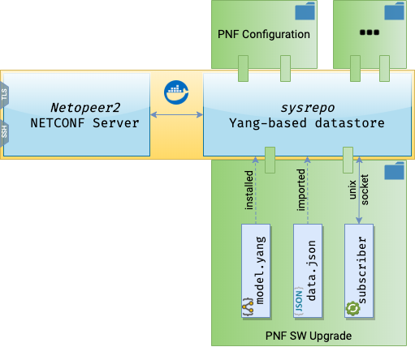

NETCONF Plug-and-Play Simulator
===============================

.. sectnum::

.. _py-requirements: https://pip.pypa.io/en/stable/reference/pip_install/#requirements-file-format
.. _yang-rfc: https://tools.ietf.org/html/rfc6020

|ci-badge| |release-badge| |docker-badge|

.. |ci-badge| image:: https://github.com/blue-onap/netconf-pnp-simulator/workflows/CI/badge.svg
   :alt: CI
.. |release-badge| image:: https://img.shields.io/github/v/tag/blue-onap/netconf-pnp-simulator?label=Release
   :alt: GitHub tag
.. |docker-badge| image:: https://img.shields.io/badge/docker%20registry-Quay.io-red
   :target: https://quay.io/repository/blue-onap/netconf-pnp-simulator?tab=tags

Overview
--------

This project builds a modular engine that allows the creation of NETCONF-enabled devices simulators,
either physical (PNF), virtual (VNF), or cloud-native (CNF)

Simply put, it's a docker container running Sysrepo and Netopeer2 servers enhanced with a plugger script that
performs the following actions at start-time:

1. Configures TLS and SSH secure accesses to the Netopeer2 server;
2. Installs multiple YANG models into sysrepo datastore;
3. Launches the corresponding subscriber applications.

The picture below unveils the architecture of this solution.

A YANG module contains the following files:

.. list-table::
   :widths: 10 50
   :header-rows: 1

   * - Filename
     - Purpose
   * - ``model.yang``
     - The YANG model specified according to `RFC-6020 <yang-rfc_>`_ and named after the module's name, e.g., *mynetconf.yang*.
   * - ``startup.json`` or ``startup.xml``
     - An optional data file with the initial values of the model. Both JSON and XML formats are supported.
   * - ``subscriber.py``
     - The Python 3 application that implements the behavioral aspects of the YANG model. If you don't supply one, a generic subscriber that logs all received events will be used.
   * - ``requirements.txt``
     - [Optional] Lists the additional Python packages required by the application, specified in the `Requirements File Format <py-requirements_>`_.

Application
-----------

The ``subscriber.py`` application can implement any wanted passive or active behaviour:

**Passive Behaviour**: The subscriber will receive an event for each modification externally applied to the YANG model.

**Active Behaviour**: At any point in time the subscriber can proactively change its own YANG model.

Runtime Configuration
---------------------

Customizing TLS and SSH accesses
~~~~~~~~~~~~~~~~~~~~~~~~~~~~~~~~

The distributed docker image comes with a sample configuration for TLS and SSH, that can be found at
``/config/tls`` and ``/config/ssh`` directories respectively. The user can replace one or both configurations
by mounting a custom directory under the respective TLS or SSH mounting point.

TLS Configuration
^^^^^^^^^^^^^^^^^

You need to provide the following PEM files under ``/config/tls``:

.. list-table::
   :widths: 10 50
   :header-rows: 1

   * - File
     - Contents
   * - ``server_key.pem``
     - The server's private key in plain (*not* protected by a passphrase).
   * - ``server_cert.pem``
     - The corresponding server's X.509v3 certificate.
   * - ``ca.pem``
     - The Certificate Authority (CA) certificate.

.. TIP:: You can reload the configuration at runtime by running ``docker exec <CONTAINER NAME or ID> /opt/bin/reconfigure-tls.sh``

SSH Configuration
^^^^^^^^^^^^^^^^^

For the SSH connection, you need to provide the public SSH key in one of these 3 files under ``/config/ssh``
in order of preference:

- ``id_ecdsa.pub``; or
- ``id_dsa.pub``; or
- ``id_rsa.pub``

.. TIP:: You can reload the configuration at runtime by running ``docker exec <CONTAINER NAME or ID> /opt/bin/reconfigure-ssh.sh``

Python Virtual Environment Support
~~~~~~~~~~~~~~~~~~~~~~~~~~~~~~~~~~

Python programs usually use additional packages not included in the standard Python distribution,
like the ``requests`` package, for example.
We support this scenario by creating isolated Python environments for each custom-provided module whenever
a ``requirements.txt`` file is present in the module directory.

Example Module
--------------

The directory ``examples/mynetconf`` contains an example YANG model and its subscriber along with a
Docker Compose configuration file to launch a basic simulator.
